## Banking and Wealth Agentforce Workshop Overview

This is the first and foundational exercise that you will use to enable all of the other exercises. You will give your agent the proper context about the customer so that it has all the information about the customer's financial accounts on hand.

We will explore:

* Flows to build automations and workflows that an agent can execute
* Context variables to maintain proper context for the agent and keep the most relevant information in mind
* Topics that define how your agent should behave
* Actions that give agents the tools they need to do their jobs

In this exercise, you will:

- **Part 1**: Update the flow to retrieve financial account information for the agent.
- **Part 2**: Create a new agent action to retrieve all of a customer's financial account details.
- **Part 3**: Test the new agent capabilities.

Click **Next** to get started!  

### 1. Create Action and Context Variable

Follow these steps to create the action context variable:

1. In Setup, search for and select **Agentforce Agents** to open the list of agents.  
2. Expand the **Banking Wealth Agent** by clicking **>** beside it, then select **Version 1** to open this agent in the Agent Builder.
3. In the left pane, select **Context**, where you can manage the variables and filters for your agent.  
4. Review the **Messaging Session** variable that is created for every conversation the agent has. Any context from the conversation channel can be provided through this variable, including data about the customer.
5. Click **New Variable** at the top of the pane and configure the new custom variable with these values:
   - **Name**: `accountJson`
   - **Data Type**: `Text`
   - **Allow LLM to use value**: checked

You will use this new variable to store all of the active policy details you retrieve about the customer so you can keep this context throughout the conversation.

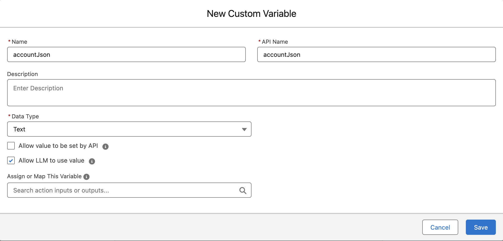

---

### 2. Create an Apex Action for Financial Account Questions

Follow these steps to create the Apex action:

1. In the left pane, select **Topics**, where you will find a number of pre-configured topics, including **Financial Account Questions**, and click **Financial Account Questions**.
2. Review the description, scope, and instructions for this topic, which define how the agent should behave when answering any customer questions about their policy.  
3. Click the **This Topic's Actions** tab at the top. You will add the updated flow as an action here so you can retrieve the customer's policy details.
4. Click the **New** dropdown and select **Create New Action**.


5. In the pop-up modal, set these values:
   - **Reference Action Type**: `Apex`
   - **Reference Action Category**: `Invocable Method`
   - **Reference Action**: `BWAM - Get Account Details`
6. Click **Next**.
7. Configure the agent action with these parameters:
   - **Loading Text**: `Retrieving your account details...`
   - For the **accountIds** input variable:
     - **Instructions**: `Account ID of customer`
     - **Require Input**: checked
   - For the **output** variable:
     - **Instructions**: `JSON output of the customer's financial accounts`
     - **Show in conversation**: checked

| 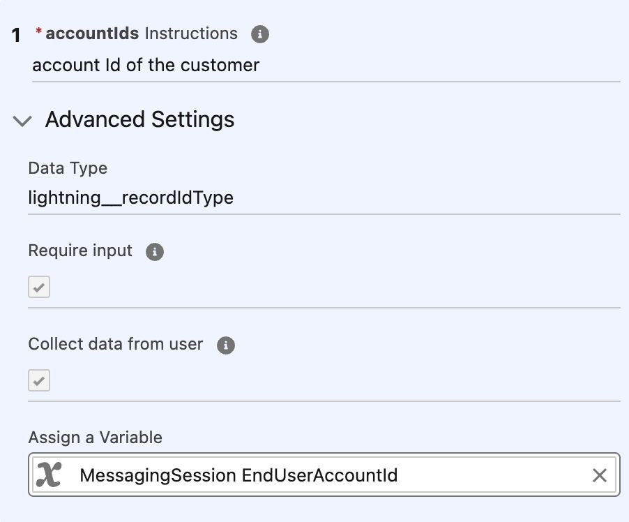 | 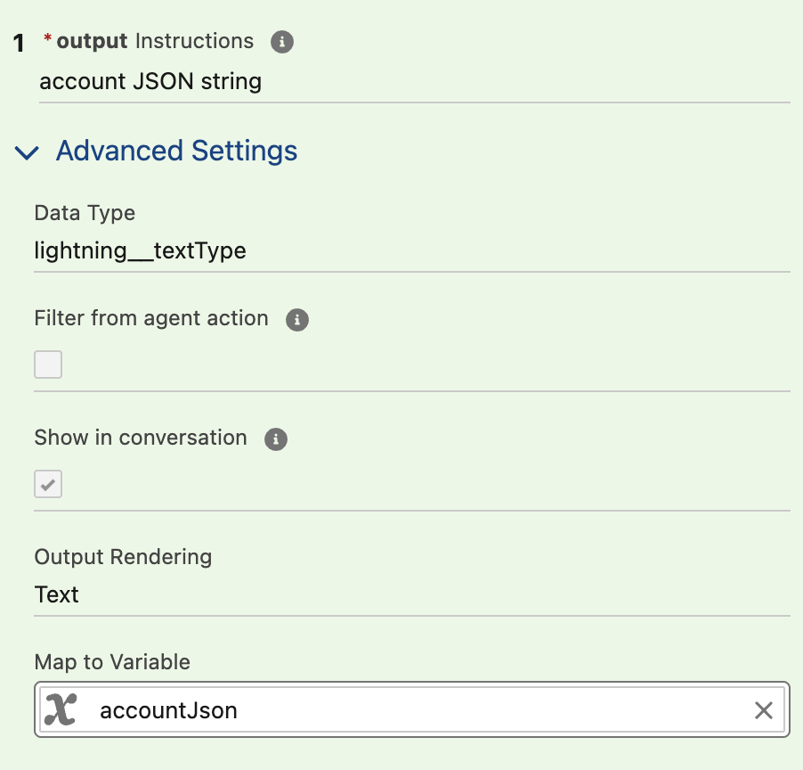 |
| ------------------------------------------------------------------------------- | -------------------------------------------------------------------------------- |

8. Click **Finish**.
9. Click the **BWAM - Get Account Details** action in the list and, for the `accountId` input variable, assign the `MessagingSession EndUserAccountId` variable.  
10. For the **output** variable, map it to your custom variable `accountJson`.

You have now finished configuring the action. Your agent can retrieve and retain proper context about your customer during the conversation.

---

### 3. Add Manage Beneficiary Topic

Now that you've given your agent the ability to retrieve context and details about your customer, you also want to give it tools to take action.  
You will create a new topic for your agent to manage beneficiaries on a customer's account.

Follow these steps to create the topic:

1. In the **Agent Builder** setup screen for the **Banking Wealth Agent**, open the **Topics** pane on the left.  
2. Open the **New** dropdown within the pane and click **New Topic**.  
3. Copy the following description into the topic:

```text
This 'Manage Beneficiaries' topic will allow customers to ask about, add or remove any existing Beneficiaries / Relationships associated to a specific financial Account. Using the financial account Ids in the accountJson variable, identify the financial account the customer is asking about. Ask for the name of the beneficiary, the percentage of the benefit to be received, and the tax ID for the beneficiary. When displaying the Financial Account Roles always include Related Account Name, Account Name, Role and Status. Execute Add Beneficiaries action when the customer wants to add new relationships or financial account role associated to a Financial Account. Execute the Remove Beneficiaries action when the customer wants to remove a relationship or financial account role associated to a Financial Account.
```

4. Click **Next** and review the generated topic definition. After reviewing, click **Next** again.  
   *Salesforce takes you to the screen for adding actions to your topic.*
5. In the **Search actions** box, search for `beneficiaries` and add these three pre-built actions:
   - `BWAM - Add Beneficiaries`
   - `BWAM - Get Beneficiaries`
   - `BWAM - Remove Beneficiaries`
6. Click **Finish**.

Your agent can now help with beneficiary requests.

---

### 4. Test Our Agent

Follow these steps to test your agent:

1. On the right side of Agent Builder, locate the **Conversation Preview** pane.  
2. Click the **eye icon** at the top right so you can set the right customer context for the conversation.  
3. In this scenario, act as **Kiran Singh**, a customer with 5 financial accounts and 2 assets (visible on Kiran Singh's account record).
4. In the **MessagingSession EndUserAccountId** variable, search for and select **Kiran Singh** to simulate a conversation as that customer.

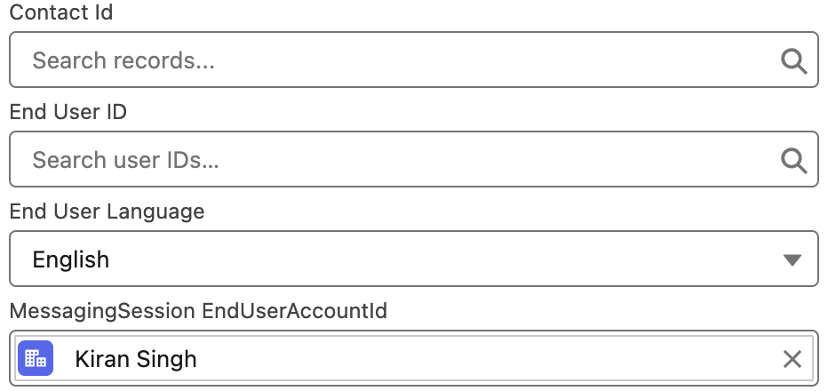

In the message box at the bottom, you can start by asking questions like:

- **What are all my accounts?**
- **What can you tell me about my assets?**

Feel free to experiment and ask the agent any other questions about financial accounts and assets. Some examples:

1. What is the total balance across my investment accounts?
2. What is the total valuation of my assets?
3. What is the balance of my checking account?

To test the ability to manage beneficiaries, try this sequence:

1. Ask, **What are all my accounts?**
2. Ask, **Show me the relationships for the family trust.**
3. Say, **Help me add another person to this account.**
4. Provide details such as: `David Singh, david.singh@example.com, 2000-01-01, Beneficiary`
5. Say, **Remove David Singh.**

The conversation can look similar to this:

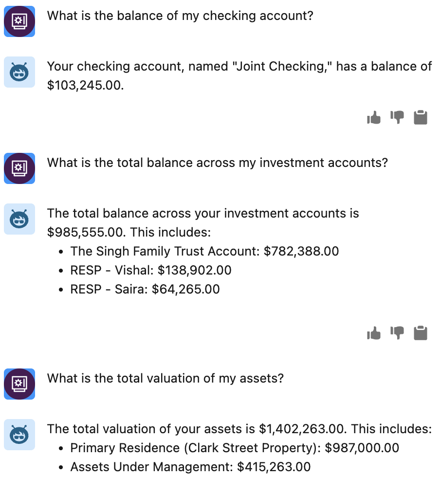

You can also test the agent from a customer portal.  
In Setup, search for **All Sites** and click the URL link beside the **Retail** site to launch it.

Click the **Messaging** icon in the lower right corner to start a new chat session with the agent (it may take a few seconds to connect).  
You can use the same questions and instructions from above.

| 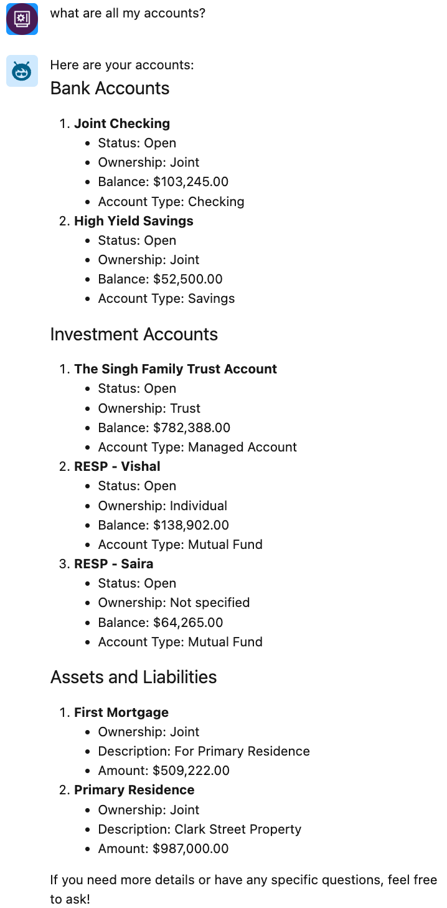 | 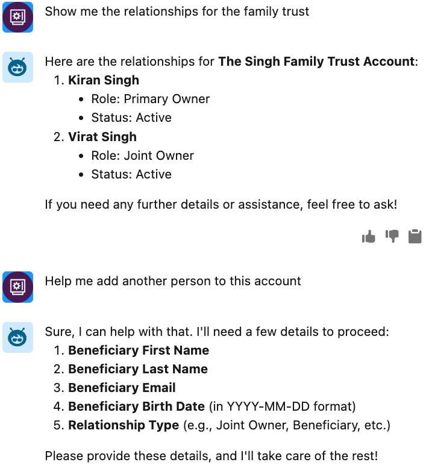 | 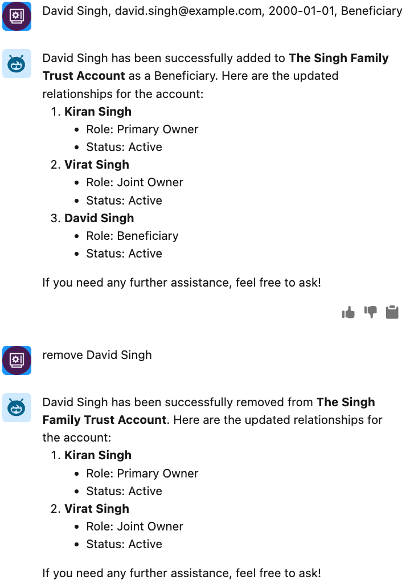 |
| ---------------------------------------------------------- | ---------------------------------------------------------- | ---------------------------------------------------------- |


## Address Change

In this exercise, you will build a prompt and a flow, and update the **Address Change** topic in your banking agent to provide customers with a self-service way to manage their account address and communicate any follow-up actions to them.

In this exercise, you will:

- **Part 1**: Create a prompt flow to ground the nearest branch.
- **Part 2**: Create the **Nearest Branch Introduction** prompt.
- **Part 3**: Add the agent action to the agent.
- **Part 4**: Test your agent in the builder.

---

### Part 1: Create Prompt Flow to Ground the Nearest Branch

#### Create the flow

1. From Setup, in the Quick Find box, enter **Flows**, and then click **Flows**.
2. Click the **New Flow** button in the top right corner.
3. Select **Template-Triggered Prompt Flow**.

#### Configure the flow

1. Leave the **Input Type** as **Manual Inputs**.
2. Open the **Toolbox** pane from the top left and click **New Resource**.
3. Create a new input variable with the following values:

| **Field**                     | **Value**               | **Explanation**                                                                   |
| ----------------------------- | ----------------------- | --------------------------------------------------------------------------------- |
| Resource Type                 | Variable                | Variable type                                                                     |
| API Name                      | Account                 | Variable name that is the same as in the flex prompt                              |
| Data Type                     | Record                  | Input is a record                                                                 |
| Object                        | Account                 | Object data to be provided as input                                               |
| Availability Outside the Flow | Check **Available for input** | Lets the prompt provide the account data to provide dynamic grounding      |

4. Click **Done** to save the resource.

---

### Part 2: Create "Nearest Branch Introduction" Prompt

This prompt helps the customer identify the nearest branch whenever the customer's address changes.

#### Create the prompt template

1. Click the **Setup** icon and select **Setup**.
2. In Quick Find, type **Prompt**.
3. Select **Prompt Builder** under the **Einstein Generative AI** group.  
   *Salesforce displays the Prompt Builder list, including options to explore this feature.*
4. Click the **New Prompt Template** button to create a new **Prompt Template**.  
   *Salesforce opens the **New Prompt Template** dialog.*
5. Complete the **New Prompt Template** form with the following values:

| **Field**              | **Value**                          | **Explanation**                                                                                                                                      |
| ---------------------- | ---------------------------------- | ---------------------------------------------------------------------------------------------------------------------------------------------------- |
| Prompt Template Type   | Flex                              | Generate content for any business purposes that other templates don’t cover. Flex prompt templates let you define your own resources.               |
| Prompt Template Name   | BWAM - Nearest Branch Introduction | Required field.                                                                                                                                      |
| API Name               | *(auto-generated)*                | Automatically generated.                                                                                                                             |
| Template Description   | Generates the follow up call to action to introduce a customer to their new nearest branch | Descriptions in metadata are used by the Planner service to understand the intent and purpose of this prompt template. |
| Name                   | Account                           | Enter the **Name** of the object for which you want to create this template.                                                                         |
| API Name               | Account                           | Enter the **API Name** of the object for which you want to create this template.                                                                     |
| Source Type            | Object                            | Defines the resources that you want this prompt to use for generating content.                                                                       |
| Object                 | Account                           | Select the object you want to use in this template.                                                                                                  |

6. Click **Next**.
7. Copy/paste the following text into the Prompt Template workspace:

```text
You are a service agent and a customer, {!$Input:Account.Name}, has just updated their address to their new home. Write a chat response to the customer informing them of the branch address closest to their new home and the name of the wealth advisor at that branch.

You must treat equally any individuals or persons from different socioeconomic statuses, sexual orientations, religions, races, physical appearances, nationalities, gender identities, disabilities, and ages. When you do not have sufficient information, you must choose the unknown option, rather than making assumptions based on any stereotypes.


"""

At the beginning of the message, congratulate the customer on their new home and let them know we're here to provide them peace of mind with their new property and move.

Do not address the customer like you would in an email, but respond as if it is part of an ongoing chat conversation with the customer.

Do not say hello or address the customer as dear. Do not sign off in the response.

Inform them that the branch nearest them is at the address provided below and that the wealth advisor there is eager to connect and understand their needs.

"""


New address: {!$Input:Account.BillingStreet}, {!$Input:Account.BillingCity} {!$Input:Account.BillingState}, {!$Input:Account.BillingPostalCode}, {!$Input:Account.BillingCountry}

{!$Flow:BWAM_Grounding_Nearest_Branch.Prompt}
```

8. Select the **OpenAI GPT 4 Omni Mini** model.
9. Click **Save** and **Activate** the template.

---

### Part 3: Add Agent Action to Agent

To use your custom Agent action, you need to assign it to the **Agentforce Banking and Wealth Agent**.

1. In the Quick Find box, enter **Agentforce Agents**, and then click **Agentforce Banking and Wealth Agent**.
2. Click **Open in Builder** in the top right corner.
3. Click **Deactivate** and, in the confirmation modal, click **OK**.
4. On the left side of the screen, click the **Update Address** Topic.
5. Click the **This Topic’s Actions** tab on the left.
6. Click **New** and select **Create New Action**.
7. For **Reference Action Type**, select **Prompt Template**.
8. For **Reference Action**, select **BWAM - Nearest Branch Introduction**.
9. Click **Next**.
10. For **Agent Action Instructions**, keep the existing text **AS-IS**.
11. Toggle off **Show loading text for this action**.

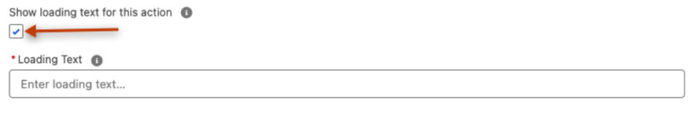

For the input and output configuration:

1. For the **Account** input, enter these instructions:  
   **This is the Account that is related to the User’s request**.
2. For the **promptResponse** output, select **Show in conversation**.
3. Verify that the configuration matches the screenshot and click **Finish**.

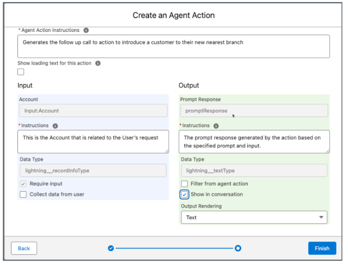

To finalize the topic behavior:

1. Navigate to the **Topic Configuration** tab.
2. Click the **Add Instructions** button at the bottom.
3. Enter the following text in the instruction:  
   **Ask the customer if they would like more information on their new nearest branch immediately after successfully updating their address. If the customer does want to find their nearest branch, run the 'BWAM - Nearest Branch Introduction' action and provide the response to the customer.**
4. Click **Save** and **Activate**.

---

### Part 4: Test Your Agentforce in the Builder

In the Conversation Preview, test the updated agent with the following prompts:

1. `I want to update my address`
2. `Kiran Singh`
3. `120 N LaSalle St, Chicago, Illinois, 60602, United States`
4. `yes`

An example conversation is shown below:

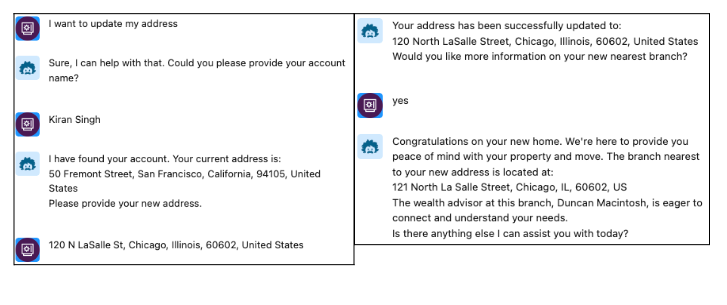

