## Banking and Wealth Agentforce Workshop Overview

In this workshop, you will build a specialized AI agent using deterministic logics that's designed to assist wealth management customers. You will configure the agent to analyze investment portfolios and provide personalized advice based on a customer's risk profile.

### What we will explore

* How to create and configure a new agent using **Agentforce Studio**.
* How to define custom **Topics** and **Actions** for specific business logic.
* How to use deterministic instructions and variables to provide conditional responses.
* How to test and validate your agent using specific customer data.

---

### 1. Create a New Agent

#### Initialize the agent

1. Click the **App Launcher** (waffle icon) and select the **Agentforce Studio** application.
2. Click **New Agent** to create a new agent.
3. In the **What agent do you want to build?** dialogue, enter `Create a portfolio advisor agent for a wealth management customer`.
    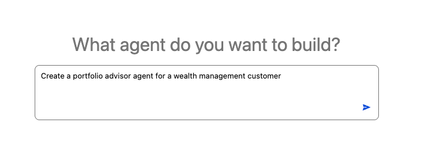

#### Configure agent details

1. Click **Agent Details** in the left-hand panel.
2. Enter the following values:
    - **Agent Name**: `My Portfolio Agent`
    - **API Name**: `My_Portfolio_Agent`
    - **Agent User's Record**: `EinsteinServiceAgent User`
3. Click **Save** in the top left.

---

### 2. Create a Topic for Portfolio Health

#### Define the topic

1. In the left-hand pane, hover over **Topics** and click the **+** (plus) icon.
2. Select **Create New Topic**.
3. For **Topic Name**, enter `Portfolio Health`.
4. Click **Create and Open**.
    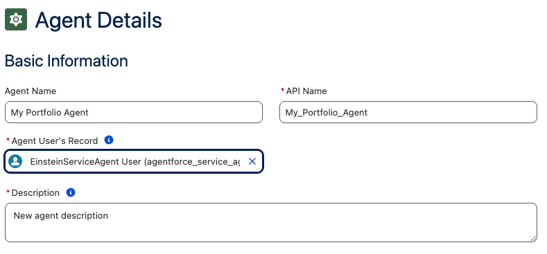
5. Enter the following description for the topic:  

```text
Assists clients with reviewing their current investment portfolio allocation, specifically tracking the balance between equities and bonds. Use this topic when a user asks about their portfolio health, current asset mix, or if they need to rebalance their accounts based on their risk profile.
```

#### Add a custom action

1. Under **Actions Available for Reasoning**, click **Select action** and choose **Create an action**.
    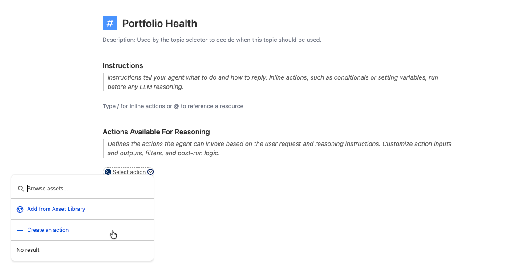
2. For the action name, enter `Get Portfolio Data` and click **Create and Open**.
3. In the **Reference Action Type** dropdown, select `Apex`.
4. Under **Reference Action**, select `Get Portfolio Allocation`.
    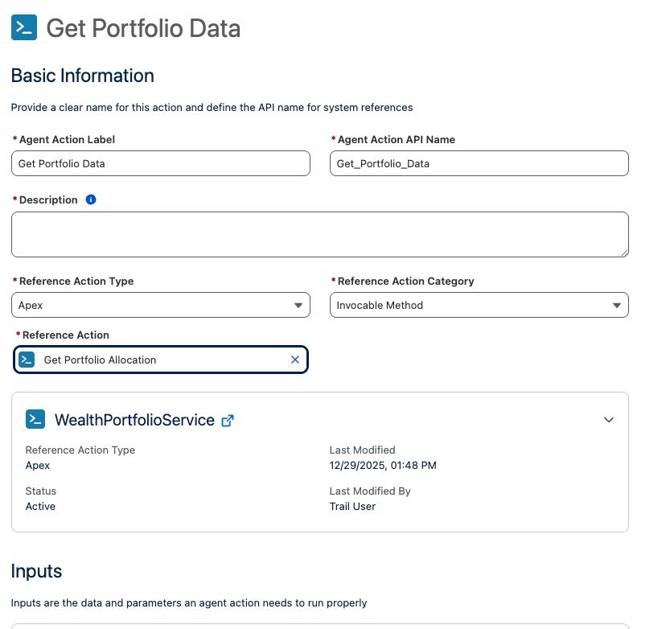
5. Click **Save**.
6. Click **Portfolio Health** in the left-hand pane to return to the topic details.
7. In the **Actions Available for Reasoning** section, click **Select action** and select the `Get Portfolio Data` action.
    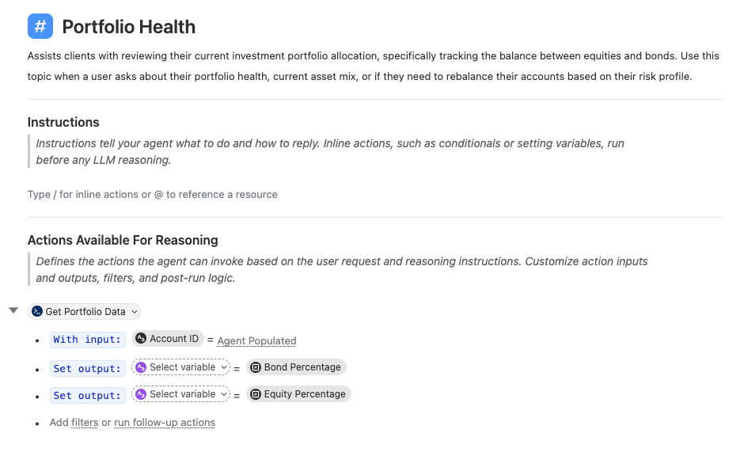
8. Click **Save**.

---

### 3. Add Deterministic Instructions

#### Add conditional logic in Canvas mode

1. Click **Portfolio Health** in the left-hand pane.
2. In the **Instructions** section, type `/` and select **Run Action**.
    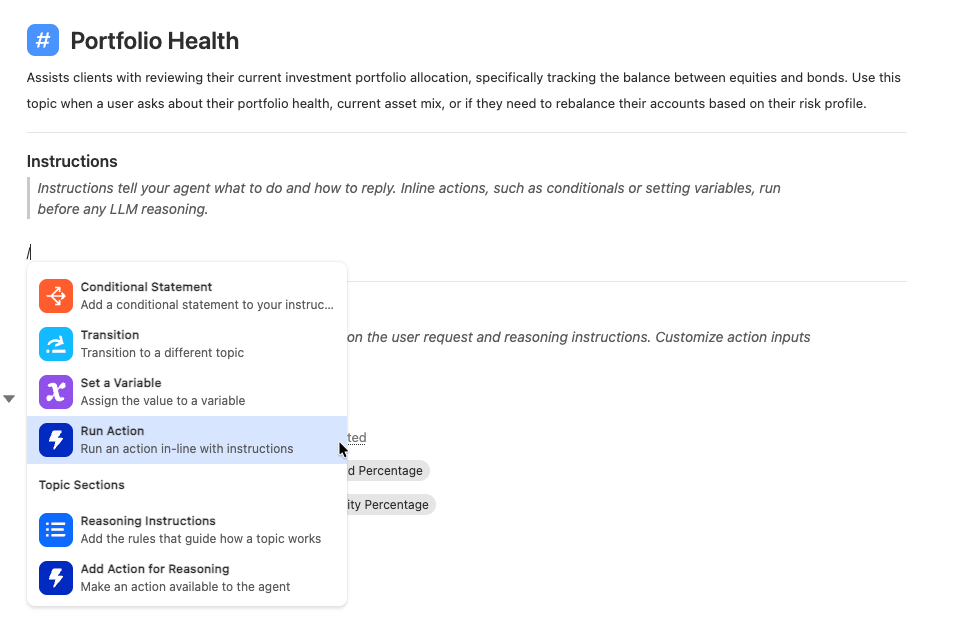
3. Click **Select action** and select `Get Portfolio Data`.
4. Next to **AccountId**, click **Select variable** and select `VerifiedCustomerId`.

#### Configure output variables

1. Next to **Set Output:** for the **Bond Percentage** value, click **Select variable** and select **Create a variable**.
2. Configure the variable:
    - **Name**: `Bond Pct`
    - **Data Type**: `Number`
    - **Default Value**: `0`
3. Click **Create**.
4. Next to **Set Output:** for the **Equity Percentage** value, click **Select variable** and select **Create a variable**.
5. Configure the variable:
    - **Name**: `Equity Pct`
    - **Data Type**: `Number`
    - **Default Value**: `0`
6. Click **Create**.
7. Verify mapping: `Bond Pct` should equal the returned **Bond Percentage** value and `Equity Pct` should be set to the returned **Equity Percentage** value.
    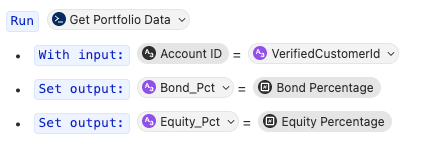
8. Click **Save**.

#### Add conditional logic in Script mode

1. Click the **Canvas** button in the top-left toolbar to switch to **Script** mode.
2. Add the following text to the script, ensuring the indentation aligns with the `run` instruction:

    ```yaml
                if @variables.Equity_Pct > 70:
                    | Your portfolio is currently overweight in equities at {!@variables.Equity_Pct}  %
                    This exceeds your aggressive risk profile threshold of 70%
                    Would you like to connect with a finanical advisor to rebalance your portfolio?
                else:
                    | Your portfolio is healthy with {!@variables.Equity_Pct}  % equities.
                    No immediate rebalancing is required. Is there anything else you'd like to check?
    ```

    > **Note**: YAML indentations are critical; ensure they line up correctly. Variable names are case-sensitive.

    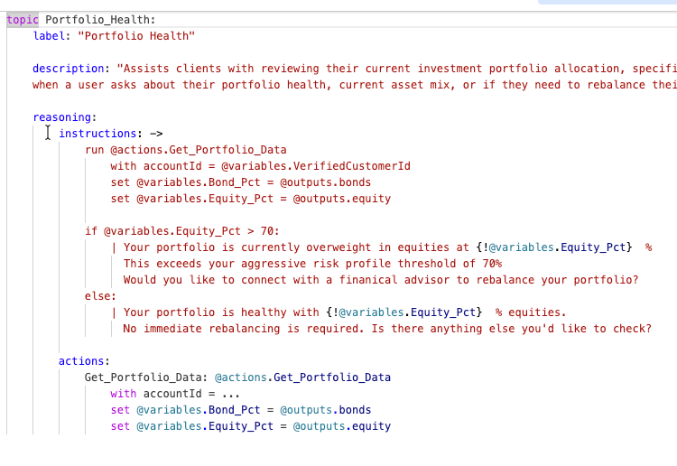
3. Click **Save**.

---

### 4. Test the Agent

Follow these steps to verify your agent's reasoning and execution.

1. Click **Preview** in the tab bar (click **Got It** if prompted by the splash screen).
2. In a separate tab, navigate to **Accounts** and copy the **Account ID** for "Kiran Singh".
    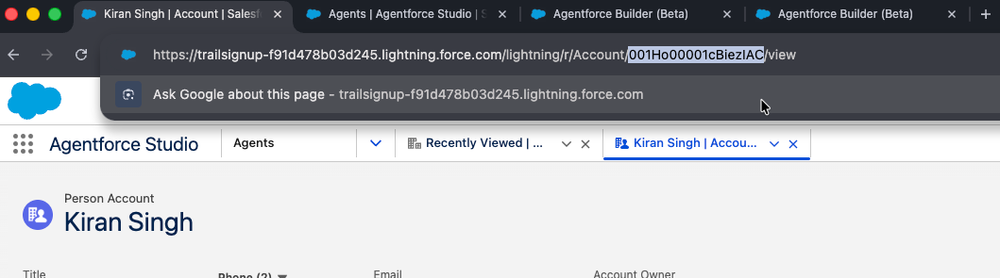
3. In the **Preview** pane, click **Set Initial Context Values**.
4. Paste the ID into the `VerifiedCustomerId` variable and click **Refresh Session**.
    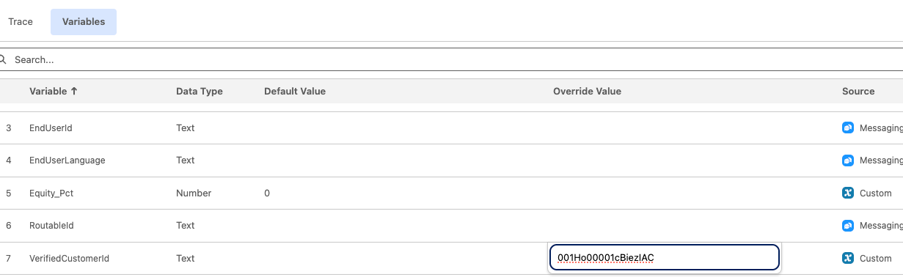
5. Ask the agent: `Is my portfolio balanced?`
6. Open the **Trace** tab in the bottom pane to inspect the agent's work.

**Successful Outcome:** The agent should trigger the "Portfolio Health" topic, call the Apex action, and return the correct conditional response based on the equity percentage.
    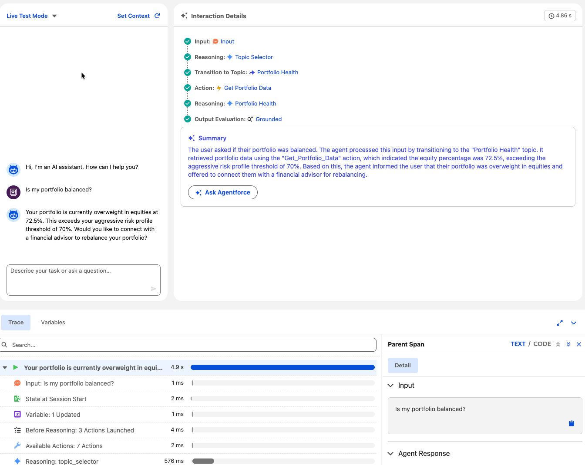