## Banking and Wealth Agentforce Workshop Overview

In this workshop, you will build a specialized AI agent using deterministic logics that's designed to assist wealth management customers. You will configure the agent to analyze investment portfolios and provide personalized advice based on a customer's risk profile.

### What we will explore

- How to create and configure a new agent using **Agentforce Studio**.
- How to define custom **Topics** and **Actions** for specific business logic.
- How to use deterministic instructions and variables to provide conditional responses.
- How to test and validate your agent using specific customer data.

---

### 1. Create an Action and Context Variable

Follow these steps to create the action context variable

1. Click the **App Launcher** (waffle icon) and select the **Agentforce Studio** application.  
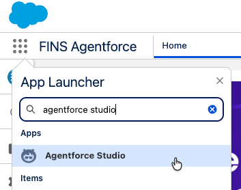
2. Click **Agents** and click on the **Banking Wealth Agent**  
3. In the left pane, select **Variables**.  This is where you can manage the variables used by your agent.  
4. Review the list of variables with a source of **Messaging Session**. Any context from the conversation channel can be provided through these variables.  
5. Click the **New** button and select **Create Custom Variable**  

  - **Name**: `accountJson`
  - **Data Type**: `String`
  
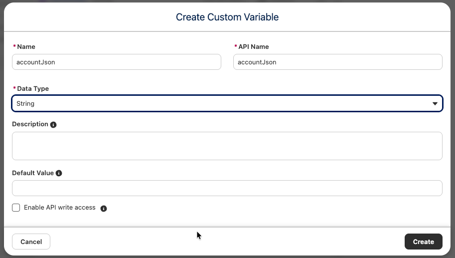  

6. Click **Create**

You will use this new variable to store all of the active policy details you retrieve about the customer so you can keep this context throughout the conversation.  

---

### 2. Create an Apex Action for Financial Account Questions

Follow these steps to create the Apex action:

1. In the left pane, expand the list of Topics. You will find a number of pre-configured topics, including **Financial Account Questions**, and click **Financial Account Questions**.
2. Review the description and instructions for this topic. This defines how the agent should behave when answering any customer questions about their policy.
3. In the canvas for the Financial Account Questions topic, click the **Select Action** button in the Actions Available for Resoning** section of the canvas.
4. Click **Create a custom action**
5. In the dialog, give the action a name of **Get Account Details** and a description of "Retrieves the details for an account"
6. Click **Create and Open**
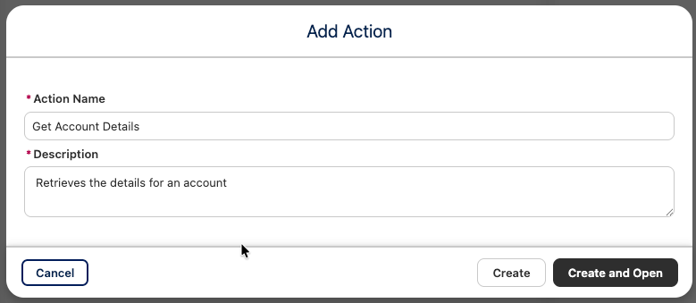

7. Click the **Reference Action Type** list box and select **Apex**
8. Click the **Reference Action** search box and select **BWAM - Get Account Details**
9. In the description field for **accountIds**, enter the following description: **account ID of the customer**.  Check the **Require input to execute action*** checkbox.
10. In the description field for **output**, enter the following description: **account JSON string**
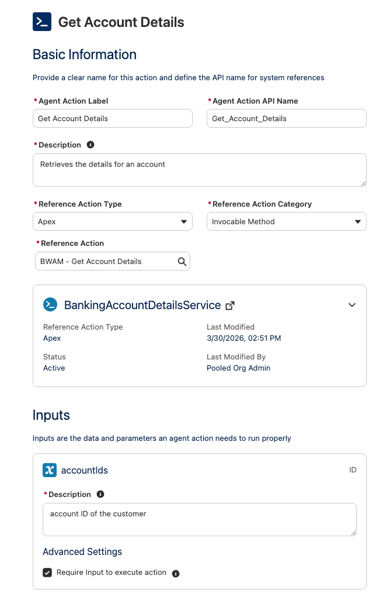
11. In the left hand pane, click on the **Financial Account Questions** topic.  At the bottom you will see **Get Account Details** listed as an available action.  Click on **Get Account Details** to expand its input and output variables.
12. Set the input variable to **Account ID**
13. Set the output variable to **accountJson**
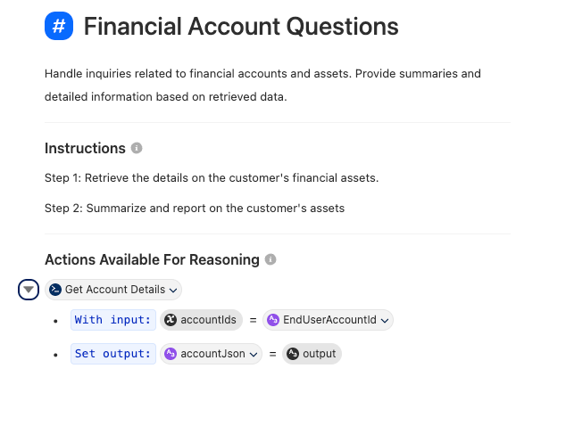
14. Click the **Save** button in the top right corner of the page or press **Ctrl-S** to save.

You have now finished configuring the action. Your agent can retrieve and retain proper context about your customer during the conversation.

---

### 3. Add Manage Beneficiary Topic

Now that you've given your agent the ability to retrieve context and details about your customer, you also want to give it tools to take action.

You will create a new topic for your agent to manage beneficiaries on a customer's account.

Follow these steps to create the topic:

1. In the left hand pane, hover over **Topics** and click the plus ( + ) button to create a new topic.
2. In the dropdown menu, select **New Topic**
3. For the **Topic Name** give it a value of "Manage Beneficiaries"
4. For the **Description** give it a value of :

```text
This 'Manage Beneficiaries' topic will allow customers to ask about, add or remove any existing Beneficiaries / Relationships associated to a specific financial Account. Using the financial account Ids in the accountJson variable, identify the financial account the customer is asking about. Ask for the name of the beneficiary, the percentage of the benefit to be received, and the tax ID for the beneficiary. When displaying the Financial Account Roles always include Related Account Name, Account Name, Role and Status. Execute Add Beneficiaries action when the customer wants to add new relationships or financial account role associated to a Financial Account. Execute the Remove Beneficiaries action when the customer wants to remove a relationship or financial account role associated to a Financial Account.
```
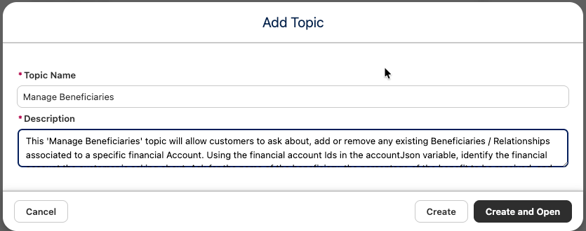
1. Click **Create and Open**
2. You will see a new topic called **Manage Beneficiaries** has been created.  Hover over the new topic name in the left panel and select the plus ( + ) symbol to add new topics.  Select to **Add From Asset Library**
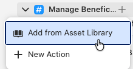
3. In the search box, enter **BWAM** to filter the topics.  Select **BWAM - Add Beneficiaries**, **BWAM - Get Beneficiaries**, and **BWAM - Remove Beneficiaries**
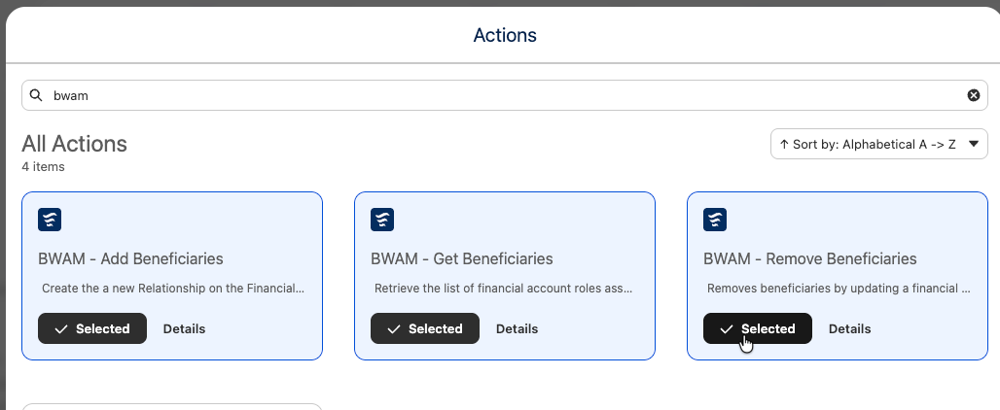

4. Click **Add to Agent**
5. Click the **Save** button in the top right corner of the page or press **Ctrl-S** to save.

Your agent can now help with beneficiary requests.

---

### 4. Test Our Agent

Follow these steps to test your agent:

1. Click the **Preview** button.  It is located at the top left of the canvas.
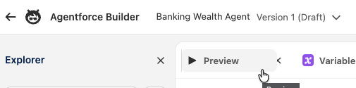
2. Click the **Set Context** link at the top of the chat window.  This will open up the list of variables in a pane at the bottom of the page.  
3. Find the **EndUserAccountId** variable and click on the cell for the **Override Value** column. This will allow you to set that variable for the test.  Search for **Kiran Singh** and select that account record.  
4. Click the **Apply and Restart Session** button.  It is located at the bottom left of the page.  
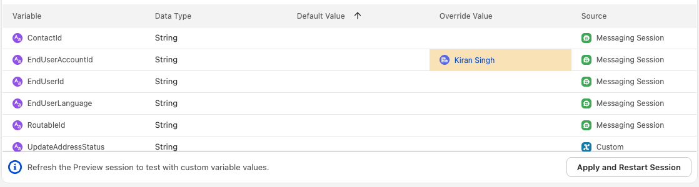
5. Start a conversation in the chat window.  You can start by asking questions like:

- What are all my accounts?
- What can you tell me about my assets?

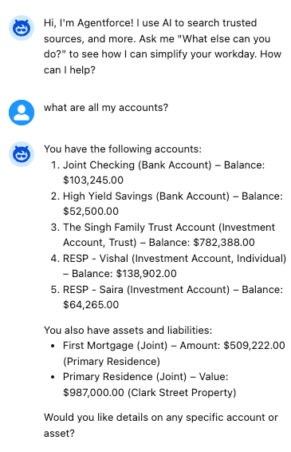

Feel free to experiment and ask the agent any other questions about financial accounts and assets. Some examples:

- What is the total balance across my investment accounts?
- What is the total valuation of my assets?
- What is the balance of my checking account?

To test the ability to manage beneficiaries, try this sequence:

1. Ask, **What are all my accounts?**
2. Ask, **Show me the relationships for the family trust**.
3. Say, **Help me add another person to this account**.
4. Provide details such as: **David Singh, david.singh@example.com, 2000-01-01, Beneficiary**. Make up any other details it may need
5. Say, **Remove David Singh**.

You can also test the agent from a customer portal.
In Setup, search for **All Sites** and click the URL link beside the **Retail** site to launch it.

Click the Messaging icon in the lower right corner to start a new chat session with the agent (it may take a few seconds to connect).
You can use the same questions and instructions from above.

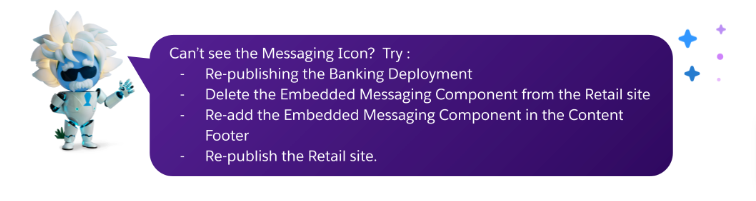
---

## Address Change

In this exercise, you will build a prompt and a flow, and update the **Address Change** topic in your banking agent to provide customers with a Çself-service way to manage their account address and communicate any follow-up actions to them.

In this exercise, you will:

- **Part 1**: Create a prompt flow to ground the nearest branch.
- **Part 2**: Create the **Nearest Branch Introduction** prompt.
- **Part 3**: Add the agent action to the agent.
- **Part 4**: Test your agent in the builder.


### Part 1: Create Prompt Flow to Ground the Nearest Branch

#### Create the flow

1. From Setup, in the Quick Find box, enter **Flows**, and then click **Flows**.
2. Click the **New Flow** button in the top right corner.
3. Select **Template-Triggered Prompt Flow**.

#### Configure the flow

1. Leave the **Input Type** as **Manual Inputs**.
2. Open the **Toolbox** pane from the top left and click **New Resource**.
3. Create a new input variable with the following values:

| **Field**                     | **Value**               | **Explanation**                                                                   |
| ----------------------------- | ----------------------- | --------------------------------------------------------------------------------- |
| Resource Type                 | Variable                | Variable type                                                                     |
| API Name                      | Account                 | Variable name that is the same as in the flex prompt                              |
| Data Type                     | Record                  | Input is a record                                                                 |
| Object                        | Account                 | Object data to be provided as input                                               |
| Availability Outside the Flow | Check **Available for input** | Lets the prompt provide the account data to provide dynamic grounding      |

4. Click **Done** to save the resource.

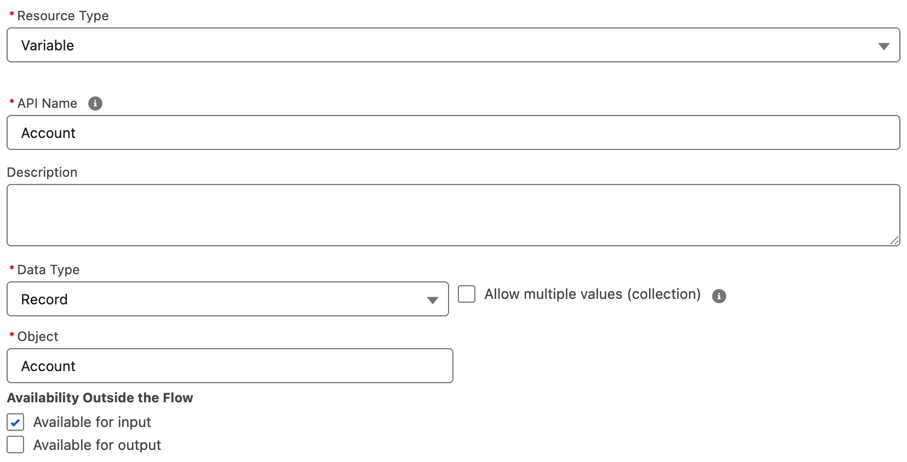


##### Get Records: Get Branches

5. Click on the + sign below the Start element and add the Get Records element  
  

<div style="margin-left: 40px; font-family: sans-serif;">
  <p>For <strong>Label</strong>, enter: <strong>Get Branches</strong></p>
  <p>For <strong>Description</strong>, enter: <strong>Find the Branch Details based on the Customer City</strong></p>
  <p>For <strong>Object</strong>, select <strong>Branch Unit</strong></p>
  <p>For <strong>Condition Requirements</strong>, add this condition:</p>
  <ul style="list-style-type: disc; margin-left: 20px;">
    <li>For <strong>Field</strong>, select <strong>Name</strong></li>
    <li>For <strong>Operator</strong>, select <strong>Equals</strong></li>
    <li>For <strong>Value</strong>, select <strong>Account</strong> then search and select <strong>BillingCity</strong> (Billing City)</li>
  </ul>
  <p>Note: This will look like {!$Account.BillingCity} and resolve to Account > Billing City  
Leave How Many Records to Store as Only the first record.
Leave How to Store Record Data as Automatically store all fields  </p>
</div>
   

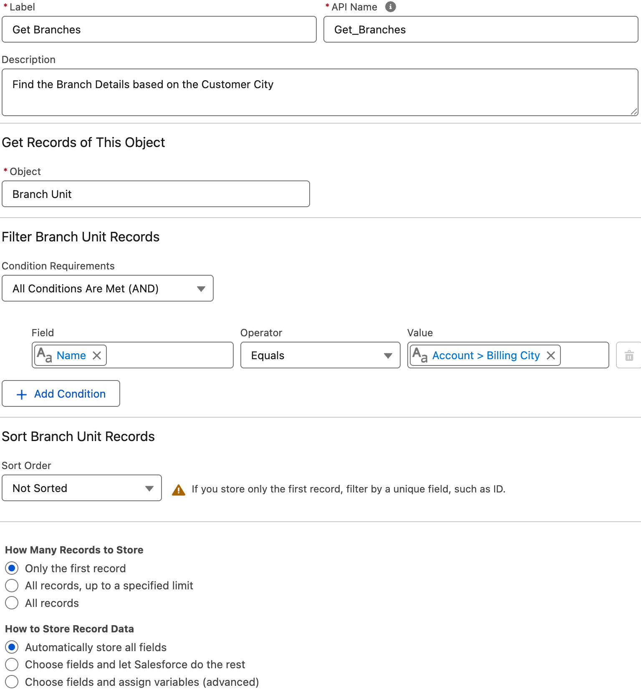

##### Add Prompt Instructions: Add Nearest Branch.

6. Click the + sign below the Get Branches step to add the Add Prompt Instructions element.  
<div style="margin-left: 40px; font-family: sans-serif;">
   <p>For <strong>Label</strong>, enter <strong>Add Nearest Branch</strong></p>
   <p>For <strong>Prompt Instructions</strong>, enter the text below.</p>
</div>
 

```
Branch address street: {!Get_Branches.Branch_Unit_Address__Street__s}
Branch address city: {!Get_Branches.Branch_Unit_Address__City__s}
Branch address state/province: {!Get_Branches.Branch_Unit_Address__StateCode__s}
Branch address zip code: {!Get_Branches.Branch_Unit_Address__PostalCode__s}
Branch address country: {!Get_Branches.Branch_Unit_Address__CountryCode__s}
Advisor Name: {!Get_Branches.BranchManager.Name}
```
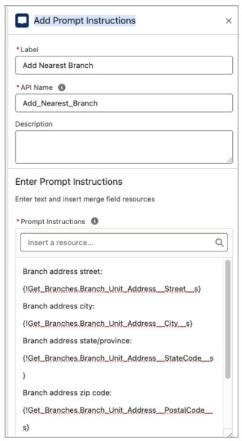

7. Click **Save** and in the modal enter: 
<div style="margin-left: 40px; font-family: sans-serif;">
   <p>For <strong>Flow Label</strong>, enter: <strong>BWAM - Grounding Nearest Branch</strong> </p> 
   <p>For the <strong>Description</strong>, enter: <strong>Find Nearest Branch for the Account</strong></p>
</div>

8. Click **Save** (it takes a moment to save)

9. Click **Activate** (it takes a moment to activate) 


---

### Part 2: Create "Nearest Branch Introduction" Prompt

This prompt helps the customer identify the nearest branch whenever the customer's address changes.

#### Create the prompt template

1. Click the **Setup** icon and select **Setup**.
2. In Quick Find, type **Prompt**.
3. Select **Prompt Builder** under the **Einstein Generative AI** group.
  *Salesforce displays the Prompt Builder list, including options to explore this feature.*
4. Click the **New Prompt Template** button to create a new **Prompt Template**.
  *Salesforce opens the **New Prompt Template** dialog.*
5. Complete the **New Prompt Template** form with the following values:


| **Field**            | **Value**                                                                                  | **Explanation**                                                                                                                       |
| -------------------- | ------------------------------------------------------------------------------------------ | ------------------------------------------------------------------------------------------------------------------------------------- |
| Prompt Template Type | Flex                                                                                       | Generate content for any business purposes that other templates don’t cover. Flex prompt templates let you define your own resources. |
| Prompt Template Name | BWAM - Nearest Branch Introduction                                                         | Required field.                                                                                                                       |
| API Name             | *(auto-generated)*                                                                         | Automatically generated.                                                                                                              |
| Template Description | Generates the follow up call to action to introduce a customer to their new nearest branch | Descriptions in metadata are used by the Planner service to understand the intent and purpose of this prompt template.                |
| Name                 | Account                                                                                    | Enter the **Name** of the object for which you want to create this template.                                                          |
| API Name             | Account                                                                                    | Enter the **API Name** of the object for which you want to create this template.                                                      |
| Source Type          | Object                                                                                     | Defines the resources that you want this prompt to use for generating content.                                                        |
| Object               | Account                                                                                    | Select the object you want to use in this template.                                                                                   |


1. Click **Next**.
2. Copy/paste the following text into the Prompt Template workspace:

```text
You are a service agent and a customer, {!$Input:Account.Name}, has just updated their address to their new home. Write a chat response to the customer informing them of the branch address closest to their new home and the name of the wealth advisor at that branch.

You must treat equally any individuals or persons from different socioeconomic statuses, sexual orientations, religions, races, physical appearances, nationalities, gender identities, disabilities, and ages. When you do not have sufficient information, you must choose the unknown option, rather than making assumptions based on any stereotypes.


"""

At the beginning of the message, congratulate the customer on their new home and let them know we're here to provide them peace of mind with their new property and move.

Do not address the customer like you would in an email, but respond as if it is part of an ongoing chat conversation with the customer.

Do not say hello or address the customer as dear. Do not sign off in the response.

Inform them that the branch nearest them is at the address provided below and that the wealth advisor there is eager to connect and understand their needs.

"""


New address: {!$Input:Account.BillingStreet}, {!$Input:Account.BillingCity} {!$Input:Account.BillingState}, {!$Input:Account.BillingPostalCode}, {!$Input:Account.BillingCountry}

{!$Flow:BWAM_Grounding_Nearest_Branch.Prompt}
```

1. Select the **OpenAI GPT 4 Omni Mini** model.
2. Click **Save** and **Activate** the template.

---

### Part 3: Add Agent Action to Agent

To use your custom Agent action, you need to add it to the **Update Address** topic in the **Banking Wealth Agent**

1. If you closed the tab, navigate back to **Agentforce Studio** and click on the **Banking Wealth Agent**
2. In the left hand panel, find the **Update Address** topic and expand it.  Click the plus ( + ) symbol to add a new action.
3. In the menu, select **New Action**
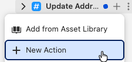
4. Set the Action Name to **Nearest Branch Introduction** and give it the following description:

```text
Lets customers who have recently changed address what their nearest branch location is.
```

1. Click the **Create and Open** button
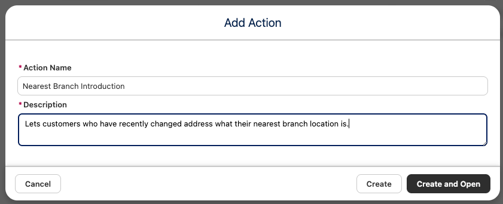
2. You should now be in the canvas for the new action.  Click the **Reference Aciton Type** dropdown and select **Prompt Template**
3. In the **Reference Action** search box, select the **BWAM - Nearest Branch Introduction** prompt template, which you created in the previous section.
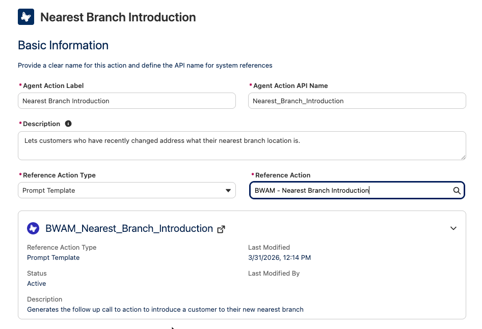
4. In the description for the **Account** input, enter the following:

```text
This is the account that is related to the user's request
```
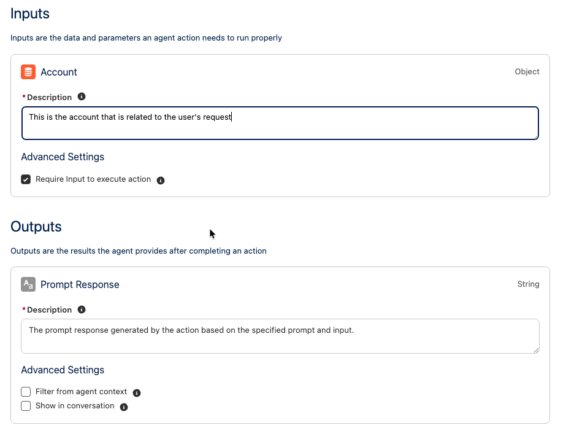
To finalize the topic, we need to update the instructions:

1. Click on the **Update Address** topic in the left hand pane to open the topic configuration in the canvas.
2. Append the following instrucitons the end of the already listed instructions:

```text
Ask the customer if they would like more information on their new nearest branch immediately after successfully updating their address. If the customer does want to find their nearest branch, run the 'BWAM - Nearest Branch Introduction' action and provide the response to the customer.
```

1. At the bottom of the canvas you will find the **Nearest Branch Introduction** action.  Click on it to expand it.
2. Set the input variable value to **Account Id**
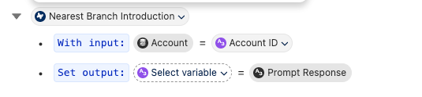
3. Click the **Save** button or press **Crtl-S** to save the agent configuration.

---

### Part 4: Test your agent

1. Click the **Preview** button.  It is located at the top left of the canvas.

2. Click the **Set Context** link at the top of the chat window.  This will open up the list of variables in a pane at the bottom of the page.
3. Find the **EndUserAccountId** variable. If **Kiran Singh** isn't still set as the value, then click on the cell for the **Override Value** column. This will allow you to set that variable for the test.  Search for **Kiran Singh** and select that account record. Click the **Apply and Restart Session** button.  It is located at the bottom left of the page.

4. In the conversation pane, test the agent with the following prompts:
- "I want to update my address"
- "Kiran Singh"
- "120 N LaSalle St, Chicago, Illinois, 60602, United States"
- "Yes"

Here is an example of what you should see

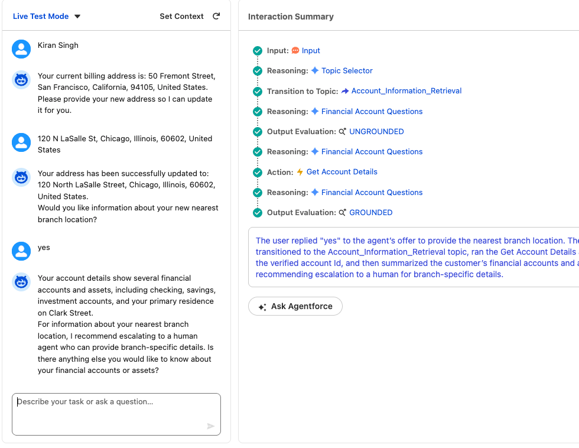

