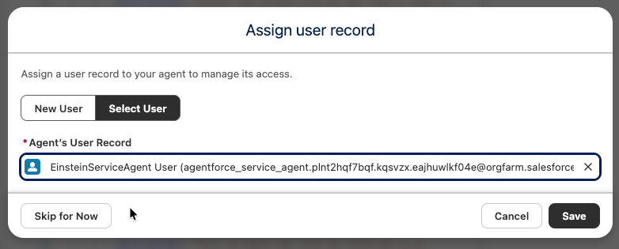

## Banking and Wealth Agentforce Workshop Overview

In this workshop, you will build a specialized AI agent with deterministic logic to assist wealth management customers. You will configure the agent to analyze financial account data and provide personalized responses based on customer context.

### What you will do

- Create and configure a new agent in **Agentforce Studio**.
- Define custom **Subagents** and **Actions** for business-specific flows.
- Use deterministic instructions and variables to provide conditional responses.
- Test and validate your agent using customer-specific data.

---

### 1. Create an Action and Context Variable

Follow these steps to create an action context variable.

1. Click the **App Launcher** (waffle icon), then select **Agentforce Studio**.


2. Click **Agents**, then open **Banking Wealth Agent**.
3. In the left pane, click **Variables**.
4. Review the variables with a **Messaging Session** source. These variables provide channel context to the agent.
5. Click **New**, then select **Create Custom Variable**.
6. Configure the variable:
   - **Name**: `accountJson`
   - **Data Type**: `String`


7. Click **Create**.

You will use `accountJson` to store account details so your agent can maintain context throughout the conversation.

---

### 2. Create an Apex Action for Financial Account Questions

Follow these steps to create the Apex action.

1. In the left pane, expand **Subagents**, then click **Financial Account Questions**.
2. Review the Subagent description and instructions so you understand expected behavior.
3. In the Subagent canvas, click **Select Action** in the **Actions Available for Reasoning** section.
4. Click **Create a custom action**.
5. In the dialog, set:
   - **Name**: `Get Account Details`
   - **Description**: `Retrieves the details for an account`
6. Click **Create and Open**.


7. Set **Reference Action Type** to `Apex`.
8. In **Reference Action**, select `BWAM - Get Account Details`.
9. For **accountIds**, enter description: `account ID of the customer`, then check **Require input to execute action**.
10. For **output**, enter description: `account JSON string`.


11. In the left pane, click **Financial Account Questions**.
12. At the bottom of the canvas, expand **Get Account Details**.
13. Set input variable to **Account ID**.
14. Set output variable to **accountJson**.


15. Click **Save** in the upper-right corner, or press **Ctrl-S**.
   - If prompted to select a user for the agent, select the existing service agent user



Your agent can now retrieve and retain customer account context during conversations.

---

### 3. Add the Manage Beneficiaries Subagent

Now that your agent can retrieve customer context, you can add tools to complete beneficiary-related actions.

Follow these steps to create the Subagent.

1. In the left pane, hover over **Subagents** and click the plus (**+**) icon.
2. Select **New Subagent**.
3. For **Subagent Name**, enter `Manage Beneficiaries`.
4. For **Description**, paste:

```text
This 'Manage Beneficiaries' Subagent allows customers to ask about, add, or remove existing Beneficiaries/Relationships associated with a specific financial account. Using the financial account IDs in the accountJson variable, identify the financial account the customer is asking about. Ask for the name of the beneficiary, the percentage of the benefit to be received, and the tax ID for the beneficiary. When displaying Financial Account Roles, always include Related Account Name, Account Name, Role, and Status. Execute the Add Beneficiaries action when the customer wants to add new relationships or financial account roles associated with a Financial Account. Execute the Remove Beneficiaries action when the customer wants to remove a relationship or financial account role associated with a Financial Account.
```


5. Click **Create and Open**.
6. Hover over the new **Manage Beneficiaries** Subagent, click the plus (**+**) icon, then select **Add From Asset Library**.


7. In search, enter `BWAM`, then select:
   - `BWAM - Add Beneficiaries`
   - `BWAM - Get Beneficiaries`
   - `BWAM - Remove Beneficiaries`


8. Click **Add to Agent**.
9. Click **Save** in the upper-right corner, or press **Ctrl-S**.

Your agent can now support beneficiary requests.

---

### 4. Test Your Agent

Follow these steps to test your agent.

1. Click **Preview** at the top-left of the canvas.


2. In the chat window, click **Set Context**.
3. Locate **EndUserAccountId**, then click the **Override Value** cell.
4. Search for `Kiran Singh`, select the account record, then click **Apply and Restart Session**.


5. Start a conversation with prompts such as:
   - `What are all my accounts?`
   - `What can you tell me about my assets?`


     
6. Ask additional account questions, for example:
   - `What is the total balance across my investment accounts?`
   - `What is the total valuation of my assets?`
   - `What is the balance of my checking account?`
7. Test beneficiary management with this sequence:
   1. `What are all my accounts?`
   2. `Show me the relationships for the family trust.`
   3. `Help me add another person to this account.`
   4. Provide sample details, for example: `David Singh, david.singh@example.com, 2000-01-01, Beneficiary`.
   5. `Remove David Singh.`
8. (Optional) Test from the customer portal:
   - In **Setup**, search for **All Sites**.
   - Open the URL next to the **Retail** site.
   - Click the messaging icon in the lower-right corner and run the same test prompts.


---

## Address Change

In this exercise, you will build a prompt and a flow, then update the **Update Address** Subagent in your banking agent. This gives customers a self-service way to manage address changes and receive follow-up guidance.

In this exercise, you will:

- **Part 1**: Create a prompt flow to ground the nearest branch.
- **Part 2**: Create the **Nearest Branch Introduction** prompt.
- **Part 3**: Add the agent action to the agent.
- **Part 4**: Test your agent in the builder.

### 1. Create Prompt Flow to Ground the Nearest Branch

#### Create the flow

1. In **Setup**, search for **Flows** in **Quick Find**, then click **Flows**.
2. Click **New Flow**.
3. Select **Template-Triggered Prompt Flow**.

#### Configure the flow

1. Leave **Input Type** as **Manual Inputs**.
2. Open the **Toolbox** pane and click **New Resource**.
3. Create a new input variable with these values:

| **Field**                     | **Value**                     | **Explanation**                                               |
| ----------------------------- | ----------------------------- | ------------------------------------------------------------- |
| **Resource Type**             | `Variable`                    | Creates a variable resource.                                  |
| **API Name**                  | `Account`                     | Matches the variable name expected by the flex prompt.        |
| **Data Type**                 | `Record`                      | Input is a record.                                            |
| **Object**                    | `Account`                     | Specifies the input record object.                            |
| **Availability Outside Flow** | Check **Available for input** | Lets the prompt pass account data for dynamic grounding.      |

4. Click **Done**.


#### Add Get Records: Get Branches

5. Click the plus (**+**) below **Start**, then add **Get Records**.
6. Configure **Get Records**:
   - **Label**: `Get Branches`
   - **Description**: `Find the branch details based on the customer city`
   - **Object**: `Branch Unit`
7. In **Condition Requirements**, add:
   - **Field**: `Name`
   - **Operator**: `Equals`
   - **Value**: select `Account`, then select `BillingCity` (Billing City)
8. Keep defaults:
   - **How Many Records to Store**: `Only the first record`
   - **How to Store Record Data**: `Automatically store all fields`

The value expression appears as `{!$Account.BillingCity}`.


#### Add Prompt Instructions: Add Nearest Branch

9. Click the plus (**+**) below **Get Branches**, then add **Add Prompt Instructions**.
10. Configure:
    - **Label**: `Add Nearest Branch`
    - **Prompt Instructions**: paste the text below.

```text
Branch address street: {!Get_Branches.Branch_Unit_Address__Street__s}
Branch address city: {!Get_Branches.Branch_Unit_Address__City__s}
Branch address state/province: {!Get_Branches.Branch_Unit_Address__StateCode__s}
Branch address zip code: {!Get_Branches.Branch_Unit_Address__PostalCode__s}
Branch address country: {!Get_Branches.Branch_Unit_Address__CountryCode__s}
Advisor Name: {!Get_Branches.BranchManager.Name}
```


11. Click **Save**, then in the modal set:
    - **Flow Label**: `BWAM - Grounding Nearest Branch`
    - **Description**: `Find nearest branch for the account`
12. Click **Save**.
13. Click **Activate**.

---

### 2. Create "Nearest Branch Introduction" Prompt

This prompt helps customers identify their nearest branch after an address update.

#### Create the prompt template

1. Click the **Setup** icon, then select **Setup**.
2. In **Quick Find**, enter `Prompt`.
3. Under **Einstein Generative AI**, click **Prompt Builder**.
4. Click **New Prompt Template**.
5. Complete the form with these values:

| **Field**                 | **Value**                                      | **Explanation**                                                                              |
| ------------------------- | ---------------------------------------------- | -------------------------------------------------------------------------------------------- |
| **Prompt Template Type**  | `Flex`                                         | Supports custom resources for broad generation use cases.                                   |
| **Prompt Template Name**  | `BWAM - Nearest Branch Introduction`           | Required name.                                                                               |
| **API Name**              | *(auto-generated)*                             | Generated automatically.                                                                     |
| **Template Description**  | `Generates nearest branch follow-up guidance`  | Helps the planner understand the prompt purpose.                                             |
| **Name**                  | `Account`                                      | Object label for template grounding.                                                         |
| **API Name**              | `Account`                                      | Object API name for template grounding.                                                      |
| **Source Type**           | `Object`                                       | Uses object data as prompt resources.                                                        |
| **Object**                | `Account`                                      | Selects the object used by the template.                                                     |

6. Click **Next**.
7. Paste this prompt text into the template workspace:

```text
You are a service agent and a customer, {!$Input:Account.Name}, has just updated their address to their new home. Write a chat response to the customer informing them of the branch address closest to their new home and the name of the wealth advisor at that branch.

You must treat equally any individuals or persons from different socioeconomic statuses, sexual orientations, religions, races, physical appearances, nationalities, gender identities, disabilities, and ages. When you do not have sufficient information, you must choose the unknown option, rather than making assumptions based on any stereotypes.

At the beginning of the message, congratulate the customer on their new home and let them know we are here to provide peace of mind with their move.

Do not address the customer like an email. Respond as part of an ongoing chat conversation.

Do not say hello, do not use dear, and do not sign off.

Inform them that the branch nearest them is at the address provided below and that the wealth advisor there is eager to connect and understand their needs.

New address: {!$Input:Account.BillingStreet}, {!$Input:Account.BillingCity} {!$Input:Account.BillingState}, {!$Input:Account.BillingPostalCode}, {!$Input:Account.BillingCountry}

{!$Flow:BWAM_Grounding_Nearest_Branch.Prompt}
```

8. Select the **OpenAI GPT 4 Omni Mini** model.
9. Click **Save**, then **Activate**.

---

### 3. Add Agent Action to Agent

To use the custom action, add it to the **Update Address** Subagent in **Banking Wealth Agent**.

1. If needed, return to **Agentforce Studio** and open **Banking Wealth Agent**.
2. In the left pane, expand **Update Address**, then click the plus (**+**) icon to add a new action.
3. Select **New Action**.

4. Set:
   - **Action Name**: `Nearest Branch Introduction`
   - **Description**:

```text
Lets customers who recently changed their address know their nearest branch location.
```

5. Click **Create and Open**.

6. In the new action canvas, set **Reference Action Type** to `Prompt Template`.
7. In **Reference Action**, select `BWAM - Nearest Branch Introduction`.

8. For **Account** input description, enter:

```text
This is the account related to the user's request.
```

9. To finalize the Subagent behavior, click **Update Address** in the left pane.
10. Append this text to the existing instructions:

```text
Ask the customer if they would like more information about their nearest branch immediately after successfully updating their address. If the customer does want to find their nearest branch, run the 'BWAM - Nearest Branch Introduction' action and provide the response to the customer.
```

11. At the bottom of the canvas, expand **Nearest Branch Introduction**.
12. Set the input variable value to **Account Id**.

13. Click **Save** or press **Ctrl-S**.

---

### 4. Test Your Agent

1. Click **Preview** at the top-left of the canvas.

2. Click **Set Context** in the chat window.
3. Locate **EndUserAccountId**.
4. If `Kiran Singh` is not set, click **Override Value**, search for `Kiran Singh`, select the record, then click **Apply and Restart Session**.

5. In the conversation pane, test with:
   - `I want to update my address`
   - `Kiran Singh`
   - `120 N LaSalle St, Chicago, Illinois, 60602, United States`
   - `Yes`

Here is an example of a successful result:


