## Relationship Assistant Agent

In this exercise, we will explore some of the standard Agentforce tools in Financial Services Cloud and how to build an assistive agent for bank tellers, wealth insurance advisors or producers to be more productive. The Agent we'll build today will assist employees with managing their relationships with clients.

Part 1: Build and deploy a relationship assistant agent

Part 2: Give our agent the ability to analyze PDF files

We will explore:

- **Agent Creator** to rapidly build a new agent using a Financial Services Cloud template
- **Topics & Instructions** to coach/instruct our Agents on how to behave and what to do
- **Prompt Builder** to give our Agent the ability to work with both structured and unstructured data

Click Next to get started!

## 1.1 Build and Deploy an Agent

In this exercise we will first explore the standard Agentforce assets that come with Financial Services Cloud and how we can leverage them to accelerate building our Relationship Assistant Agent.

Click the **Setup Cog** icon at the top right and select **Setup**. Search for **Agentforce** in **Quick Find** and select **Agentforce Assets**.

This page has 2 tabs - Topics and Actions

1. Topics are how we organize and define how our Agent should operate and captures the instructions and scope of what an Agent should do. Review the list of existing standard topics for templates on how Agents can handle certain tasks. You'll notice there are a number of financial services specific topics, including **Financial Account Balances**, **Checkbook Ordering** and **Transfer Funds**
2. Actions are the tools we can give Agents to execute for their jobs to be done. There are a lot of standard actions available for many of the common tasks we may want an agent to do. There are also financial services-specific ones such as creating cases for **transfer funds**, **checkbook requests** or **fee reversals**, **interaction summaries** and **getting financial account data**. Take a look through this list as well

Let's now use some of these assets to build an agent. In **Quick Find**, search for and select **Agentforce Agents**. At the top right, click the **+ New Agent** button to get taken to the Agent Creator. We can see that there are a lot of agent templates we can use to get started. For this exercise, we will use the **Banking Relationship Assistance** template. Click it and then click **Next** in the top right.

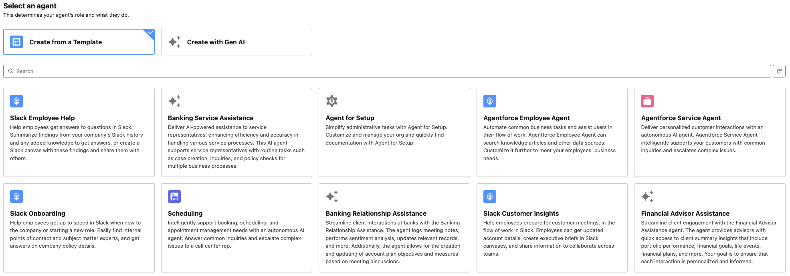

On the next screen, by default, there is the **Post-Meeting Assistance** Topic associated with the agent that gives our agent a bunch of assistive tools for helping employees track and manage their customer interactions in FSC. Click Next again to get to the **Customize your Agent** section. We'll make a few adjustments here (because relationship management spans across financial products):

- Name = Relationship Assistant
- API Name = Relationship_Assistant
- Description = Streamline client interactions at a financial services organization with Relationship Assistance. The agent logs meeting notes, performs sentiment analysis, updates relevant records, and more. Additionally, the agent allows for the creation and updating of account plan objectives and measures based on meeting discussions. The agent can help with analysis of the customer's income statements and provide insights into any discrepancies
- Role = **Leave as-is**
- Company = As a large financial services organization, Cumulus Financial provides a wide range of services, including retail banking, wealth management and life insurance policies

After adjusting the Agent details, click **Next** and then **Create**.

This will take us into the Agent Builder where we can further configure and build out our agent. On the left, we have all our configurations tools. The right has the Conversation Preview where we can test our agent. In the middle, we can see the reasoning and process flow that our Agent goes through in real time when we test our agent.

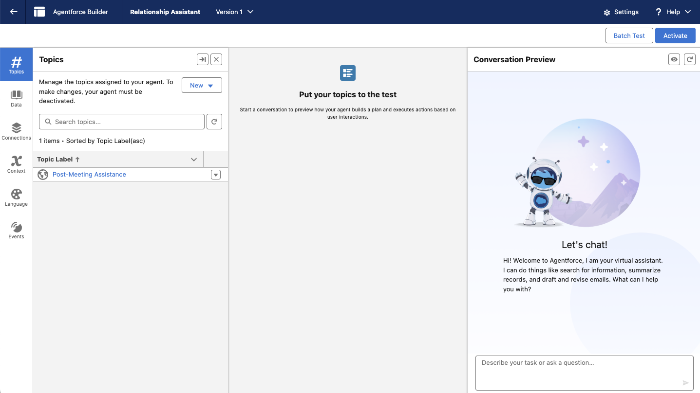

## 1.2 Build Multimodal Prompt to Analyze Income Statements

While assisting with managing interactions is very helpful, we want to give our agent the ability to analyze income statements of our customers.

Back in Setup, search and select Prompt Builder. In the top right, click New Prompt Template and provide this definition:

**Prompt Template Type** = Flex
**Prompt Template Name** = INS - Analyze Income Statement
**Template Description** = Summarize an income statement document and identify discrepancies

Under Define Sources add 2 variables:

| Name | API Name | Source Type | Object |
| ---- | ---- | ---- | ---- |
| Account | Account | Object | Account |
| Income Statement | Income_Statement | Object | File |

Click Next and we will be taken into the Prompt Builder. There are 3 panes here:

1. **Prompt**: The prompt template that we will provide
2. **Resolved Prompt**: The raw prompt that is sent to the LLM with the resolved RAG data
3. **Response**: Results from the LLM
On the left under Template Settings, we can choose/configure the LLM being used, choose allowed languages and provide inputs for testing our prompt. Copy/paste the prompt template below into the Prompt pane:

```text
Analyze and provide a succinct summary of an income statement file for a business owned by <CUSTOMER_NAME> to identify the costs, revenue, profits, discrepancies and income statement year.
Provide a succinct bulleted list summary of the income statement
Do not exceed over 200 words
Focus on the most recent year data and any discrepancies in the document. If there are no discrepancies, explicitly state that
```

In our prompt template, we have the placeholder **<CUSTOMER_NAME>** that we want to replace with grounding of the actual customer's name. Delete this placeholder and with your cursor at its location, click the **+ Insert Resource** drop-down in the prompt pane. From this drop-down, we can insert structured and unstructured data from flows, objects, vector database, data cloud and more sources. In our case, we want to click Account and then search for and click Account Name to insert this field variable into our prompt.

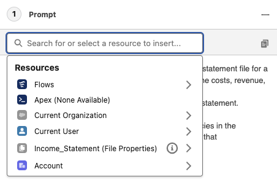 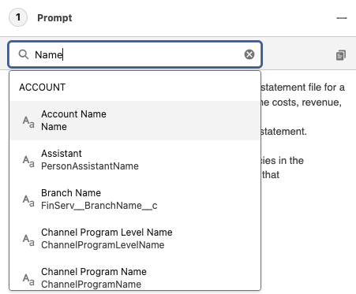
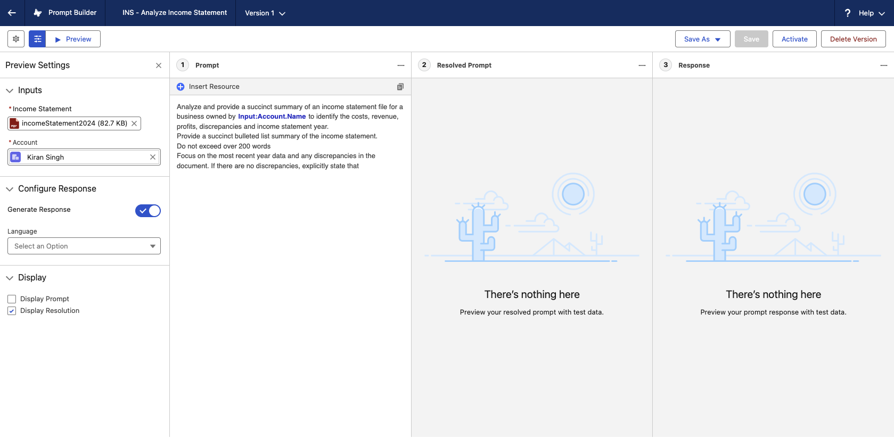

At the top left, click **Save & Preview** and you will be asked to provide inputs. Search for and select **Kiran Singh** for **Account**. For **Income Statement**, click Select File and search for, select and add the **incomeStatement2024** file. Click the **Preview** button at the top again and now we can see the analysis results

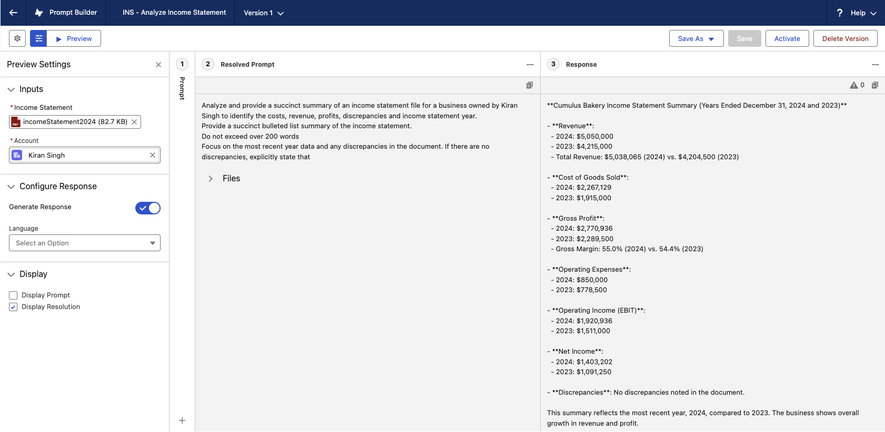

In the top right, click the **Activate** button

### 1.3 Update our Agent

Now that we have our prompt, we want to add it to our Relationship Assistance Agent. Back in Setup, search for **Agentforce** in **Quick Find** and select **Agentforce Agents**. In the list of agents, expand **Relationship Assistance** by clicking the **>** and clicking **Version 1**

In the Agent Builder, in the Topics pane on the left, select the **New** drop-down and click on **+ New Topic**. When prompted about what you want this topic to do, copy/paste this in:

```text
Summarize and analyze a customer's income statement document
```

Review the generated Description, Scope and Instructions, then click **Next**. In the list of Actions, search for and check off the **INS - Get File on Account** pre-built action and click **Finish**. This action will retrieve the income statement file for our agent.

We now also want to add our prompt template into the Topic. Click our newly created topic on the left and then select the **This Topic's Action** tab at the top.

Open the **New** drop-down and select **+ Create New Action**. For Reference Action Type, select **Prompt Template**. In Reference Action, select the prompt we created: **INS - Analyze Income Statement**. Click **Next**. Finish the action definition by:

1. Uncheck **Show loading text for this action**
2. For the **Account** input variable, enter these instructions: Account record of the customer
3. For the **File** input variable enter these instructions: Income statement file
4. For the **Prompt Response** output variable, check off **Show in conversation**
5. Click **Finish**

We've now finished updating our agent, click Activate at the top right to turn it on!

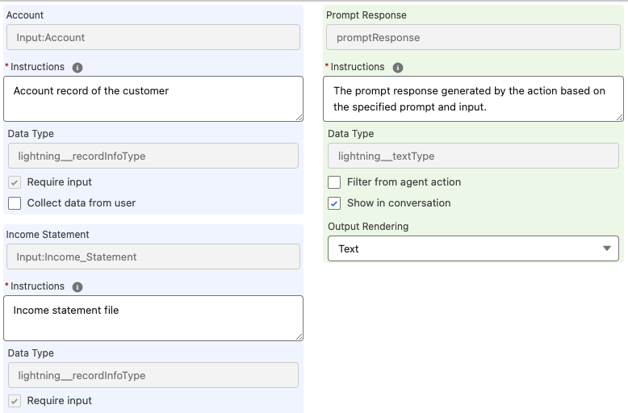

### 1.4 Deploy and Test the Relationship Assistant

We are almost done! Our agent is built and now we can deploy and test it out. Go back to Setup and in Quick Find, search for and select **Permission Set**. On the left side, click **R** to filter to permission sets that start with "R" where we will want to select the **Relationship Assistant Agent Access** permission set. This permission set is already assigned to our user, but we want to associate our agent with it. At the bottom of the Apps section, click **Agent Access**

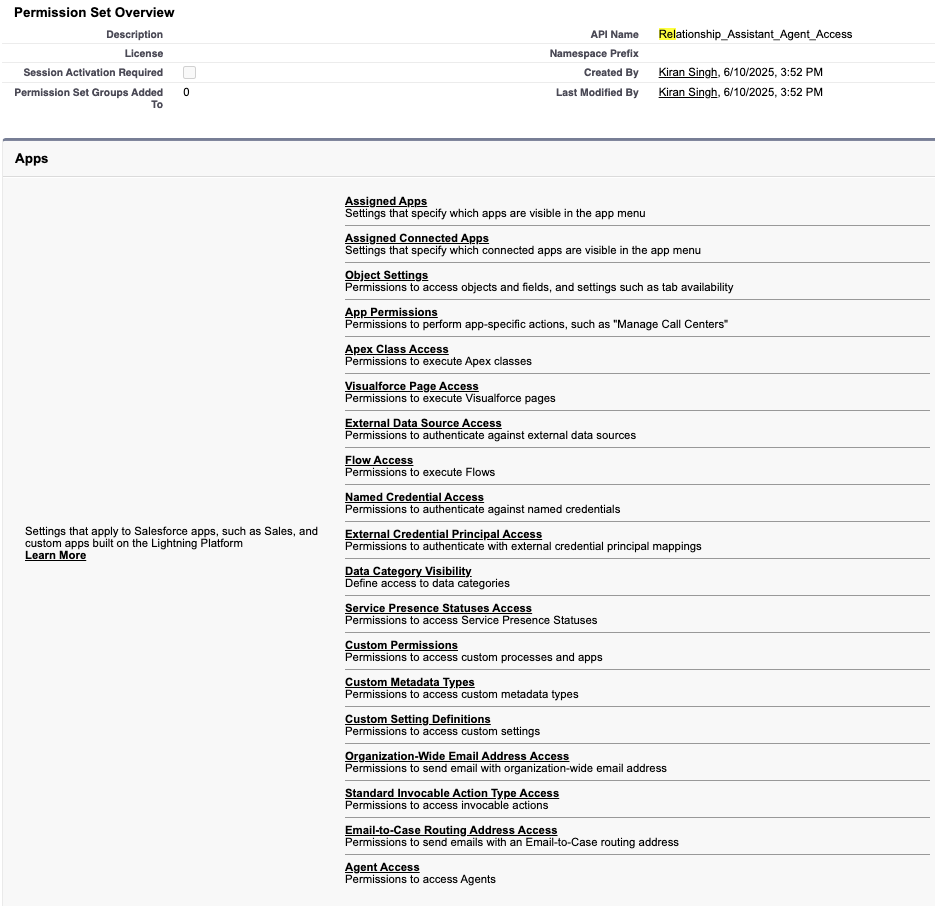

Click the **Edit** button in the middle. Select our **Relationship Assistant** Agent and the **Add** right arrow to move it from the Available Agents to Enabled Agents column. Click **Save**. Now our agent is assigned to our user!

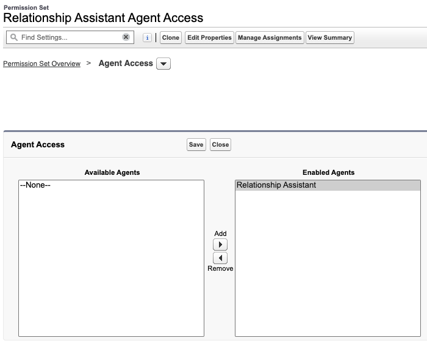

Click the **App Launcher** (9 dots at the top left) and search for and select **Accounts**. In the list of accounts, find and open the **Kiran Singh** Account record. You will also now see the Agentforce icon at the top right. Click it to open a chat window with our Relationship Assistant. We can now ask it to do a number of things, such as:

1. Analyze the income statement for kiran singh
2. For my phone call with Kiran Singh on his account, we talked about this financial goals and his appetite for risk in his investments. The call was very positive and we had follow ups to explore some more risky financial products to include in his portfolio. This call happened today from 3-4PM

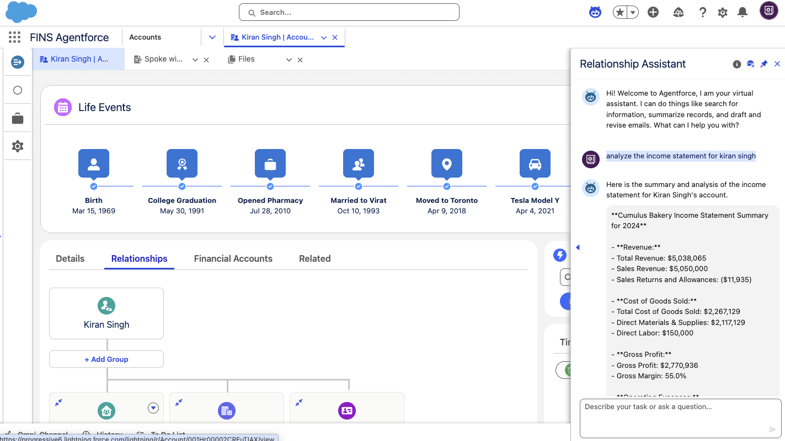

### 1.5 Automate Agent Testing

Building agents is critical, but its critical that we can rapidly iterate and evolve our coaching over time. To maintain the consistency and quality of our core agent capabilities as we change.

Back in **Agent Builder** for our **Relationship Assistance** agent, let's click the **Batch Test** button at the top right. This will take us to **Agentforce Testing Center** and asked to define a **New Test** where we can define a suite of test use cases to automate testing for our Agent. Let's start by naming our new test **Relationship Assistant Test Suite** and click **Next**

For Test Conditions, check off **Include context variables**, then check off the **currentRecordId** context variable and finally click **Next**. This way our tests will include this context, knowing which customer record the user is currently viewing.

In the next **Test Data** section, we can upload test cases in CSV format or use generative AI to create test use cases. For this exercise, we will define use cases with generative AI.

1. Click the **Generate Test Cases based on topics and actions** button
2. Set Number of test cases = 6
3. Copy/paste this prompt into the describe the test cases box:

```text
Build 5 test cases for the Post-Meeting Assistance Topic about creating an interaction, creating a task, drafting an email to the customer, creating an interaction attendee and creating an interaction summary. Create 1 test case for the Income Statement Analysis Topic that will analyze the income statement of the customer
```
<p float="left">
  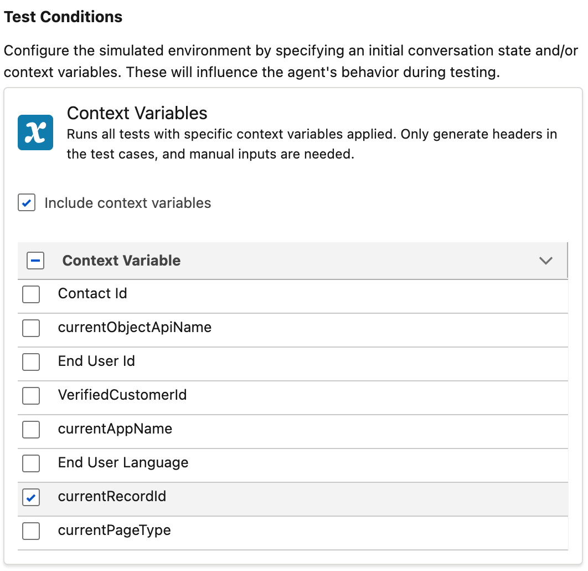
  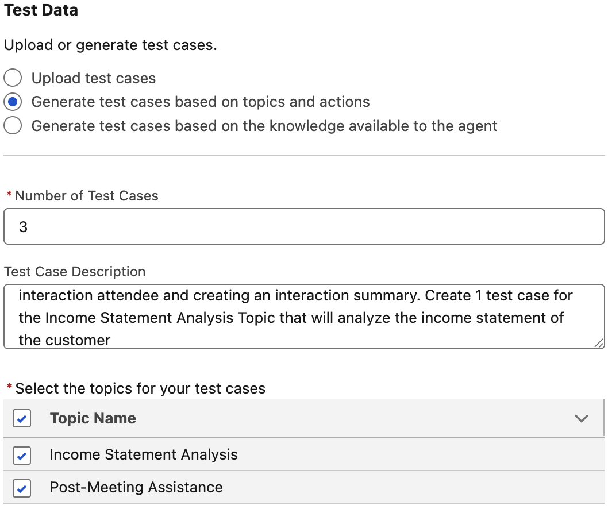 
</p>

Click **Next**. The Evaluations section lets us choose which criteria we want to evaluate when we run our test. Let's check off all evaluation criteria and click **Generate Test Cases**

This next part can take a few minutes so take a break, relax, and watch some cat videos. Refresh the screen after 1-2 minutes and you should see 6 test cases generated for you. Let's see how our agent performs against this now by clicking **Run Test Suite** at the top right

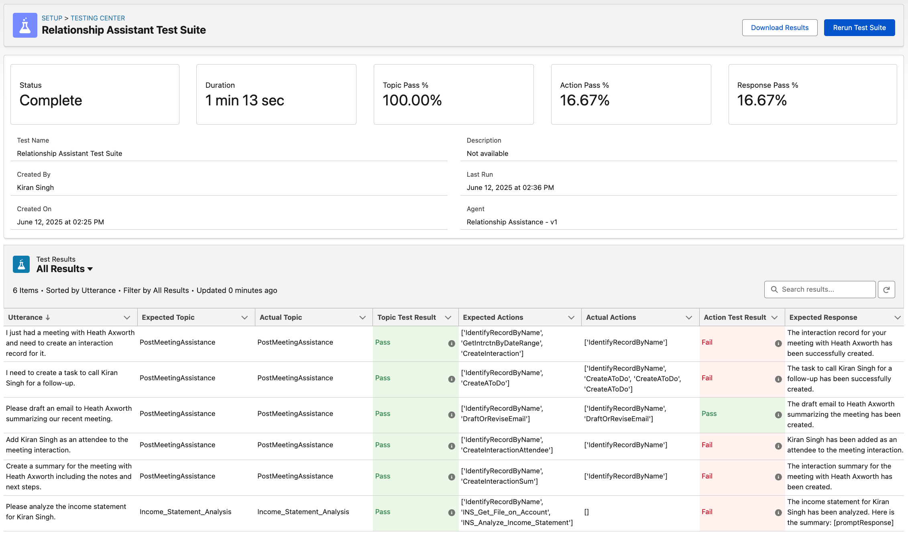

After another 1-2 minutes, our set of tests should be finished running! Refresh the screen again and the status should be **Complete**. You can see the range of results and iterate on the test prompts from here to better reflect the use cases you want to test for.

It is also best to keep in mind that not getting a follow-up question from the agent can be a good thing and that agents are inherently semantic. Test results will not always consistently pass the same use cases, even if we changed nothing. Even so, this can be a great tool to monitor your agent's performance and catch any red flags before an end user does!

<p style="text-align: center;"><strong style="color: purple; font-size: 30px; font-weight: bold;">Congratulations!</strong>

<p style="text-align: center;"><strong style="color: purple; font-size: 18; font-weight: bold;">You've completed the Financial Services Agentforce Workshop!

