# Insurance Agentforce Workshop Overview

In this workshop, you will configure an Agentforce-powered insurance agent that can answer complex policy questions, surface relevant claims and payment history, and guide customers through billing updates in real time. You’ll update existing flows, wire them into agent actions, and use context variables so the agent always has the right customer data at its fingertips.

## 1. Answer Insurance Policy Questions

This is the first and foundational exercise that we will use to enable all of our other exercises. We will give our Agent the proper context about the customer so that the agent has all the information about the customer's policies, claims, and payments on hand.

**Part 1**: Update flow to retrieve claims and payments information for the Agent  
**Part 2**: Create a new agent action to retrieve all of a customer's active insurance policy details  
**Part 3**: Test the new agent capabilities

We will explore:

- **Flows** to build automations and workflows that an Agent can execute
- **Context Variables** to maintain proper context for the Agent and keep the most relevant information in mind
- **Actions** to give Agents tools for their jobs to be done

Click **Next** to get started!

---

### 1.1 Update Flow to Retrieve Claims and Payments

In the **Quick Find** bar in Setup, search for and select **Flows** to open the list of flows.  
In the list, find **INS - Get Active Insurance Policies for Account** and click it to open the flow in a new tab.

Flows let us automate tasks; you can explore this flow to see how it builds a list of all active policies associated with the customer.

At the end of the flow:

1. Click the **+** icon right above the end node.
2. In the search bar, find and select **Get Active Insurance Policy Details**.

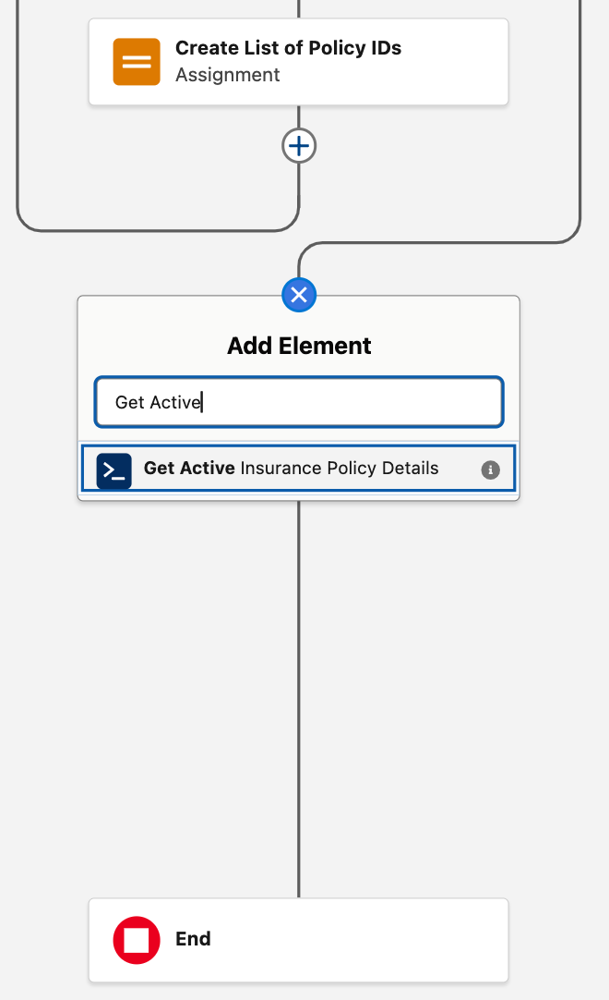

For configuring the Flow Action in the new right pane:

1. Populate the **Label** with **Retrieve Claims and Payments Details**.
2. The **API Name** will be automatically populated after you fill in and leave the Label field.
3. Toggle to include the **listOfPolicyIds** parameter, and in the parameter input, search for the **policyIds** variable to add it.
4. Check the **Manually assign variables** checkbox at the bottom to bring up the output parameter, then search for the **PolicyJson** variable and select it.

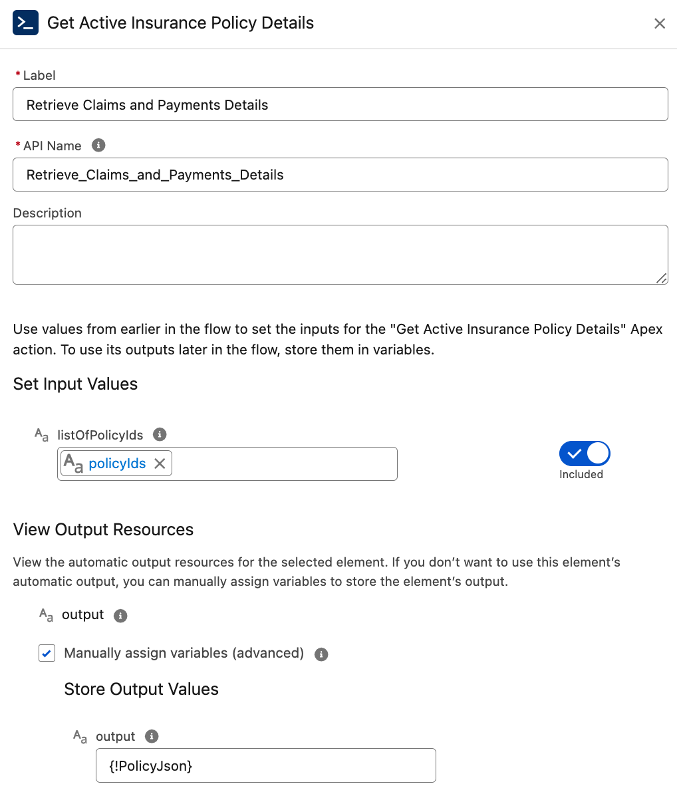

When you’re done configuring the flow:

1. Click **Save as New Version** at the top right.
2. In the pop-up modal, click **Save**.
3. After saving, click **Activate** at the top right to make the updated flow available for use.

You can now close this tab.

---

### 1.2 Create Action and Context Variable

Back in Setup, search for and select **Agentforce Agents** to open the list of Agents.  
Expand the **Insurance Agent** by clicking **>** beside it, then select **Version 1** to open this agent in the Agent Builder (the main tool for building our Agent).

In the left pane, select **Context**, where you can manage the variables and filters in your Agent.  
Variables help the Agent maintain context, orchestrate data across actions, and remember what's important.

The **Messaging Session** variable is always created for every conversation that the Agent has.  
Any context from the conversation channel can be provided through this variable, including data about the customer.

Click **New Variable** at the top of the pane and define a new custom variable with:

- **Name** = `PolicyJson`
- **Data Type** = `Text`
- **Allow LLM to use value** = checked

Click **Save**. You will use this variable to store all of the active policy details you retrieve about the customer so that context is available throughout the conversation.

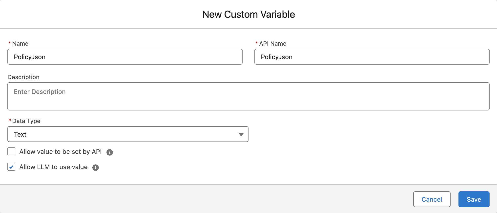

Next, in the left pane, select **Topics**, where you will find a number of preconfigured topics, including **Insurance Policy Questions**. Click it.

This opens the description, scope, and instructions for the topic, defining how the Agent should behave when answering customer questions about their policy.  
Select the **This Topic's Actions** tab at the top. You will add the updated flow as an Action here so you can retrieve the customer's policy details.

Click the **New** drop-down and select **Create New Action**.

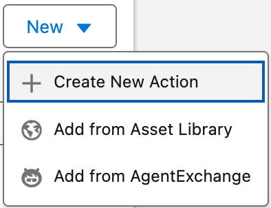

In the pop-up modal, select:

- **Reference Action Type** = `Flow`
- **Reference Action** = `INS - Get Active Insurance Policies for Account`

Click **Next**.

Configure the Agent Action with these parameters:

- **Loading Text** = `Retrieving your policy details...`
- For the **InsuredAccountID** input variable, check **Require Input**.
- For the **PolicyJson** output variable, check **Show in conversation**.

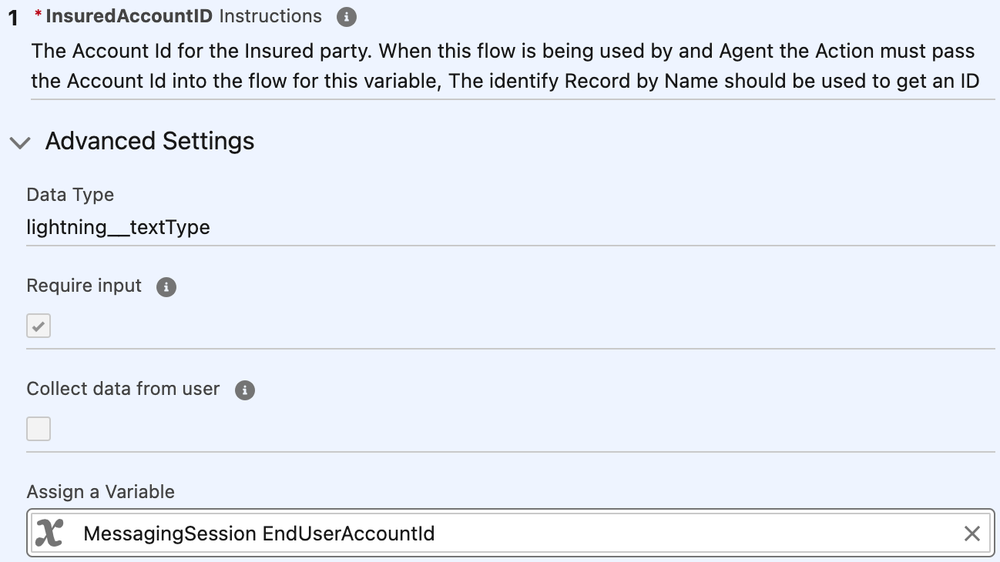
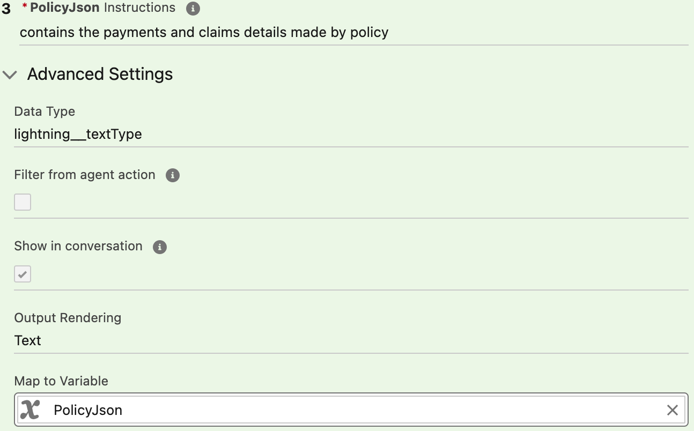

You still need to pass the Account ID from the `MessagingSession` as input into the Action and store its results in the `PolicyJson` output variable.  
Click the **INS - Get Active Insurance Policy Details** action in the list and, for the **InsuredAccountID** input variable, assign **MessagingSession EndUserAccountId**.  
For the **PolicyJson** output variable, map it to your custom variable **PolicyJson**.

You’ve now finished configuring the Action.

---

### 1.3 Test Our Agent

Let's start testing and interrogating the agent with all sorts of questions about our policies!

On the right side of Agent Builder, use the **Conversation Preview** pane.  
Click the **eye icon** at the top right so you can set the right customer context for the conversation.  
In this scenario, you are **Kiran Singh**, a customer with multiple auto policies, a renter's policy, and a life insurance policy. You can see all this on Kiran Singh's account record.

In the **MessagingSession EndUserAccountId** variable, search for and select **Kiran Singh** to simulate a conversation as that customer. Click **Apply** afterwards.


In the message box at the bottom, you can start by asking questions like:

- **What are all my policies?**
- **What are all my car policies?**

Feel free to experiment and ask the agent any other questions about your policies, claims, or payments. Some examples:

1. How much do I owe next month?
2. Which policies are up for renewal soon?
3. What payment method am I using to pay for my Honda Civic policy?
4. Can you tell me the status of my claims?
5. How much have I paid in fees for this year?

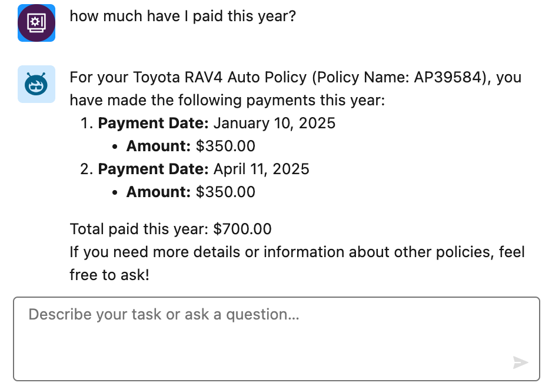

---

## 2. Add a Driver Exercise

In this exercise, you will enhance the insurance agent so it can manage drivers on an auto insurance policy.  
This topic will allow the agent to add a driver to an insurance policy and capture the necessary details.

**Part 1**: Create a **Manage Drivers on Auto Policy** topic for the Insurance Agent  
**Part 2**: Create new agent actions to add a new driver and extract data from a driver’s license image  
**Part 3**: Test the new agent topic

The concepts you'll explore include:

- **Topics** to coach/instruct Agents on how to behave and what to do
- **Actions** to give Agents tools to execute tasks

Click **Next** to get started!

---

### 2.1 Create Auto Policy Driver Management Topic

Click the **Setup Cog** icon and select **Setup**.  
In **Quick Find**, search for **Agentforce** and select **Agentforce Agents**.  
In the list of agents, expand **Insurance Agent** by clicking **>**, then click **Version 1**.

Once in the builder, on the **Topics** tab on the left, click the **New** drop-down and select **New Topic**.  
When asked to provide a description of the topic, copy and paste the description below:

```text
As an insurance carrier, I want to manage drivers on Auto policies. This include retrieving existing auto insurance policies associated with an account, listing all existing drivers and adding a new driver after collecting their first name, last name, email, phone number, driver's license number, license issue date and license expiry date.

If an image of a drivers license is provided, analyze it to extract the new driver's first name, last name, driver's license number, license issue date and license expiry date for use when adding the new driver to the policy
```

Click **Next** and review the generated Topic definition for managing drivers on auto policies. It should look similar to the generated summary.  
Click **Next** again after reviewing.

On the actions step, search for and check off the **INS - Get Drivers on Policy** action, then click **Finish**.

---

### 2.2 Create New Agent Action

You will now create a new Agent Action to include in this topic.  
This action is based on an existing pre-built flow and prompt template and gives the agent the ability to add a new driver.

In Agent Builder, click the new **Driver Management** topic and navigate to the **This Topic’s Actions** tab.  
Click the **New** drop-down and select **Create New Action**.

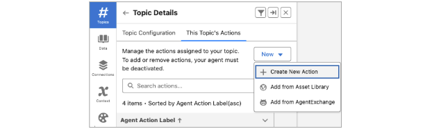

In the new modal:

1. For **Reference Action Type**, select **Flow**.
2. For **Reference Action**, search for and select **INS - Add Driver to Policy**.
3. Leave the default values as-is and click **Next**.

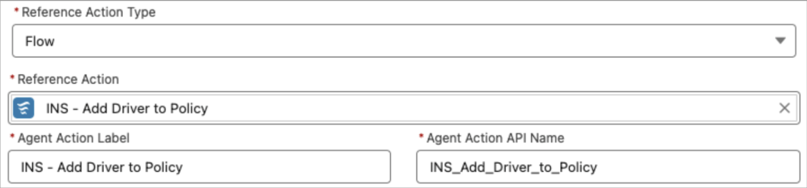

The Agent Action Instructions, Input Instructions, and Output Instructions are already populated using the documented descriptions from the flow.  
Complete the Agent Action configuration by:

1. Unchecking **Show loading text for this action**.
2. For every input variable, checking both **Require input** and **Collect data from user**. This includes:
   - `DriversLicense`
   - `LicenseIssueDate`
   - `Email`
   - `firstName`
   - `lastName`
   - `licenseExpiryDate`
   - `Phone`
   - `policyId`
3. For the output `caseNumber` variable, check **Show in conversation**.

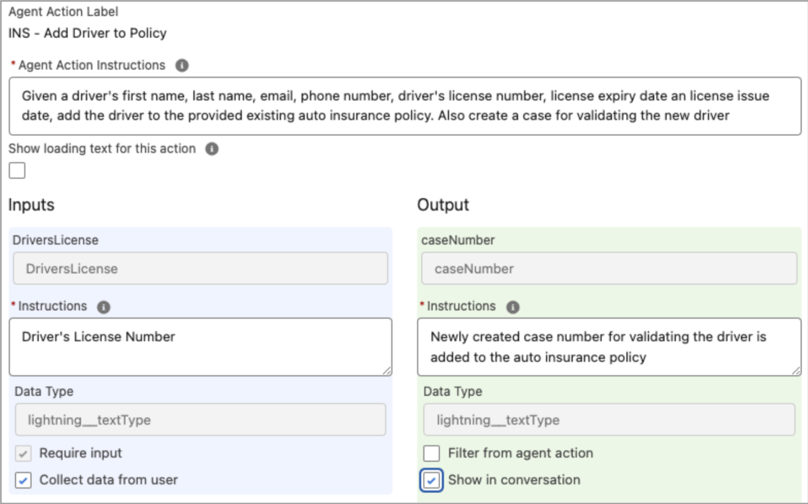

Click **Finish**. Then click **Activate** in the top right to activate the agent.  
Your agent can now add a driver to an auto policy.

---

### 2.3 Add a Driver from the Insurance Portal

Uploading a file isn’t supported in the Conversation Preview, so you will test this new topic directly from the insurance portal.

From Setup, enter **All Sites** in Quick Find.

Click the URL link beside the **Insurance** site (in the URL column), or open:  
`/insurance/s/`

Click the floating **Messaging** icon in the bottom right corner to start interacting with the new agent.  
Try prompts like:

1. My name is Kiran Singh and I want to add a driver to my auto insurance policy.
2. \<Select any listed auto insurance policy\>
3. The driver is John Doe and his email is `john@example.com` and phone number is `555-555-5555`. His driver's license number is `J3498544`, issued on Jan 4, 2020 and expires on Jan 5, 2030.

---

## 3. Address Change

An address change in insurance can lead to many complicated follow-ups, from updating auto premiums to cancelling policies, often requiring human intervention.  
In this exercise, you’ll explore how an agent can help a customer change their address, validate additional information, and hand over to a real person if necessary.

**Part 1**: Create an action for updating an address and generating follow-ups  
**Part 2**: Create actions to change payment frequency and method  
**Part 3**: Test the new agent capabilities

We will explore:

- **Actions** to give Agents tools for their jobs to be done
- **Flows** to dynamically ground our prompt
- **Prompt Templates** to form more sophisticated responses with dynamic RAG

Click **Next** to get started!

---

### 3.1 Review Address Change Topic

First, review the initial setup of the **Address Change** topic and the two custom actions that are already pre-built.

Click the **Setup Cog** icon and select **Setup**.  
In **Quick Find**, search for **Agentforce** and select **Agentforce Agents**.  
In the list of agents, expand **Agentforce for Insurance** by clicking **>**, then click **Version 1**.

On the left side of the screen, click the **Address Change** topic.  
Take a minute to review the topic’s **Classification Description**, **Scope**, and **Instructions** to understand what you’re telling the agent to do.

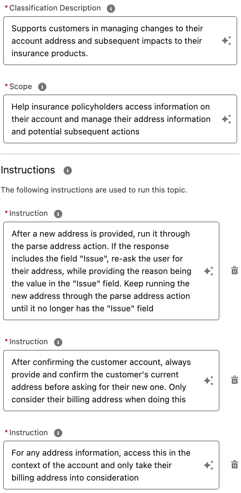

Switch to the **This Topic’s Actions** tab and look at the actions that this topic can execute. These include:

1. **FINS - Parse Address**: Runs a prompt template that takes an unstructured address and returns the address in a standardized and structured JSON format.  
   If it does not feel confident standardizing the address, the prompt returns with an error message instead, explaining what it felt was missing or wrong with the raw unstructured address.
2. **FINS - Update Account Address**: Takes the JSON-formatted, standardized address from the Parse Address action and updates the customer’s billing address on their Account record.
3. **INS - Cancel Insurance Policy**: Begins the process to cancel an insurance policy. You can use this in case you need to cancel a renter's insurance policy.

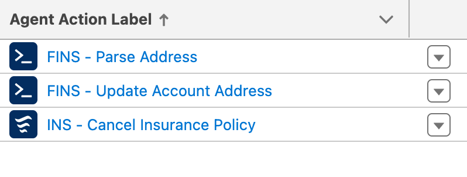

Leave this tab open; you will come back to Agent Builder later.

---

### 3.2 Build RAG Dynamic Grounding Flow

You will now build a dynamically grounded prompt to compose a more sophisticated follow-up with the customer after updating their billing address.  
Before that, create a new flow to ground the prompt.

From Setup, in the Quick Find box, enter **Flows**, and then click **Flows**.  
Click **New Flow** at the top right and select **Template-Triggered Prompt Flow** in the Frequently Used section of the pop-up modal. This opens Flow Builder.

Close any pop-ups, then open the Toolbox pane from the top left by clicking the **Window Pane** icon and click **New Resource**.

In the pop-up modal, create a new input variable with this definition:

1. **Resource Type** = `Variable`
2. **API Name** = `Account`
3. **Data Type** = `Record`
4. **Object** = `Account`
5. Check **Available for Input**

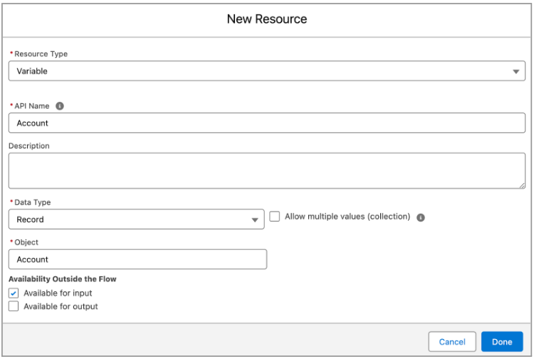

Next, click the circular **+** icon below the **Start** element and add a **Get Records** element with this definition:

1. **Label** = `Get Renters Insurance Policies`
2. **Object** = `Insurance Policy`
3. For **Condition Requirements**, keep **All Conditions Are Met (AND)** and add these two filters:
   - `PolicyType Equals Renters`
   - `NameInsured ID Equals Account > Account ID` (select **Account**, then search and select **Id (Account ID)**; this resolves to **Account > Account ID**)
4. Leave the remaining configurations as-is.


Open the Toolbox again by clicking the **Window Pane** icon and click **New Resource** to create a new formula with this definition:

1. **Resource Type** = `Formula`
2. **API Name** = `newRenterInsuranceQuoteLink`
3. **Data Type** = `Text`
4. For **Formula**, use:

```text
'https://<BASE_DOMAIN>.my.site.com/insurance/s/home-quoting'
```

Replace the `<BASE_DOMAIN>` placeholder with the base domain of your Salesforce org. You can find this in your browser’s URL.  
**DO NOT** include `https://` at the beginning or a `/` at the end of the domain URL.

Here is an example:  
`https://<BASE_DOMAIN>.lightning.force.com/lightning/setup/SetupNetworks/home`


Click the circular **+** icon below the **Get Renters Insurance Policies** element to add an **Add Prompt Instructions** element with this definition:

1. **Label** = `Add Dynamic Policy Data`
2. For **Prompt Instructions**, use:

```text
Existing Renter's Insurance Policy information:

ID={!Get_Renters_Insurance_Policies.Id}
Name={!Get_Renters_Insurance_Policies.PolicyName}
Status={!Get_Renters_Insurance_Policies.Status}
Type={!Get_Renters_Insurance_Policies.PolicyType}

Link to new home insurance submission:{!newHomeInsuranceQuoteLink}
```

Click **Save** in the top right. In the pop-up modal, set **Label** = `INS - Renters Insurance Grounding`, then click **Save**.  
Finally, click **Activate** in the top right when available.

---

### 3.3 Build Prompt with Flow

Now that you have a flow for dynamically grounding the prompt, you will create the prompt template itself.

Back in Setup, search for and select **Prompt Builder**.  
In the top right, click **New Prompt Template** and provide this definition:

1. **Prompt Template Type** = `Flex`
2. **Prompt Template Name** = `INS - Property Insurance Call to Action`
3. **Template Description** = `After an address change, generate a follow up ask or call to action for the customer`
4. Under **Define Sources**, add this variable:
   - **Name** = `Account`
   - **API Name** = `Account`
   - **Source Type** = `Object`
   - **Object** = `Account`

Click **Next**.

In the Prompt Template workspace, use the following instructions:

```text
You are an insurance agent and a customer, {!$Input:Account.Name}, has just updated their address. Write a chat response to the customer with follow-ups based on the current customer situation.

You must treat equally any individuals or persons from different socioeconomic statuses, sexual orientations, religions, races, physical appearances, nationalities, gender identities, disabilities, and ages. When you do not have sufficient information, you must choose the unknown option, rather than making assumptions based on any stereotypes.

"""
If the customer has a renter's insurance policy with us, ask them if they would like to cancel their existing rental insurance policy
At the beginning of the message, congratulate the customer on their new home and let them know we're here to provide them ease of mind with their new property and move. Let the customer know that we can help them quote a new home insurance policy with the link referenced below
Do not reference their existing renter's insurance policy ID field
Do not address the customer like you would an email, respond as if it is part of an ongoing chat conversation with the customer
Do not say hello or address the customer as dear, do not sign off in the response
"""

New address: {!$Input:Account.BillingStreet}, {!$Input:Account.BillingCity} {!$Input:Account.BillingState}, {!$Input:Account.BillingPostalCode}, {!$Input:Account.BillingCountry}

{!$Flow:INS_Renters_Insurance_Grounding.Prompt}
```

Click **Save** and **Activate** the Prompt Template.

---

### 3.4 Add Prompt as Action to Agent

Now you’ll wire the new prompt template into the agent as an action.

Go back to the Agent Builder tab with your **Agentforce for Insurance** configuration.

On the left pane, click to open the **Address Change** topic and then select the **This Topic's Action** tab at the top.

Open the **New** drop-down and select **+Add Action**.  
For **Reference Action Type**, select **Prompt Template**.  
In **Reference Action**, select the prompt you created: **INS - Property Insurance Call to Action**.  
Click **Next** and finish the action definition by:

1. Unchecking **Show loading text for this action**.
2. For the **Account** input variable, enter these instructions: `Account record used to determine the call to action`
3. For the **Prompt Response** output variable, check **Show in conversation**.
4. Click **Finish**.

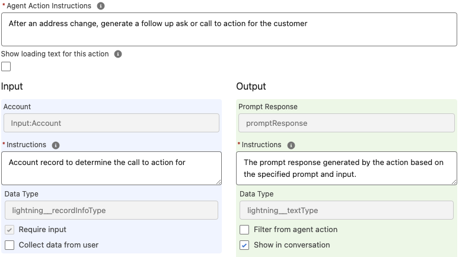

Next, navigate back to the **Topic Configuration** tab and scroll to the bottom.  
Click the **Add Instructions** button twice and add these two additional instructions so the agent knows how to use the new action:

**New Instruction #1**

```text
Immediately after updating the customer's address, ask the customer if they are moving to this new address. If yes, run the 'INS - Property Insurance Call to Action' action.
```

**New Instruction #2**

```text
If the customer provided a date in the past about canceling their renter's insurance policy, inform them that we cannot cancel an insurance policy in the past and ask them for the cancellation date again until they provide one in the future, suggesting today. After a future or current date is successfully provided, query for the customer's renter's insurance policy and use that to run the ‘INS - Cancel Insurance Policy’ action with the provided date and renter’s insurance policy ID.
```

Click **Save**, then click **Activate** in the top right.

---

### 3.5 Test the Agent

Time for the big reveal—let’s interact with the agent’s address change capabilities.

Go to the external insurance portal:  
`/insurance/s/`

Once the portal has fully opened, click the floating **Messaging** icon in the lower right corner to start interacting with the agent.  
You can test the address change experience with prompts like:

1. What are my policies?
2. I want to change my address.
3. Use your own home address (for example: *120 N LaSalle St, Chicago, Illinois, 60602, United States*).
4. Yes
5. Yes
6. last week Friday
7. next week Thursday

---

## 4. Billing Management

With the policy management topic, you’ve retrieved customer details, including information about payments.  
Now you’ll give the agent tools to help customers manage their payments as well.

**Part 1**: Create a topic for managing billing information  
**Part 2**: Create actions to change payment frequency and method  
**Part 3**: Test the new agent capabilities

We will explore:

- **Topics** to coach/instruct Agents on how to behave and what to do
- **Filters** to ensure your agent doesn't overstep its bounds
- **Instructions** to coach your Agent on how to operate

Click **Next** to get started!

---

### 4.1 Create Billing Topic

You will first create a new topic in the Insurance Agent to handle billing tasks.

Click the **Setup cog** icon and select **Setup**.  
In **Quick Find**, search for **Agentforce** and select **Agentforce Agents**.  
In the list of agents, expand **Agentforce for Insurance** by clicking **>**, then click **Version 1**.

In Agent Builder, in the **Topics** pane on the left, open the **New** drop-down and click **+ New Topic**.  
When prompted about what you want this topic to do, copy and paste the following description:

```text
Using the PolicyJson and customerCreditScore variables, help the customer update their payment/billing frequency for a policy or update their payment method for a policy. The allowed payment frequencies include Semi-Monthly, Monthly, Quarterly, Semi-Annual and Annually. The allowed payment methods are Credit Card, Bank Transfer, PayPal and Check by Mail.
```

Review the generated **Description**, **Scope**, and **Instructions**, then click **Next**.  
In the list of Actions, search for and check off these pre-built actions:

1. `INS - Update Billing Frequency`
2. `INS - Update Policy Payment Method`

Click **Finish**.

---

### 4.2 Define Filters for Actions

You don’t want to let the customer update their payment method or billing frequency if they have a credit score under 500, so you will define strict filters to enforce this.

First, persist the customer's credit score from their Account record.  
In the **Context** pane on the left, you'll see a custom variable **customerCreditScore** already defined for persisting the customer's credit score during the conversation.  
You’re already retrieving the credit score using the **INS - Get Account Details** action but not storing it yet.

Go back to **Topics** and open the **Insurance Policy Questions** topic.  
Change to the **This Topic's Actions** tab. You’ll see the **INS - Get Account Details** action being called there. Click to open this action.

- Assign the **accountID** input variable to **MessagingSession EndUserAccountId**.
- Assign the **customerCreditScore** output variable to the **customerCreditScore** custom variable you reviewed earlier.

| 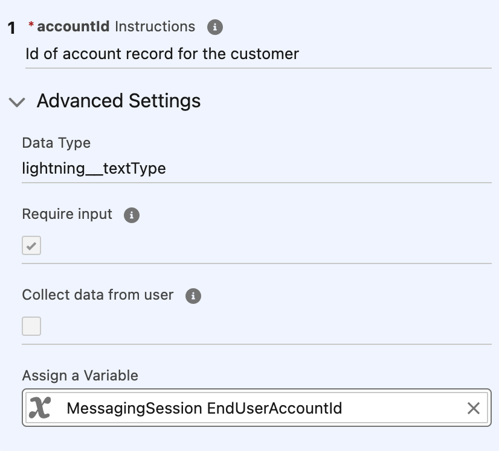 | 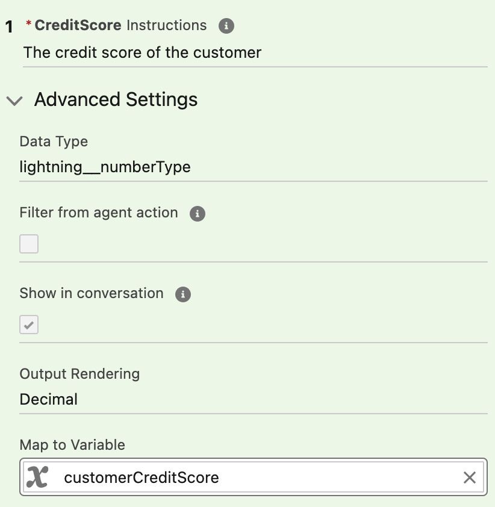 |
| --- | --- |

Now that you have the customer's credit score, define a filter condition using it.  
Open the **Context** pane and navigate to the **Filters** tab. Click **New** and define the filter as:

1. **Label** = `Low Risk Customer`
2. Create one condition:
   - **Resource** = `customerCreditScore`
   - **Operator** = `Greater Than`
   - **Value** = `500`

Click **Save**.

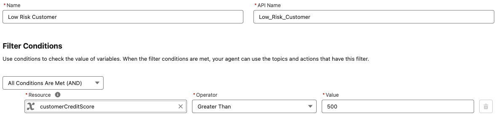

Next, apply this filter to both actions in your billing topic.  
Open the **Topics** pane and navigate into your billing topic (name may vary).  
Go to the **This Topic's Actions** tab and select the **INS - Update Policy Payment Method** action.

At the top right of the action pane, click the filter icon, then search for and select the **Low Risk Customer** filter.  
Close the action and repeat these steps for the **INS - Update Billing Frequency** action.

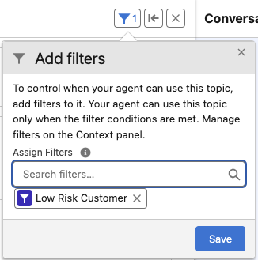

---

### 4.3 Test the Agent

Let's test our agent. In the preview pane on the right, click the Eye icon at the top and for the MessagingSession EndUserAccountId variable, search and select Kiran Singh. Click Apply

In the chat box, converse with the agent using these messages:

1. What are my policies
2. I want to update the payment method for my RAV4 policy
3. paypal

The response back from the Agent wasn't what we were hoping for. We can see reasoning in the middle pane about why our Agent decided to choose this action. Let's click the Suggest Improvement button to get suggestions on how we can improve our agent and answer the questions from the builder. You can provide feedback like the screenshot below:

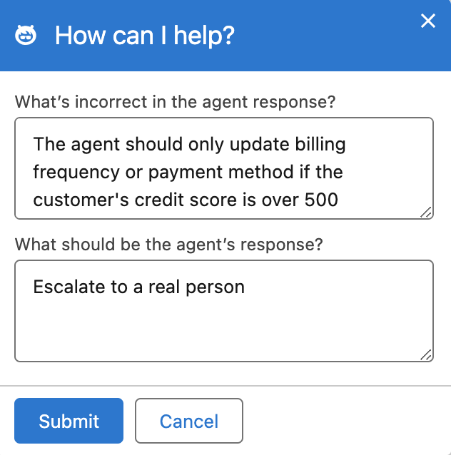

Based on the feedback. We can add a new instruction into our Topic, something like this:

```text
Before updating billing frequency or payment method, verify that the customer's credit score is over 500. If the credit score is 500 or below, escalate the request to a live human agent
```

Back on the Topic pane on the left and in our billing Topic, click Add Instruction at the bottom and copy/paste the above instruction in and click Save

Click the Refresh (circular arrow) at the top left the Conversation Preview panel at the top and let's try it again! Did the agent behave as we would expect?
