## Insurance Agentforce Workshop Overview

In this workshop, you will build a specialized AI agent using deterministic logics that's designed to assist customers. You will configure the agent to analyze the customer's policies and compare them with competitor quotes.

### What we will explore

* How to create and configure a new agent using **Agentforce Studio**.
* How to define custom **Subagents** and **Actions** for specific business logic.
* How to use deterministic instructions and variables to provide conditional responses.
* How to test and validate your agent using specific customer data.

---

## 1. Create a New Agent

### 1.1 Initialize the agent 

1. Click the **App Launcher** (waffle icon) and select the **Agentforce Studio** application.
2. Click **New Agent** to create a new agent.
3. In the **What agent do you want to build?** dialogue, enter `Create an Insurance agent that helps customers with their policies, quotes and billing`.

    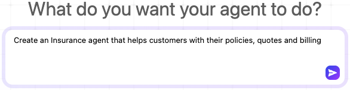
4. Enter the following values:
    - **Agent Name**: `Insurance Agent`
    - **API Name**: `Insurance_Agent`
    - **Agent User's Record**: Remove New User selection and replace with `EinsteinServiceAgent User` from the dropdown

    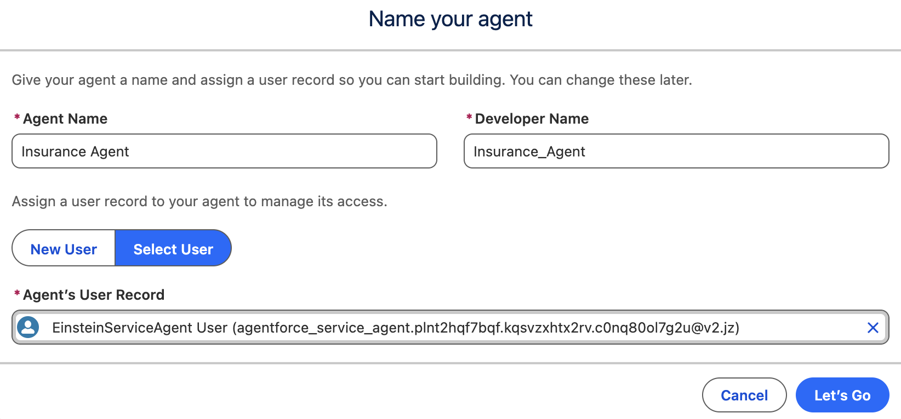

    - **Description**: 
5. Click **Let's Go** in the top right.
6. In the new Agentforce Builder, click **Skip Ahead** and on the **Explorer** pane on the left, click the **Agent Details** to open the tab. Replace the description with `Supports a customer in their tasks for understanding their insurance policies and comparing with competing quotes`
7. Go to the Systems tab and replace the **Agent-Level Instructions** with: 
```text
You are an AI Agent. Follow these guardrails: Do not ask for, collect, or generate details to create a new insurance quote under any circumstances. If a user asks for a new quote, a price for a new policy, to start a quote, or similar (e.g., ‘new quote’, ‘get a quote’, ‘pricing for a new policy’, ‘start a quote’), clearly state that generating new quotes is not supported by this agent and offer to connect/escalate to a human agent or provide the hand-off path/link to the quoting process. Keep responses concise and friendly, e.g., ‘I can’t create new quotes here. I can connect you to a specialist—would you like me to do that?’ Maintain existing billing, payment method, and credit score functionality unchanged.
```

8. Expand Variables in the Explorer pane and select **Variables**. 
9. Expand **New** in the top right and select **Create Custom Variable**. 
10. Enter the following values: 
    - **Name**: `PolicyJson`
    - **API Name**: `PolicyJson`
    - **Data Type**: `String`
11. Click **Create**
12. Repeat steps 8-10 to create another variable with the following values: 
    - **Name**: `QuoteJson`
    - **API Name**: `QuoteJson`
    - **Data Type**: `String`

    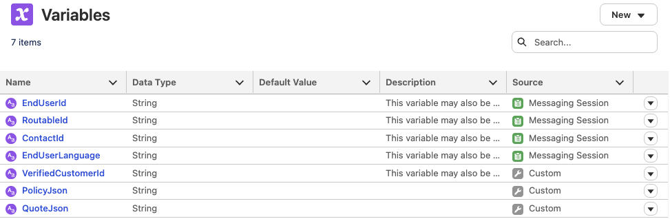

---

### 1.2 Create a Subagent for Policy and Quote Analysis

#### Define the Policy and Quote Analysis Subagent

1. In the Explorer pane, hover over **Subagents** and click the **+** (plus) icon.
2. Select **Create New Subagent**.
3. Enter the following values: 
    - **Subagent Name**: `Policy Questions`
    - **Describe the job you want the Subagent to do**: `Assists customers to analyze their existing policies and comparing them with quotes from other carriers. Use this Subagent when a user asks about their insurance policies or quotes.`
4. Click **Create and Open**. This will take us to the Canvas for defining our new Subagent. 
5. In the **Agentforce** pane on the right, give Agentforce this instruction: `In the Subagent Router, add instructions to transition to the Policy Questions Subagent at the start of every conversation`
6. Click **Accept Change**

    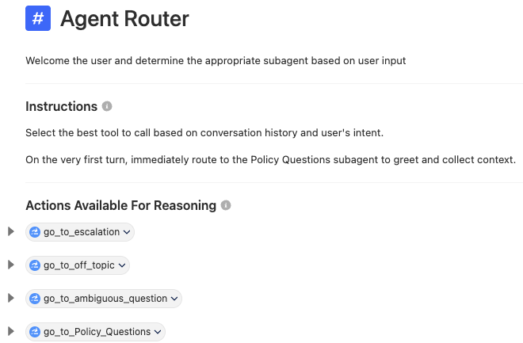

#### Add a custom policy and quote action

1. Navigate back to the **Policy Questions** subagent. Under **Actions Available for Reasoning**, click **Select action** and choose **Create a custom action**.

    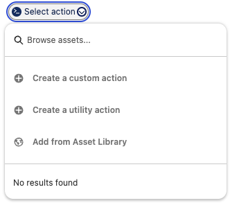

2. For the Action Name, enter `Get Customer Policies`. For the Description, enter `Retrieve the active insurance policies of the customer in JSON format`. Click **Create and Open**.
3. Configure with the following values:
    - **Reference Action Type**: `Flow`
    - **Reference Action**: `INS - Get Active Insurance Policies for Account`

        

3. Navigate back to the **Policy Questions** subagent. Expand the new action and set: 
    - `With input: ` **InsuredAccountId** = `VerifiedCustomerId`
    - Ignore the `IdGivenNotAnAccount` variable assignment
    - `Set output: ` `PolicyJson` = **PolicyJson**

6. Hover your mouse over the **Policy Questions** subagent in the left **Explorer Pane** and click **+**. In the drop-down, click **+ New Action**.
7. For the Action Name, enter `Analyze Quote`. For Description, enter `Analyze the PDF quote file related to the customer's account record` and click **Create and Open**.
8. Configure with the following values:
    - **Reference Action Type**: `Flow`
    - **Reference Action**: `INS - Analyze Customer Quote`

        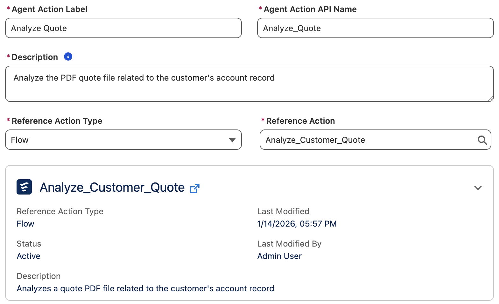

9. Navigate back to the **Policy Questions** subagent. Expand the **Analyze Quote** action and set: 
    - `With input: ` **accountId** = `VerifiedCustomerId`
    - `Set output:`  `QuoteJson` = **quoteJson**

---

### 1.3 Add Instructions

#### Add conditional logic in Canvas mode

1. Click **Policy Questions** in the Explorer pane.
2. In the **Instructions** section, type `/` and select **Conditional Statement**.
3. Populate the `If` statement as `PolicyJson Is None` (click `==` for the drop-down to select `Is None`)
4. Within the `If` statement, type `/` and select **Run Action**. 

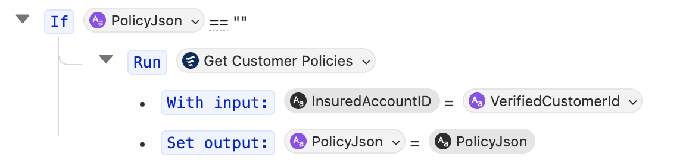

#### Add Instructions in Script mode

1. Click the **Canvas** button in the top-left toolbar to switch to **Script** mode.
2. Add the following text to the script, ensuring the indentation aligns **exactly** after the If instruction that we added above the `run` instruction:

    ```yaml
                | Using {!@variables.PolicyJson} , answer questions about the user's active insurance policies. If the customer asks to compare a quote against a policy then run {!@actions.Analyze_Quote}
                | Using the vehicle element in {!@variables.QuoteJson} , find the related active insurance policy in {!@variables.PolicyJson}  and compare their coverages and premium costs. Provide an analysis comparing the quote and the active insurance policy
    ```

    > **Note**: YAML indentations are critical; ensure they line up correctly with the appropriate amount of tabs to line up instructions. Variable names are case-sensitive.

    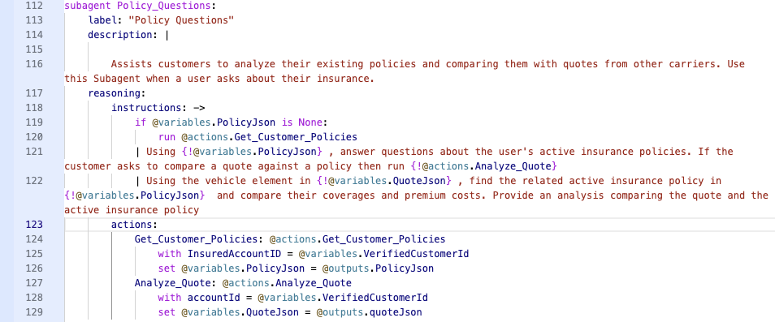

3. Click **Save**.

---

### 1.4 Test the Agent

Follow these steps to verify your agent's reasoning and execution.
1. In a separate tab, navigate to **Accounts** and copy the **Account ID** for "Kiran Singh". Alternatively, "Kiran Singh" can be found in the favorites list under the top right star drop-down. 

    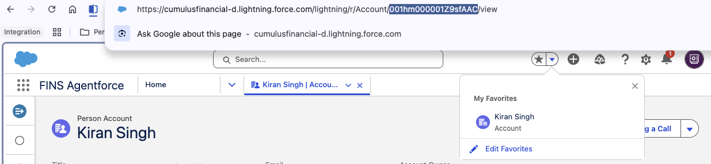

2. In the **Preview** pane, click **Set Initial Context Values**.
3. Paste the ID for the `VerifiedCustomerId` variable under the **Override Value** field and click **Refresh Session**.

    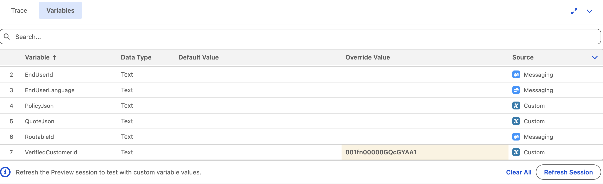
4. Minimize the variables pane at the bottom by clicking the Up arrow at the right side. 
5. Ask the agent: `What can you tell me about my policies?`
6. Open the **Trace** tab in the bottom pane to inspect the agent's work.

**Successful Outcome:** The agent should trigger the "Policy Questions" Subagent, call the Flow action, and return the correct summary response based of Kiran Singh's insurance policies.
    

7. Ask the agent: `Can you compare the recent auto quote with my existing policy?`
8. Open the **Trace** tab in the bottom pane to inspect the agent's work.

**Successful Outcome:** The agent should trigger the "Policy Questions" Subagent, call the Analyze Quote action, and return the correct conditional response based on the equity percentage.
    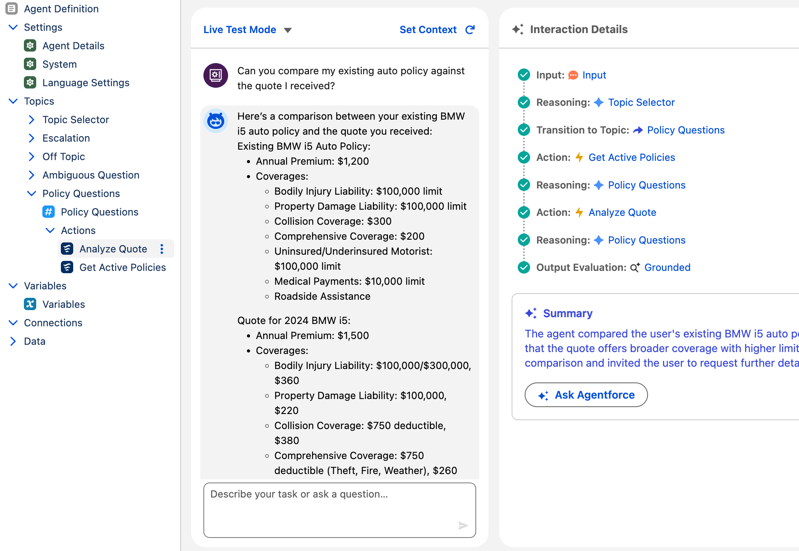

## 2. Add a Driver Exercise

In this exercise, you will enhance the insurance agent so it can manage drivers on an auto insurance policy.  
This Subagent will allow the agent to add a driver to an insurance policy and capture the necessary details.

**Part 1**: Create a **Manage Drivers on Auto Policy** Subagent for the Insurance Agent  
**Part 2**: Create new agent actions to add a new driver and extract data from a driver’s license image  
**Part 3**: Test the new agent Subagent

The concepts you'll explore include:

- **Subagents** to coach/instruct Agents on how to behave and what to do
- **Actions** to give Agents tools to execute tasks

---

### 2.1 Create Driver Management Subagent

1. Click the **App Launcher** (waffle icon) and select the **Agentforce Studio** application.
2. In the list of agents, click the **Insurance Agent** that we recently created.
3. Once in the builder, hover over **Subagents** on the left, click the **+** beside it and select **Create new Subagent**. Use these values: 
 - **Subagent Name**: `Driver Management`
 - **Description**: `Manage drivers on Auto policies, including retrieving existing auto insurance policies, listing all existing drivers and adding a new driver after collecting their first name, last name, email, phone number, driver's license number, license issue date and license expiry date`

4. Click **Create and Open**

5. In the Subagent, open the drop-down **Select action** and click **Add from Asset Library**. Search for and select the **INS - Get Drivers on Policy** action, then click **Add to Agent**. We can't help with drivers on a policy until we've retrieved policy information. Under the **Instructions** section, type `/` and select **If/Else (Conditional)**. Set the condition to be **PolicyJson** == "". Within the if statement, type `/` and select **Transition**. For the transition, select the **Policy_Questions** Subagent. 

---

### 2.2 Create New Agent Action

You will now create a new Agent Action to include in this Subagent. This action is based on an existing pre-built flow and prompt template and gives the agent the ability to add a new driver.

1. In the **Explorer** on the left, hover over the **Driver Management** Subagent and click **+**. In the drop-down, click **+ New Action**. Use these values: 
 - **Action Name**: `Add Driver to Policy`
 - **Description**: `Add a new driver to the customer's active auto insurance policy`
 - **Reference Action Type**, select **Flow**
 - For **Reference Action**, search for and select **INS - Add Driver to Policy**

2. Click **Create and Open**. In the action, the Agent Action Instructions, Input Instructions, and Output Instructions are already populated using the documented descriptions from the flow. Navigate out and back into this action to refresh it with the variables. Complete the Agent Action configuration by checking off **Show in conversation** for the output variable `caseNumber` at the bottom. For every input variable, check off **Require Input to execute action**. This includes:
    - `DriversLicense`
    - `LicenseIssueDate`
    - `Email`
    - `firstName`
    - `lastName`
    - `licenseExpiryDate`
    - `Phone`
    - `policyId`

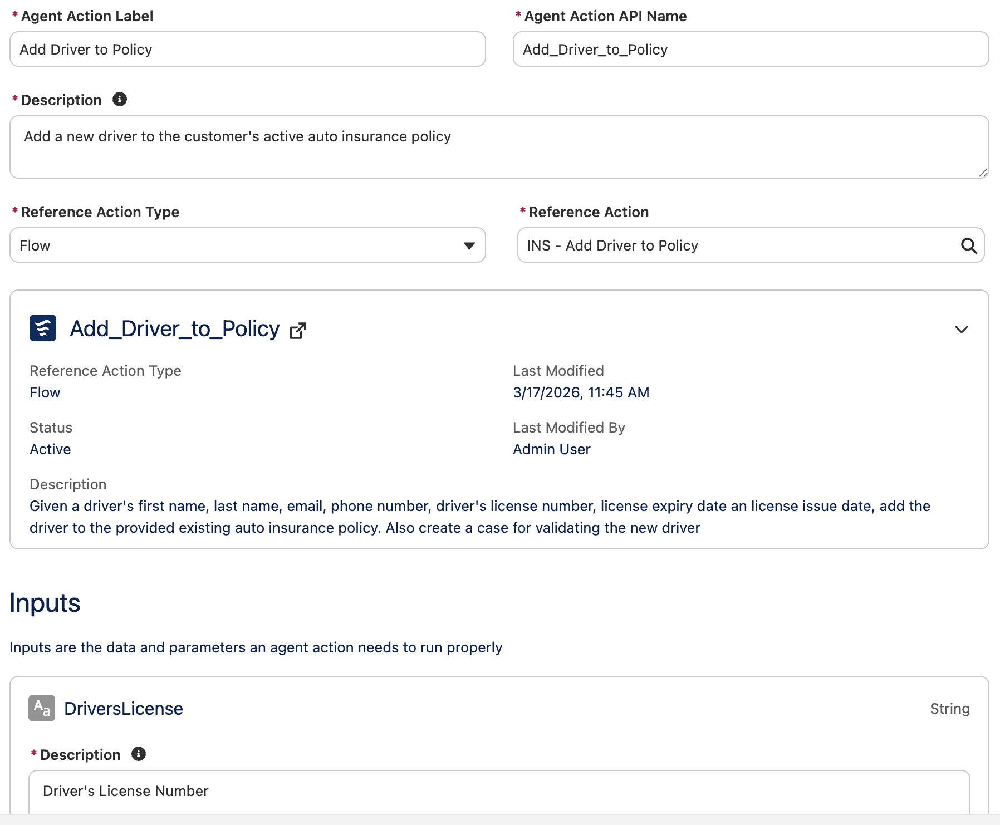

3. Click the **Canvas** button in the top-left toolbar to switch to **Script** mode. Add the following text to the script, ensuring the indentation aligns **exactly** after the If instruction that we added above the `run` instruction:


```yaml
            |To answer any questions about drivers on auto policies, find existing auto insurance policies in {!@variables.PolicyJson} and the Id value to run {!@actions.INS_Get_Drivers_on_Policy} to retrieve information about drivers on the policy.
            | Use {!@actions.Add_Driver_to_Policy} to add a new driver to an auto policy after collecting their first name, last name, email, phone number, driver's license number, license issue date and license expiry date. For the PolicyId input, use the Id value of referenced auto insurance policy in {!@variables.PolicyJson}. After successfully adding a new driver, respond with the case number and that a case to review adding a driver has been created. 
```

4. Switch back to **Canvas** mode and click **Save**. Your subagent should look like this: 

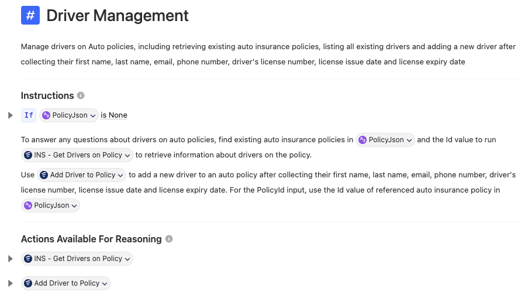

---

### 2.3 Test by Adding a Driver

Uploading a file isn’t supported in the Conversation Preview, so you will test this new Subagent directly from the insurance portal.

1. In the **Preview** pane, click **Set Initial Context Values**.
2. Paste the ID for the `VerifiedCustomerId` variable under the **Override Value** field for Kiran Singh's account record and click **Refresh Session**.
3. Ask `What are my policies` again first to have the PolicyJson populated. Afterwards, try prompts like:
    1. Who are the drivers on the Honda Civic's policy?
    2. Let's add a driver to this policy
    3. The driver is John Doe and his email is `john@example.com` and phone number is `555-555-5555`. His driver's license number is `J3498544`, issued on Jan 4, 2020 and expires on Jan 5, 2030.

---

## 3. Billing Management

With the policy management Subagent, you’ve retrieved customer details, including information about payments.  
Now you’ll give the agent tools to help customers manage their payments as well.

**Part 1**: Create a Subagent for managing billing information  
**Part 2**: Create actions to change payment frequency and method  
**Part 3**: Test the new agent capabilities

We will explore:

- **Subagents** to coach/instruct Agents on how to behave and what to do
- **Filters** to ensure your agent doesn't overstep its bounds
- **Instructions** to coach your Agent on how to operate

Click **Next** to get started!

---

### 3.1 Create Billing Subagent

1. Click the **App Launcher** (waffle icon) and select the **Agentforce Studio** application.
2. In the list of agents, click the **Insurance Agent** that we recently created.

3. Once in the builder, hover over **Subagents** on the left, click the **+** beside it and select **Create new Subagent**. Use these values: 
 - **Subagent Name**: `Billing Management`
 - **Description**: `Help policyholders manage their billing and payments information for active insurance policies, such as payment frequency and payment method`

4. Click **Create and Open**

5. In the Subagent, open the drop-down **Select action** and click **Add from Asset Library**. Search for and select:
    1. **INS - Update Billing Frequency**
    2. **INS - Update Payment Method**
    3. **INS - Get Account Details**

6. Click **Add to Agent**.
7. Under instructions, type `/` and select **Run Action** and select the **INS - Get Account Details** action. 

---

### 3.2 Define Filters for Actions

You don’t want to let the customer update their payment method or billing frequency if they have a credit score under 500, so you will define strict filters to enforce this. First, persist the customer's credit score from their Account record.  

1. Expand Variables in the Explorer pane and select **Variables**. 
2. Expand **New** in the top right and select **Create Custom Variable**. 
3. Enter the following values: 
- **Name**: `customerCreditScore`
- **API Name**: `customerCreditScore`
- **Data Type**: `Number`
4. Click **Create**
5. Open the **Billing Management** Subagent. Expand the **INS - Get Account Details** action and set these inputs/outputs: 
    - Input **accountID** = **VerifiedCustomerId**
    - Output **customerCreditScore** = **customerCreditScore**

6. Next, hover over the **INS - Update Billing Frequency** action and click the **Add filter** in the **Add to block** modal. Set the condition to be: 
    - `Available when:` **customerCreditScore** > 500 (click `==` for the drop down and select greater than)

7. Repeat this step again for the **INS - Update Payment Method** action.

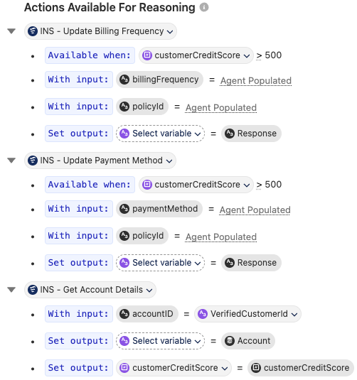

8. Copy these instructions into the Instructions section. Replace anything in <> brackets by using `@` to insert the relevant variable or action. 

```text
Help the customer update their payment/billing frequency for a policy using <INS - Update Billing Frequency> or update their payment method for a policy using <INS - Update Payment Method>. The allowed payment frequencies include Semi-Monthly, Monthly, Quarterly, Semi-Annual and Annually. The allowed payment methods are Credit Card, Bank Transfer, PayPal and Check by Mail. The policyId input is the Id value in <PolicyJson>, a 18-character alphanumeric value. Confirm which insurance policy should be updated. Ensure valid inputs are provided before running actions. 
```

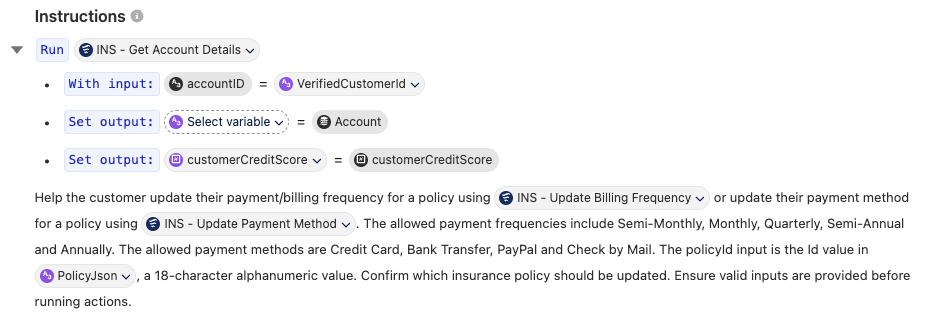

---

### 3.3 Test the Agent

1. Let's test our agent. In the **Preview** pane, click **Set Initial Context Values**.
2. Paste the ID for the `VerifiedCustomerId` variable under the **Override Value** field and click **Refresh Session**. 

In the chat box, converse with the agent using these messages:

1. What are my policies
2. I want to update the payment method for my RAV4 policy
3. paypal

The response back from the Agent wasn't what we were hoping for. We can see reasoning in the middle pane about why our Agent decided to choose this action. Let's click the Suggest Improvement button to get suggestions on how we can improve our agent and answer the questions from the builder. You can provide feedback like the screenshot below:

Based on the feedback. We can add a new instruction into our Subagent, something like this:

```text
Before updating billing frequency or payment method, verify that the customer's credit score is over 500. If the credit score is 500 or below, escalate the request to a live human agent
```

---

## 4. Address Change

An address change in insurance can lead to many complicated follow-ups, from updating auto premiums to cancelling policies, often requiring human intervention.  
In this exercise, you’ll explore how an agent can help a customer change their address, validate additional information, and hand over to a real person if necessary.

**Part 1**: Create an action for updating an address and generating follow-ups  
**Part 2**: Create actions to change payment frequency and method  
**Part 3**: Test the new agent capabilities

We will explore:

- **Actions** to give Agents tools for their jobs to be done
- **Flows** to dynamically ground our prompt
- **Prompt Templates** to form more sophisticated responses with dynamic RAG

---

### 4.1 Create the Address Change Subagent

1. Click the **App Launcher** (waffle icon) and select the **Agentforce Studio** application.
2. In the list of agents, click the **Insurance Agent** that we recently created.

3. Once in the builder, hover over **Subagents** on the left, click the **+** beside it and select **Create new Subagent**. Use these values: 
 - **Subagent Name**: `Address Change`
 - **Description**: `Help policyholders manage changes to their account address and any subsequent impacts to their insurance products.`

4. Click **Create and Open**

5. In the Subagent, open the drop-down **Select action** and click **Add from Asset Library**. Search for and select:
 -  **FINS - Update Account Address**: This takes a standardized address strging and updates the customer’s billing address on their Account record.
 - **INS - Cancel Insurance Policy**: Begins the process to cancel an insurance policy. You can use this in case you need to cancel a renter's insurance policy.
 - **INS - Get Account Details**: Retrieves customer account details, including their address.
 
6. Click **Add to Agent**.

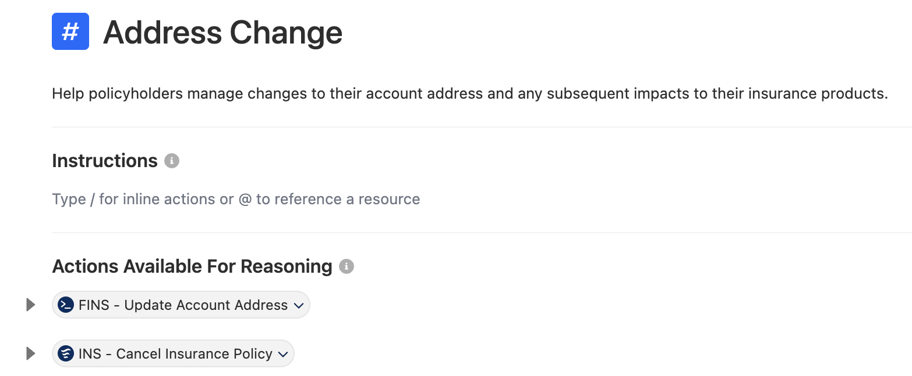

---

### 4.2 Build RAG Dynamic Grounding Flow

You will now build a dynamically grounded prompt to compose a more sophisticated follow-up with the customer after updating their billing address.  
Before that, create a new flow to ground the prompt.

From Setup, in the Quick Find box, enter **Flows**, and then click **Flows**.  
Click **New Flow** at the top right and select **Template-Triggered Prompt Flow** in the Frequently Used section of the pop-up modal. This opens Flow Builder.

Close any pop-ups, then open the Toolbox pane from the top left by clicking the **Window Pane** icon and click **New Resource**.

In the pop-up modal, create a new input variable with this definition:

1. **Resource Type** = `Variable`
2. **API Name** = `Account`
3. **Data Type** = `Record`
4. **Object** = `Account`
5. Check **Available for Input**


Next, click the circular **+** icon below the **Start** element and add a **Get Records** element with this definition:

1. **Label** = `Get Renters Insurance Policies`
2. **Object** = `Insurance Policy`
3. For **Condition Requirements**, keep **All Conditions Are Met (AND)** and add these two filters:
   - `PolicyType Equals Renters`
   - `NameInsured ID Equals Account > Account ID` (select **Account**, then search and select **Id (Account ID)**; this resolves to **Account > Account ID**)
4. Leave the remaining configurations as-is.

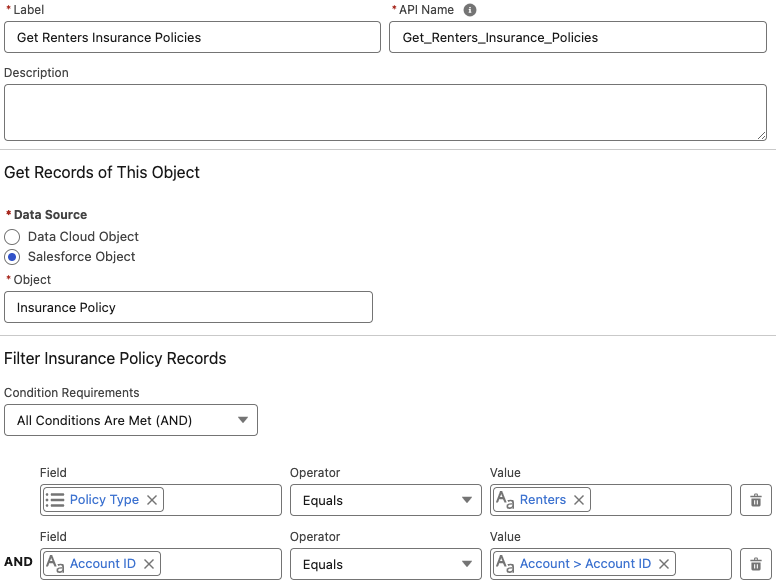

Open the Toolbox again by clicking the **Window Pane** icon and click **New Resource** to create a new formula with this definition:

1. **Resource Type** = `Formula`
2. **API Name** = `newRenterInsuranceQuoteLink`
3. **Data Type** = `Text`
4. For **Formula**, use:

```text
'https://<BASE_DOMAIN>.my.site.com/insurance/s/home-quoting'
```

Replace the `<BASE_DOMAIN>` placeholder with the base domain of your Salesforce org. You can find this in your browser’s URL.  
**DO NOT** include `https://` at the beginning or a `/` at the end of the domain URL.

Here is an example:  
`https://<BASE_DOMAIN>.lightning.force.com/lightning/setup/SetupNetworks/home`

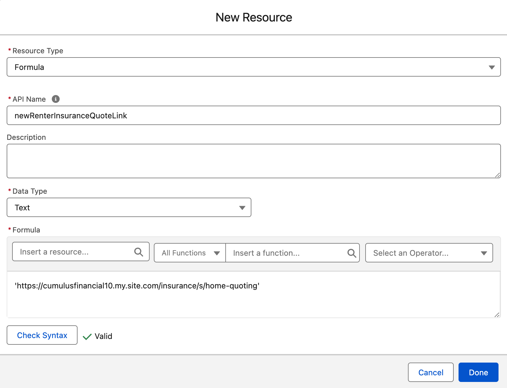

Click the circular **+** icon below the **Get Renters Insurance Policies** element to add an **Add Prompt Instructions** element with this definition:

1. **Label** = `Add Dynamic Policy Data`
2. For **Prompt Instructions**, use:

```text
Existing Renter's Insurance Policy information:
ID={!Get_Renters_Insurance_Policies.Id}
Name={!Get_Renters_Insurance_Policies.PolicyName}
Status={!Get_Renters_Insurance_Policies.Status}
Type={!Get_Renters_Insurance_Policies.PolicyType}
Link to new home insurance submission={!newHomeInsuranceQuoteLink}
```

Click **Save** in the top right. In the pop-up modal, set **Label** = `INS - Renters Insurance Grounding`, then click **Save**.  
Finally, click **Activate** in the top right when available.

---

### 4.3 Build a Prompt with RAG using Flow

Now that you have a flow for dynamically grounding the prompt, you will create the prompt template itself.

Back in Setup, search for and select **Prompt Builder**.  
In the top right, click **New Prompt Template** and provide this definition:

1. **Prompt Template Type** = `Flex`
2. **Prompt Template Name** = `INS - Property Insurance Call to Action`
3. **Template Description** = `After an address change, generate a follow up ask or call to action for the customer`
4. Under **Define Sources**, add this variable:
   - **Name** = `Account`
   - **API Name** = `Account`
   - **Source Type** = `Object`
   - **Object** = `Account`

Click **Next**.

In the Prompt Template workspace, use the following instructions:

```text
You are an insurance agent and a customer, {!$Input:Account.Name}, has just updated their address. Write a chat response to the customer with follow-ups based on the current customer situation.

You must treat equally any individuals or persons from different socioeconomic statuses, sexual orientations, religions, races, physical appearances, nationalities, gender identities, disabilities, and ages. When you do not have sufficient information, you must choose the unknown option, rather than making assumptions based on any stereotypes.

"""
If the customer has a renter's insurance policy with us, ask them if they would like to cancel their existing rental insurance policy
At the beginning of the message, congratulate the customer on their new home and let them know we're here to provide them ease of mind with their new property and move. Let the customer know that we can help them quote a new home insurance policy with the link referenced below
Do not reference their existing renter's insurance policy ID field
Do not address the customer like you would an email, respond as if it is part of an ongoing chat conversation with the customer
Do not say hello or address the customer as dear, do not sign off in the response
"""

New address: {!$Input:Account.BillingStreet}, {!$Input:Account.BillingCity} {!$Input:Account.BillingState}, {!$Input:Account.BillingPostalCode}, {!$Input:Account.BillingCountry}

{!$Flow:INS_Renters_Insurance_Grounding.Prompt}
```

Click **Save** and **Activate** the Prompt Template.

---

### 4.4 Add Prompt as Action to Agent

Now you’ll wire the new prompt template into the agent as an action.

Go back to the Agent Builder for the **Insurance Agent**. In the **Explorer** on the left, hover over **Actions** sub-section within the **Address Change** Subagent and click **+**. In the drop-down, click **Create new action**. Use these values: 
 - **Action Name**: `Property Insurance Call to Action`
 - **Description**: `After an address change, generate a follow up ask or call to action for the customer`

Click **Create and Open**. In the action, use these configurations: 

 - **Reference Action Type** = **Prompt Template**
 - **Reference Action** = **INS - Property Insurance Call to Action**
 - For the **Account** input variable, enter these instructions: `Account record used to determine the call to action`
 - For the **Prompt Response** output variable, check **Show in conversation**

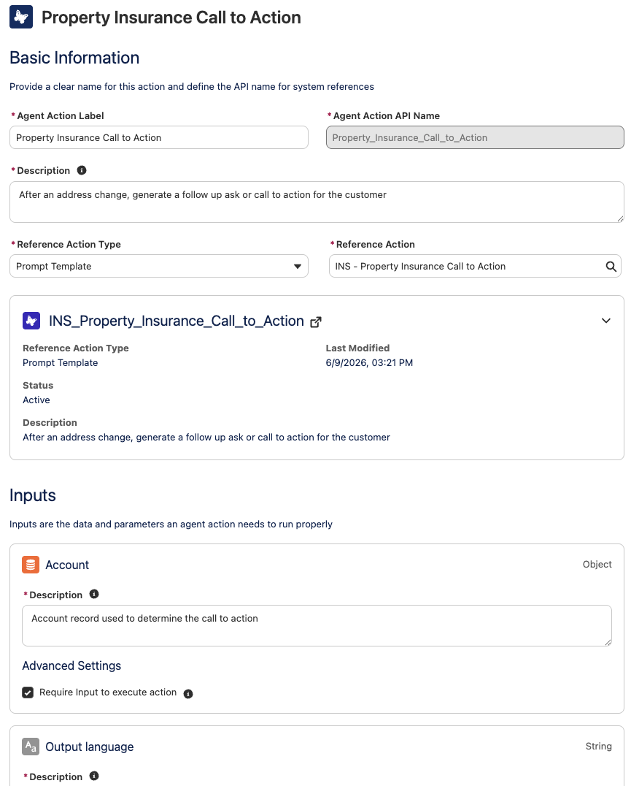

In **Explorer**, open the Address Change Subagent and under instructions, add the following: 

```text
Use <​INS - Get Account Details>​ to get the customer's account details, including their address. Only use their billing address.

Use <FINS - Update Account Address> to update the customer's address with a new address provided by the user. Parse, standardize and validate the provided address so that it can be separated into "Street", "City", "State", "ZipCode", and "Country" values. Do not use abbreviations when standardizing. If unable to properly parse the provided address, ask the user for the missing values and continue until a complete valid address that can be parsed. Once a complete valid address, serialize these values into a JSON string to use for the Address JSON input. 

Immediately after updating the customer's address, ask the customer if they are moving to this new address. If yes, run ​<Property Insurance Call to Action>​ and provide the exact response back to the user.

In response to the <Property Insurance Call to Action>​, if the customer wants to cancel their policy, but provided a date in the past about canceling their renter's insurance policy, inform them that we cannot cancel an insurance policy in the past and ask them for the cancellation date again until they provide one in the future or today. After a future or current date is successfully provided, run ​<INS - Cancel Insurance Policy​> with the provided date and renter’s insurance policy Id from <PolicyJson>.
```

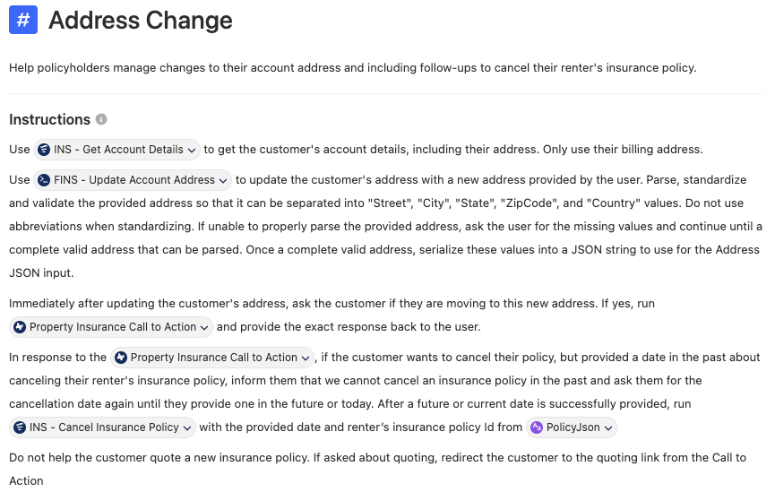

Click **Save** in the top right.

---

### 4.5 Test the Agent

Time for the big reveal—let’s interact with the agent’s address change capabilities.

1. In the **Preview** pane, click **Set Initial Context Values**.
2. Paste the ID for the `VerifiedCustomerId` variable under the **Override Value** field and click **Refresh Session**.

You can test the address change experience with prompts like:

    1. What are my policies?
    2. I want to change my address.
    3. Use your own home address (for example: *120 N LaSalle St, Chicago, Illinois, 60602, United States*).
    4. Yes
    5. Yes
    6. last week Friday
    7. next week Thursday

---

