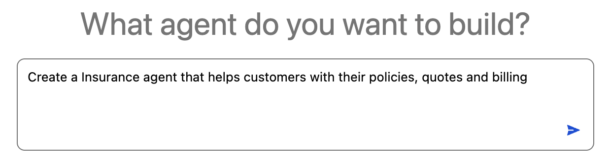
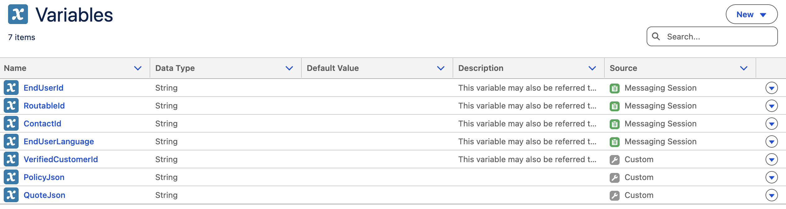
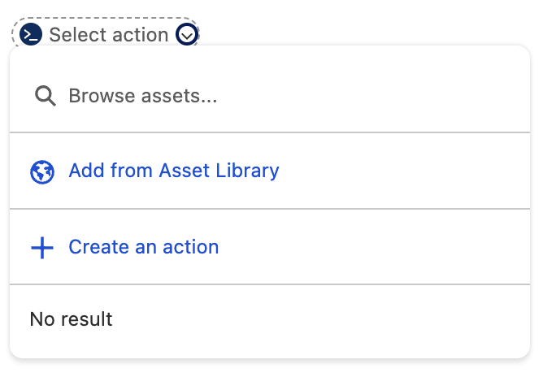
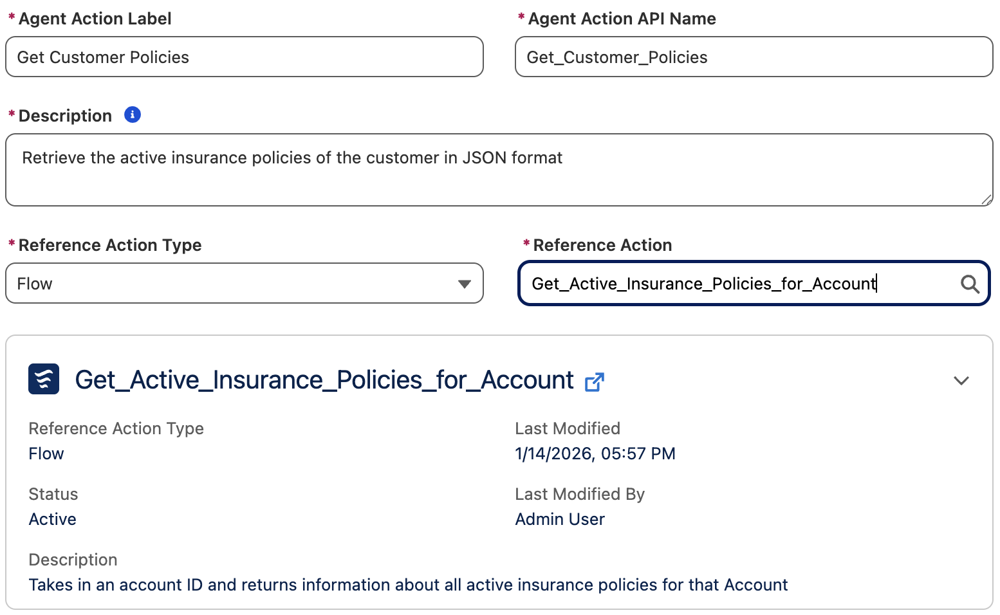
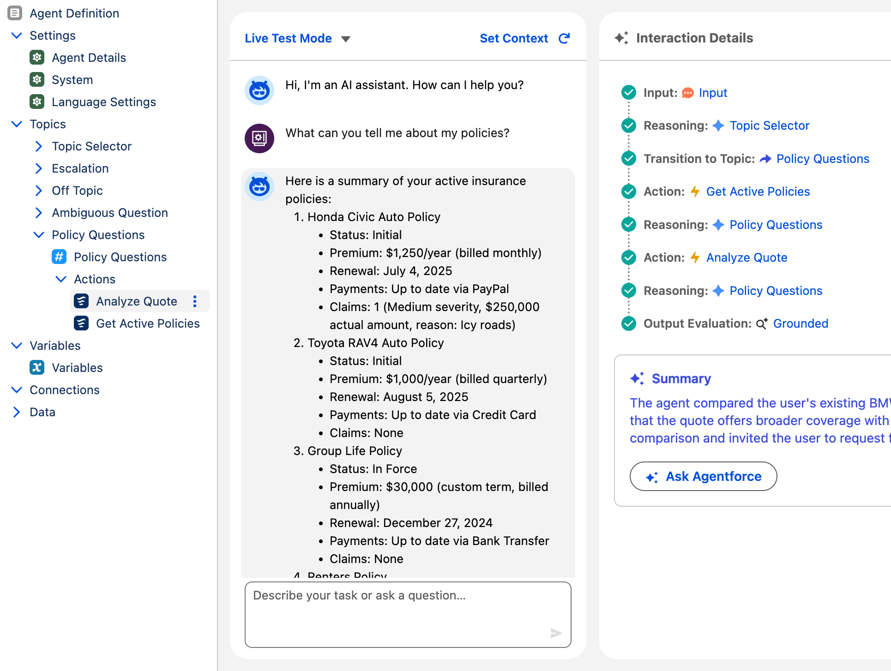

## Insurance Agentforce Workshop Overview

In this workshop, you will build a specialized AI agent using deterministic logics that's designed to assist customers. You will configure the agent to analyze the customer's policies and compare them with competitor quotes.

### What we will explore

* How to create and configure a new agent using **Agentforce Studio**.
* How to define custom **Topics** and **Actions** for specific business logic.
* How to use deterministic instructions and variables to provide conditional responses.
* How to test and validate your agent using specific customer data.

---

### 1. Create a New Agent

#### Initialize the agent

1. Click the **App Launcher** (waffle icon) and select the **Agentforce Studio** application.
2. Click **New Agent** to create a new agent.
3. In the **What agent do you want to build?** dialogue, enter `Create a Insurance agent that helps customers with their policies, quotes and billing`.
    
4. Enter the following values:
    - **Agent Name**: `Insurance Agent`
    - **API Name**: `Insurance_Agent`
    - **Agent User's Record**: Remove New User selection and replace with `EinsteinServiceAgent User` from the dropdown

    

    - **Description**: 
5. Click **Let's Go** in the top right.
6. In the new Agentforce Builder, click **Skip Ahead** and on the **Explorer** pane on the left, click the **Agent Details** to open the tab. Replace the escription with `Supports a customer in their tasks for understanding their insurance policies and comparing with competing quotes`

7. Expand Variables in the Explorer pane and select **Variables**. 
8. Expand **New** in the top right and select **Create Custom Variable**. 
9. Enter the following values: 
    - **Name**: `PolicyJson`
    - **API Name**: `PolicyJson`
    - **Data Type**: `String`
10. Click **Create**
11. Repeat steps 8-10 to create another variable with the following values: 
    - **Name**: `QuoteJson`
    - **API Name**: `QuoteJson`
    - **Data Type**: `String`

    

---

### 2. Create a Topic for Policy and Quote Analysis

#### Define the Policy and Quote Analysis topic

1. In the Explorer pane, hover over **Topics** and click the **+** (plus) icon.
2. Select **Create New Topic**.
3. Enter the following values: 
    - **Topic Name**: `Policy Questions`
    - **Describe the job you want the topic to do**: `Assists customers to analyze their existing policies and comparing them with quotes from other carriers. Use this topic when a user asks about their insurance.`
4. Click **Create and Open**. This will take us to the Canvas for defining our new Topic. 
5. In the **Agentforce pane on the right, give Agentforce this instruction: `In the Topic Selector, add the action to transition to the Policy Questions topic`
6. Click **Accept Change**

    

#### Add a custom policy and quote action

1. Under **Actions Available for Reasoning**, click **Select action** and choose **Create an action**.
    
2. For the Action Name, enter `Get Customer Policies` and click **Create and Open**.
3. Configure with the following values:
    - **Reference Action Type**: `Flow`
    - **Reference Action**: `INS - Get Active Insurance Policies for Account`
    - **Description**: `Retrieve the active insurance policies of the customer in JSON format`

4. In the **Explorer** pane, click Polic Questions to go back to our Topic. Put your cursor after our new `Get Customer Policies` action and press Enter to start a new line. Click **Select action** and choose **Create an action**.
5. For the Action Name, enter `Analyze Quote` and click **Create and Open**.
6. Configure with the following values:
    - **Reference Action Type**: `Flow`
    - **Reference Action**: `INS - Get Active Insurance Policies for Account`
    - **Description**: `Retrieve the active insurance policies of the customer in JSON format`
    

---

### 3. Add Instructions

#### Add conditional logic in Canvas mode

1. Click **Policy Questions** in the Explorer pane.
2. In the **Instructions** section, type `/` and select **Conditional Statement**.
3. Populate the `If` statement as `PolicyJson` == `""`
4. Within the `If` statement, type `/` and select **Run Action**. 
3. Click **Select action** and select `Get Customer Policies`. Expand the action a nd set: 
    - `With input: ` **accountId** = `VerifiedCustomerId`
    - `Set output: ` `PolicyJson` = **PolicyJson**


#### Add Instructions in Script mode

1. Click the **Canvas** button in the top-left toolbar to switch to **Script** mode.
2. Add the following text to the script, ensuring the indentation aligns after the If instruction that we added above the `run` instruction:

    ```yaml
            | Using the {!@variables.PolicyJson}  variable, answer any questions about the user's active insurance policies
            | If the customer asks to compare a quote against a policy then 
            run @actions.Analyze_Quote
                with accountId = @variables.VerifiedCustomerId
                set @variables.QuoteJson = @outputs.quoteJson

            | quoteUsing the Vehicle element in {!@variables.QuoteJson}  , find the active insurance policy in {!@variables.PolicyJson}  and compare their coverages and premium costs. Provide an analysis of this comparison to the user.
    ```

    > **Note**: YAML indentations are critical; ensure they line up correctly. Variable names are case-sensitive.

    
3. Click **Save**.

---

### 4. Test the Agent

Follow these steps to verify your agent's reasoning and execution.
1. In a separate tab, navigate to **Accounts** and copy the **Account ID** for "Kiran Singh".
    
2. In the **Preview** pane, click **Set Initial Context Values**.
3. Paste the ID for the `VerifiedCustomerId` variable under the **Override Value** field and click **Refresh Session**.
    
4. Minimize the variables pane at the bottom by clicking the Up arrow at the right side. 
5. Ask the agent: `What can you tell me about my policies?`
6. Open the **Trace** tab in the bottom pane to inspect the agent's work.

**Successful Outcome:** The agent should trigger the "Policy Questions" topic, call the Flow action, and return the correct summary response based of Kiran Singh's insurance policies.
    
7. Ask the agent: `Can compare the recent auto quote with my existing policy?`
8. Open the **Trace** tab in the bottom pane to inspect the agent's work.

**Successful Outcome:** The agent should trigger the "Policy Questions" topic, call the Analyze Quote action, and return the correct conditional response based on the equity percentage.
    
