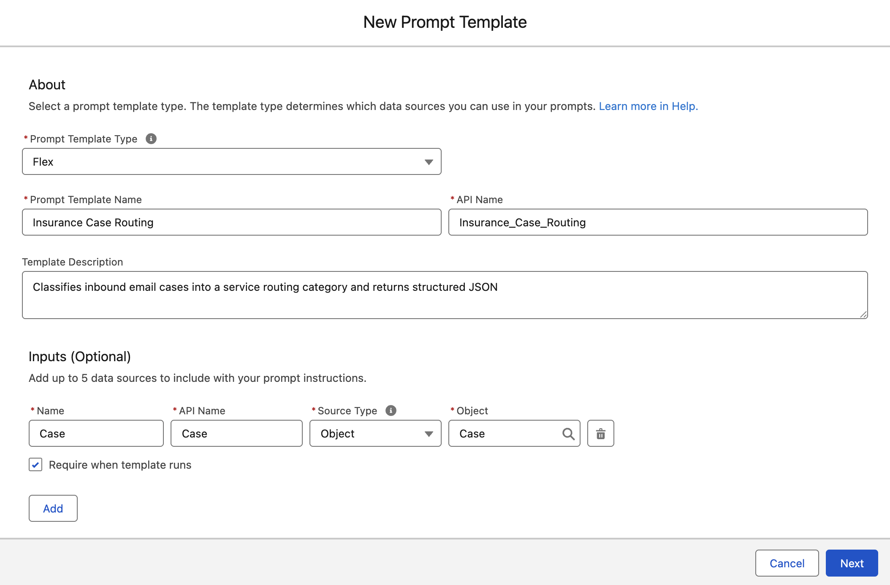
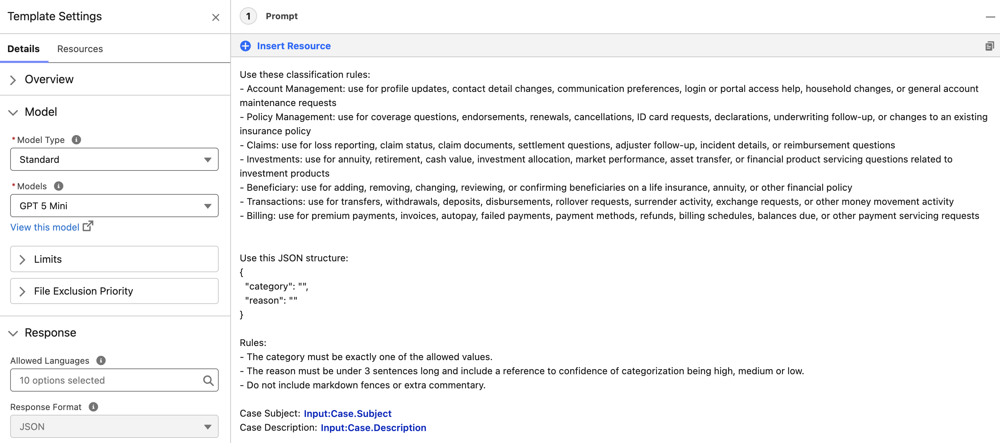
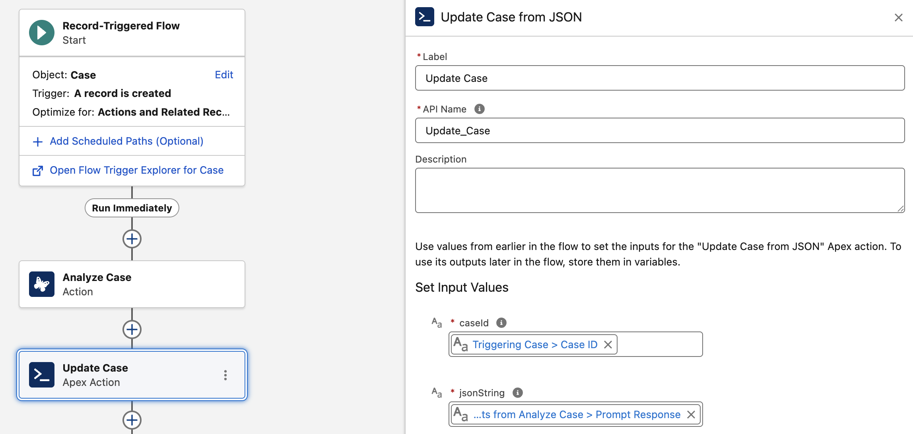
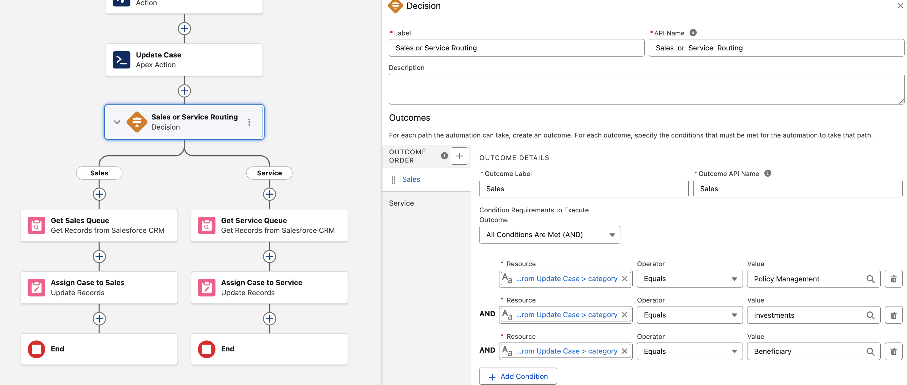
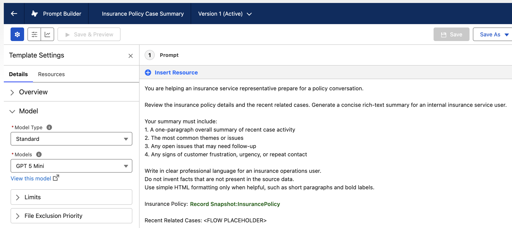
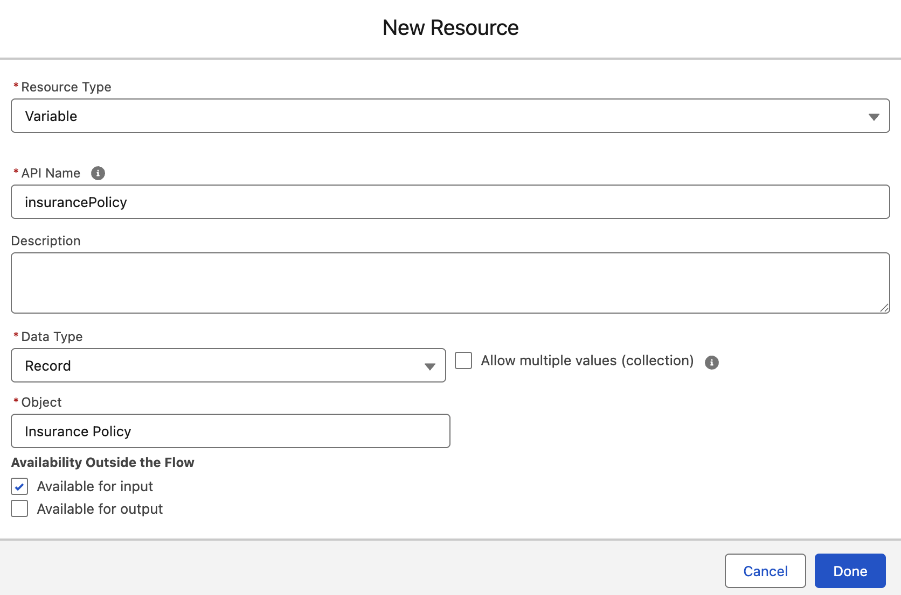
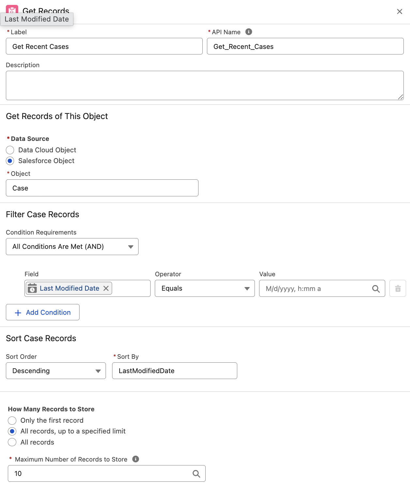
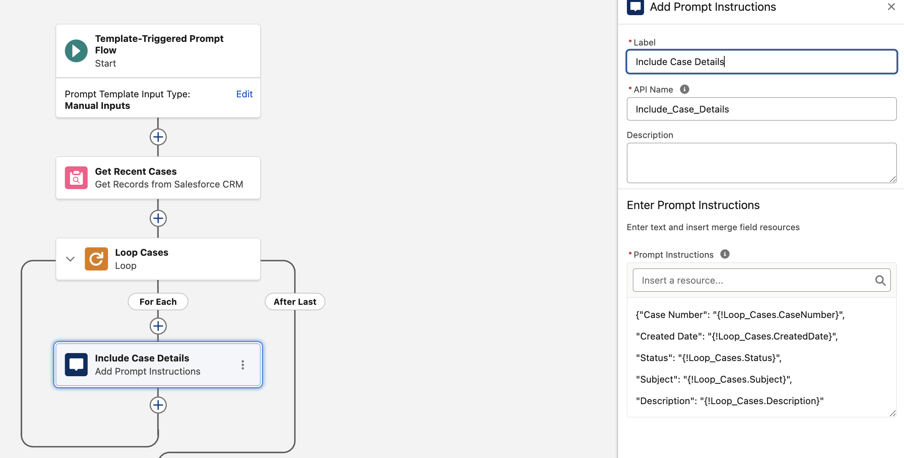
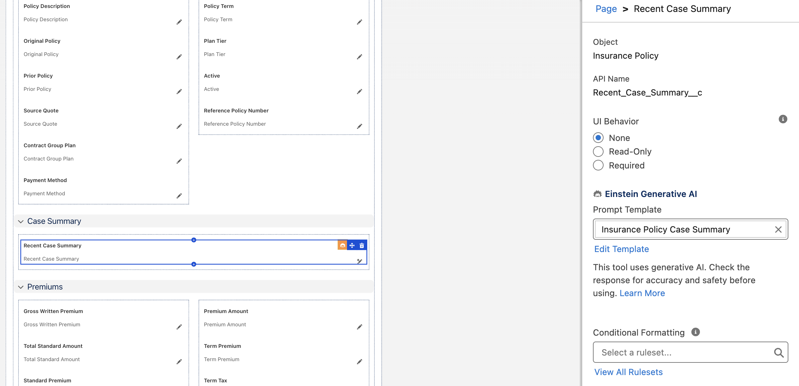
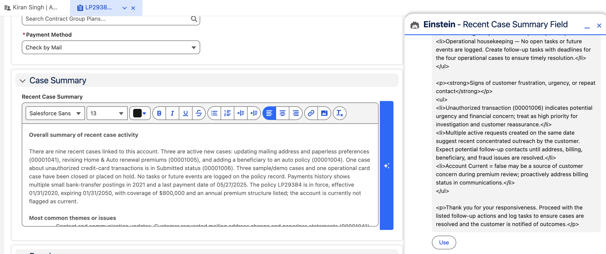

## Insurance Prompt Builder Workshop Overview

In this workshop, you will build two practical generative AI automations for an insurance business using **Prompt Builder**, **Flow Builder**, and **Financial Services Cloud** data. Both exercises are designed for a Salesforce admin and focus on common service operations: routing inbound service requests and summarizing policy-related service history.

We will explore:

- **Prompt Templates** to classify inbound requests and summarize related service activity
- **Flow Builder** to orchestrate prompt execution and update records automatically

---

### 1. Route Inbound Email Cases with Prompt Builder

In this exercise, you will build a generative AI-assisted case routing process for an insurance carrier. When a new Case is created from **Email-to-Case**, a record-triggered flow will invoke a prompt template that analyzes the case **Subject** and **Description** and returns structured JSON. The flow will then use that response to classify and route the case.

The routing categories for this exercise are:

- `Account Management`
- `Policy Management`
- `Claims`
- `Investments`
- `Beneficiary`
- `Transactions`
- `Billing`

#### 1.1 Create the Case Routing Prompt Template

Next, create a prompt template that classifies an inbound insurance service request and returns JSON that a flow can parse.

1. In **Setup**, use **Quick Find** to search for and select **Prompt Builder**.
2. Click **New Prompt Template**.
3. Enter these values:
   - **Prompt Template Type**: `Flex`
   - **Template Name**: `Insurance Case Routing`
   - **API Name**: `Insurance_Case_Routing`
   - **Description**: `Classifies inbound email cases into a service routing category and returns structured JSON`
4. Add an input with these values: 
   - **Name**: Case
   - **API Name**: Case
   - **Source Type**: Object
   - **Object**: Case
5. Save the prompt template.



6. Under Template Settings, set **Response Format** to **JSON**
7. For the prompt instructions, use a prompt similar to the one below:

```text
You are assisting an insurance operations team with triaging inbound email cases.

Review the case subject and description and classify the request into exactly one of these categories:
- Account Management
- Policy Management
- Claims
- Investments
- Beneficiary
- Transactions
- Billing

Use these classification rules:
- Account Management: use for profile updates, contact detail changes, communication preferences, login or portal access help, household changes, or general account maintenance requests
- Policy Management: use for coverage questions, endorsements, renewals, cancellations, ID card requests, declarations, underwriting follow-up, or changes to an existing insurance policy
- Claims: use for loss reporting, claim status, claim documents, settlement questions, adjuster follow-up, incident details, or reimbursement questions
- Investments: use for annuity, retirement, cash value, investment allocation, market performance, asset transfer, or financial product servicing questions related to investment products
- Beneficiary: use for adding, removing, changing, reviewing, or confirming beneficiaries on a life insurance, annuity, or other financial policy
- Transactions: use for transfers, withdrawals, deposits, disbursements, rollover requests, surrender activity, exchange requests, or other money movement activity
- Billing: use for premium payments, invoices, autopay, failed payments, payment methods, refunds, billing schedules, balances due, or other payment servicing requests

Return valid JSON only.

Use this JSON structure:
{
  "category": "",
  "reason": ""
}

Rules:
- The category must be exactly one of the allowed values.
- The reason must be under 3 sentences long and include a reference to confidence of categorization being high, medium or low.
- Do not include markdown fences or extra commentary.

Case Subject: {!$Input:Case.Subject}
Case Description: {!$Input:Case.Description}
```

8. Save and activate. 



This prompt design keeps the output deterministic enough for a flow to interpret while still using AI to understand natural-language insurance requests.

---

#### 1.2 Build the Record-Triggered Flow

Now recreate the flow that runs whenever a new case arrives from Email-to-Case. The existing flow in the org is named **Route Email Cases with AI**, and it uses a prompt template followed by an Apex action to interpret the JSON response before routing the Case to either the **Sales** or **Service** queue.

1. In **Setup**, search for and select **Flows**.
2. Click **New Flow**.
3. Select **Record-Triggered Flow**.
4. Configure the start conditions:
   - **Object**: `Case`
   - **Trigger the Flow When**: `A record is created`
6. Click **Done**.

Add the first action that calls the prompt template:

1. Click the **+** icon after **Start** and add an **Action**.
2. Search for the prompt template action for **Insurance Case Routing** and select it.
3. Set the input parameter:
   - **Input:Case** = `Triggering Case > Entire Resource`
4. Leave the action configured to **store output automatically**.
5. Use this element configuration:
   - **Label**: `Analyze Case`
   - **API Name**: `Analyze_Case`

This action sends the entire Case record into the prompt template and stores the generated JSON response as the prompt output.

Next, add the Apex action that parses the JSON and updates the Case fields:

1. Click the **+** icon after **Analyze Case** and add an **Action**.
2. Search for and select the Apex action **Update Case from JSON**.
3. Configure the action with:
   - **Label**: `Update Case`
4. Set the input parameters:
   - **caseId** = `Triggering Case > Id`
   - **jsonString** = `Outputs from Analyze Case > Prompt Response`
5. Leave the action configured to **store output automatically**.

This Apex action uses the prompt response to update the Case and returns the normalized routing category that the flow uses in the next step.



Now add the routing decision:

1. Click the **+** icon after **Update Case** and add a **Decision**.
2. Configure the decision:
   - **Label**: `Sales or Service Routing`
   - **API Name**: `Sales_or_Service_Routing`
3. Create an outcome with:
   - **Outcome Label**: `Sales`
   - Set Conditions to be for `Any Condition Is Met (OR)` and include 3 conditions: 
      - **Update_Case.Category** Equals `Policy Management`
      - **Update_Case.Category** Equals `Investments`
      - **Update_Case.Category** Equals `Beneficiary`
4. Update the default outcome label as `Service`.

This means the flow sends Cases classified into the sales-oriented categories down the **Sales** branch. All other categories continue down the default **Service** branch.

Next, configure the **Sales** branch:

1. Under the **Sales** outcome, add a **Get Records** element.
2. Configure it with:
   - **Label**: `Get Sales Queue`
   - **Object**: `Group`
   - **Condition**: **Developer Name** Equals `Sales`
3. After that, add an **Update Triggering Record** element.
4. Configure it with:
   - **Label**: `Assign Case to Sales`
   - **Field**: `OwnerId`
   - **Value**: `Get_Sales_Queue.Id`

Then configure the **Service** branch:

1. Under the default **Service** outcome, add a **Get Records** element.
2. Configure it with:
   - **Label**: `Get Service Queue`
   - **Object**: `Group`
   - **Condition**: **Developer Name** Equals `Service`
3. After that, add an **Update Triggering Record** element.
4. Configure it with:
   - **Label**: `Assign Case to Service`
   - **Field**: `OwnerId`
   - **Value**: `Get_Service_Queue.Id`



Save and activate the flow:

1. Click **Save** and use:
   - **Flow Label**: `Route Email Cases with AI`
2. If prompted, confirm the API name generated by Salesforce.
3. Click **Activate**.

---

#### 1.3 Test Case Routing

Now test the end-to-end routing experience. Use your own email inbox. 

In setup, search for and open **Email-to-Case**. If there is an introduction screen, click **Continue**. At the bottom under **Routing Addresses**, click **Edit** beside the **Incoming Case** routing. Within its configuration, scroll down and click **Save**. Afterwards, you'll see an email address generated under the **Email Services Address** column that can be used for triggering Email-to-Case. Keep this email for use with testing. 

Go to Kiran Singh's account record and update his email address to your own email address that you will use for testing. 

Send emails to the routing email address to test our automated routing. It can take a minute for the case to be created via email. Some possible tests include:

1. **Account Management**
   - **Subject**: `Update mailing address and communication preferences`
   - **Description**: `I moved to a new address and also want paperless statements for all of my policies. Please update my contact preferences on my account.`
2. **Policy Management**
   - **Subject**: `Please add my new vehicle to my policy`
   - **Description**: `I replaced my old car and need to update coverage on my active auto policy before the weekend. Please let me know what information you need for the endorsement.`
3. **Claims**
   - **Subject**: `Need help with claim after windshield damage`
   - **Description**: `I submitted a claim for my auto policy after road debris cracked my windshield and I want to know the next steps, deductible, and current claim status.`
4. **Investments**
   - **Subject**: `Question about my annuity allocation options`
   - **Description**: `I want to review the current investment allocations in my annuity and understand whether I can move funds into a more conservative option.`
5. **Beneficiary**
   - **Subject**: `Need to update beneficiary on my life policy`
   - **Description**: `I recently got married and want to change the beneficiary on my life insurance policy from my sister to my spouse.`
6. **Transactions**
   - **Subject**: `Request for partial withdrawal from my policy`
   - **Description**: `I would like to take a partial withdrawal from the cash value of my policy and need help understanding the process and timing.`
7. **Billing**
   - **Subject**: `Autopay failed for my premium payment`
   - **Description**: `My monthly premium did not process and I need help updating my payment method and confirming whether my balance is now past due.`

For each test case, verify the following:

- The flow runs when the Case is created
- The **AI Case Category** field is populated with the expected category
- The **AI Routing Reason** explains the classification
- The Case owner is updated to the expected queue

**Successful outcome:** New inbound email cases are automatically classified and routed to the right insurance service team with a visible explanation of why the routing decision was made.

---

### 2. Summarize Recent Cases for an Insurance Policy

In this exercise, you will build a policy-level summary experience for service users using a **Field Generation Prompt Template** on the **InsurancePolicy** object. A prompt-template-triggered flow will retrieve recent Case details, prepare the grounding context, and then the field generation template will write a summary into the existing **Recent Case Summary** rich text field on the policy.

This is useful when a service rep is reviewing a policy before a renewal call, investigating repeat service issues, or preparing for a high-touch customer conversation.

---

#### 2.1 Create the Policy Case Summary Prompt Template

Now create the field generation prompt template that will turn recent policy-related cases into a concise insurance service summary directly on the policy record.

1. In **Setup**, open **Prompt Builder**.
2. Click **New Prompt Template**.
3. Choose **Field Generation** as the prompt template type.
4. Enter these values:
   - **Template Name**: `Insurance Policy Case Summary`
   - **API Name**: `Insurance_Policy_Case_Summary`
   - **Description**: `Generates a summary of recent policy-related cases for service and operations users`
   - **Object**: `InsurancePolicy`
   - **Target Field**: `Recent Case Summary`
5. Save the template.

Use prompt instructions similar to the following:

```text
You are helping an insurance service representative prepare for a policy conversation.

Review the insurance policy details and the recent related cases. Generate a concise rich-text summary for an internal insurance service user.

Your summary must include:
1. A one-paragraph overall summary of recent case activity
2. The most common themes or issues
3. Any open issues that may need follow-up
4. Any signs of customer frustration, urgency, or repeat contact

Write in clear professional language for an insurance operations user.
Do not invent facts that are not present in the source data.
Use simple HTML formatting only when helpful, such as short paragraphs and bold labels.

Insurance Policy: {!$RecordSnapshot:InsurancePolicy.snapshot}

Recent Related Cases: <FLOW PLACEHOLDER>
```

7. Save the prompt template.



---

#### 2.2 Build the Prompt-Template-Triggered Flow

Next, build the prompt-template-triggered flow that appends recent Case details into the prompt context. In the org, this flow is named **Get Recent Cases for Policy Summary Prompt** and is a **Prompt Flow** that loops through a recent Case collection and adds each Case as structured prompt instructions.

1. In **Setup**, open **Flows**.
2. Click **New Flow**.
3. Select the flow option used for a **Prompt Template Triggered Flow** in your org.
4. In the **Manager** tab, click **New Resource** and create this input variable:
   - **Resource Type**: `Variable`
   - **API Name**: `insurancePolicy`
   - **Data Type**: `Record`
   - **Object**: `InsurancePolicy`
   - **Available for input**: checked

This flow is invoked by the prompt template, so the active policy record is passed into the flow through this `insurancePolicy` variable.



Add the recent case retrieval logic:

1. Add a **Get Records** element for **Case**.
2. Configure it with:
   - **Label**: `Get Recent Cases`
   - **Object**: `Case`
   - **How Many Records to Store**: all records
   - **Sort By**: `LastModifiedDate`
   - **Sort Order**: `Descending`
   - **Limit**: `10`
   - **How to Store Record Data**: automatically store all fields
3. Add the relationship filter your org uses to identify Cases for the current policy. If your org uses a policy lookup on Case, use the incoming `insurancePolicy` variable to build that filter.



Next, loop through the Cases and append them into the prompt output:

1. Add a **Loop** element after **Get Recent Cases**.
2. Configure it with:
   - **Label**: `Loop Cases`
   - **Collection Variable**: `Get Recent Cases`
   - **Direction**: `First item to last item`
3. Inside the loop, add an **Add Prompt Instructions** element and set the **Label** to `Include Case Details`. Copy/paste this content into the **Prompt Instructions** text box: 

```text
{"Case Number": "{!Loop_Cases.CaseNumber}",
"Created Date": "{!Loop_Cases.CreatedDate}",
"Status": "{!Loop_Cases.Status}",
"Subject": "{!Loop_Cases.Subject}",
"Description": "{!Loop_Cases.Description}"}
```

This flow appends each recent Case into `$Output.Prompt`, which makes those Case details available to the **Recent Case Summary** field generation prompt.



Save and activate the flow with the name `Get Recent Cases for Policy Summary Prompt`.

Let's now go back to our **Insurace Policy Case Summary** prompt template and highlight <FLOW PLACEHOLDER>. Click through **Insert Resource** > **Flows** > **Get Recent Cases for Policy Summary Prompt**. This inserts our recently created flow to help dynamically ground our prompt with recent cases related to the insurance policy. **Save** and **Activate** the prompt template. 

---

#### 2.3 Update the InsurancePolicy Lightning Record Page

Now update the **InsurancePolicy** Lightning record page so the **Recent Case Summary** field uses the field generation prompt template you created.

1. Back in our main user screen, open the Insurance Policies list view and then open the record detail page of the LP29384 life insurance policy belonging to Kiran Singh. 
3. In the top-right, click the cog icon and select **Edit Page** at the bottom of the drop-down. This navigates us to the Lightning App Builder of our Insurance Policy record page. 
4. Under the details tab, find and select the **Recent Case Summary** field (it's under the **Case Summary** section). In the right pane, find and select our **Insurance Policy Case Summary** prompt template. 
6. Save the page. If prompted, click **Activate** so the updated page is available to users.
7. Click the back arrow in the top left to go back to our insurance policy record page. 



---

#### 2.4 Test Policy Summarization

You are now ready to test the policy summary experience.

1. Open an **InsurancePolicy** record that already has several related Cases.
2. Review the related list to confirm there is enough recent service activity to summarize.
3. Use the **Recent Case Summary** field on the Lightning record page to generate the summary with the configured prompt template.
4. Wait for prompt generation to complete.
5. Refresh the record if needed.
6. Review the **Recent Case Summary** field.

Validate that the generated summary:

- Mentions recent service themes accurately
- Identifies open or unresolved issues
- Reflects repeat contacts or urgency when present
- Uses details only from the related Cases



**Successful outcome:** A user can open any policy record, generate the summary from the field experience on the Lightning record page, and quickly understand recent support history before helping the customer.

---

### 3. Wrap-Up

In this workshop, you built two insurance-focused generative AI automations:
May
1. A **record-triggered flow** that classifies and routes inbound Email-to-Case requests using a prompt template with **JSON output**
2. A **field generation prompt template** on **InsurancePolicy** that uses a prompt-template-triggered flow to gather recent case context and generate a policy service summary

These patterns are useful starting points for many Financial Services Cloud use cases. Once they are working, you can extend them with more sophisticated routing logic, confidence thresholds, escalation rules, policy-specific prompts, or richer summary formats for service and underwriting teams.
