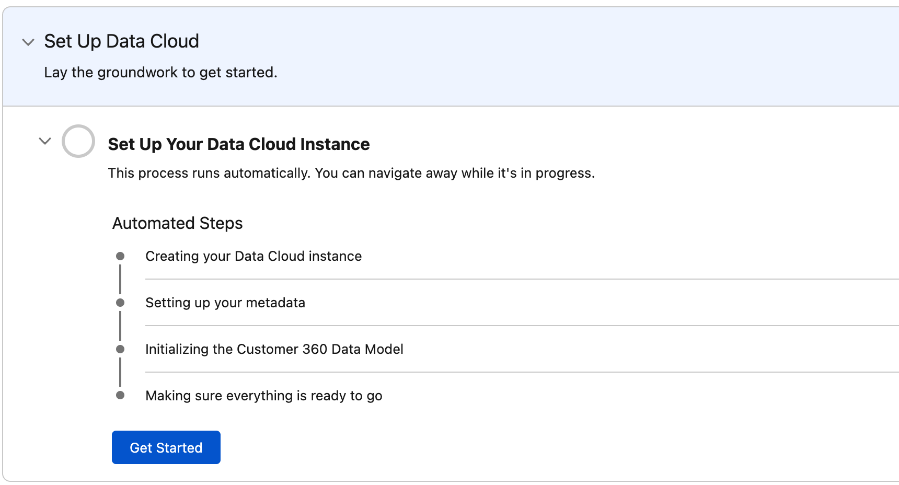
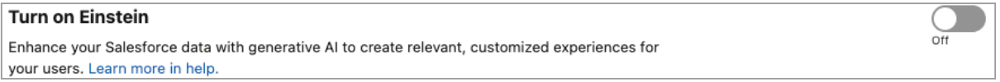
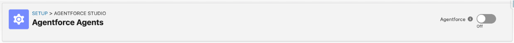
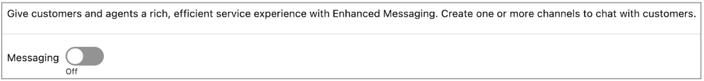

## Workshop Environment Setup

This guide will prepare your environment for the workshop by enabling Einstein capabilities and connecting your Agent with an external site.

---

### 2. Enable Data 360

Click the **Setup** icon in the top right and select **Data Cloud Setup**. A new tab will open. Scroll to the bottom of the page and click **Get Started**. This will start the provisioning of Data 360 in your environment and takes approximately 40 minutes to complete. 

---

### 1. Open Setup

Click the **Setup** icon in the top right and select **Setup**. A new tab will open.

---

### 2. Enable Agentforce

Refresh the browser and, in the Quick Find box, search for and select **Agentforce Agents** or go [here](/lightning/setup/EinsteinCopilot/home).  
At the top of the page, toggle on **Agentforce**.

---

### 3. Enable Messaging

In the Quick Find box, search for and select **Messaging Settings** or go [here](/lightning/setup/LiveMessageSetup/home).  
Toggle on **Messaging**.

---

### 4. Create an Embedded Service Deployment (Web)

In the Quick Find box, search for and select **Embedded Service Deployments** or go [here](/lightning/setup/EmbeddedServiceDeployments/home).

1. Click **New Deployment** on the top right.
2. In the pop-up, select **Enhanced Chat**. If you cannot select it, close the pop-up by clicking the **X** at the top right. You may have opened the pop-up multiple times.
3. Select **Web** and click **Next**.
4. Fill the form using the table below and click **Save**. It can take a minute to save.

   - **a) Embedded Service Deployment Name**: `Retail Deployment`
   - **b) Domain**: `<BASE DOMAIN>.my.site.com`  
     Replace the `<BASE DOMAIN>` placeholder with the base domain of your Salesforce org. You can find this in the URL of your browser. **DO NOT** include `https:/` at the beginning or a `/` at the end of the domain URL.  
     Here is an example:  
     [`https:/<BASE_DOMAIN>.lightning.force.com/lightning/setup/SetupNetworks/home`](https:/base_domain.lightning.force.com/lightning/setup/SetupNetworks/home)
   - **c) Messaging Channel**: `Retail Channel`

Click **Publish** after the deployment is saved. It will need up to 10 minutes to fully deploy.

---

### 5. Add Embedded Messaging to an Experience Cloud Site

In the Quick Find box, search for and select **All Sites** or go [here](/lightning/setup/SetupNetworks/home).  
This takes you to the Experience Cloud setup page where you can publish your agent to a customer-facing website.

1. Click **Builder** next to the **Retail** site. This opens a new tab that lets you configure, build, and publish a customer-facing website.
2. If a popup appears, click **X** to close it.
3. Scroll to the bottom of the website and open the Components panel by clicking the **lightning icon** at the top left.
4. Search for the **Embedded Messaging** component and drag-and-drop it to the bottom of the Experience Cloud page (in the Content Footer section). Leave all the default parameters.
5. Click the **Publish** button at the top right and click **Publish** again in the pop-up to confirm.
6. Click **Got It** and you’re done!

---